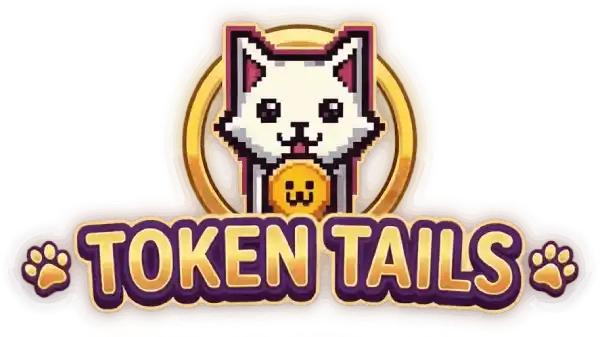

  

<h1 align="center">Token Tails</h1>

  A playful Web3 + AI pet universe where digital cats become collectible companions,
  stories, and game-ready characters.

  <a href="#overview">Overview</a> •
  <a href="#workspace">Workspace</a> •
  <a href="#highlights">Highlights</a> •
  <a href="#license">License</a>

---

## Overview

Token Tails blends collectible pet experiences with interactive gameplay and creator tools.
The project includes a consumer-facing app, admin CMS, backend services, and smart contract
workspaces used for rewards, ownership, and game-linked utility.

## Workspace

- `client/` — Main user app (web/mobile-capacitor surface, gameplay, feed, minting flows).
- `backend/` — API services, auth, payments, content, and integrations.
- `cms/` — Internal management interface for content and operations.
- `contracts/` — Smart contract workspaces and chain-specific scripts.
- `app/` — Additional app-layer code and supporting modules.

## Highlights

- AI-assisted pet experiences and themed portrait generation.
- Collectible and game utility loops connected to on-chain assets.
- Multiple game modes (including arcade-style pixel experiences).
- Marketplace and reward mechanics tied to user progression.
- Cross-platform product surface across web and mobile app shells.

## License

This repository is commercially licensed.
See [COMMERCIAL_LICENSE.md](COMMERCIAL_LICENSE.md) for terms.
