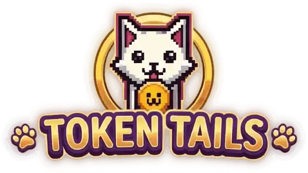

<p align="center">
  
</p>

<h1 align="center">Token Tails</h1>

<p align="center">
  A Web3 and AI pet universe where rescued cats become collectible companions, game characters,
  and portraits, and where play funds real shelters.
</p>

<p align="center">
  <a href="https://tokentails.com">Web</a> •
  <a href="https://play.google.com/store/apps/details?id=com.tokentails.app">Android</a> •
  <a href="https://apps.apple.com/lt/app/token-tails/id6745582489">iOS</a> •
  <a href="https://t.me/CatbassadorsBot/app">Telegram</a> •
  <a href="./docs/README.md">Documentation</a>
</p>

---

## What it is

Token Tails links three loops. Shelters register rescued cats, and AI turns each one into a
collectible character. Players collect, feed, stake, and play with those cats across pixel
platformers and a match-3 mode, earning $TAILS and catnip. Anyone can buy an AI portrait of their
own pet or a card pack, and purchases flow back to shelter partners. Ownership is recorded as NFTs
on Stellar.

## Repository

| Path | What | Stack |
|---|---|---|
| [`backend/`](backend/) | REST API: auth, cats, blessings, shelters, games, payments, AI generation, cron | NestJS 9, MongoDB, Stripe, Stellar SDK, OpenAI, Gemini |
| [`client/`](client/) | Website, game shell, portrait funnel, feed, marketplace; also the mobile web bundle and Telegram Mini App | Next.js 16, React 19, Phaser 4, Capacitor 7, Stellar Wallets Kit |
| [`cms/`](cms/) | Admin console for shelters and staff | Next.js 16, Firebase Auth, TinyMCE |
| [`contracts/`](contracts/) | Soroban NFT contracts (production), SKALE ERC-721s, faucets, archived prototypes | Rust, Solidity, Node |
| [`docs/`](docs/) | Project documentation | Markdown |
| [`extra/`](extra/) | Traction figures and the settlement rail proposal | Markdown |

## Quick start

```bash
# API
cd backend && cp .env.example .env && npm install && npm run dev        # :3005

# Website
cd client && npm install && npm run dev                                  # :3000, needs NEXT_PUBLIC_BE_URL

# Admin
cd cms && npm install && npx next dev --turbo -p 3001                    # :3001, needs NEXT_PUBLIC_BE_URL
```

Full setup, environment variables, and gotchas are in [docs/DEVELOPMENT.md](docs/DEVELOPMENT.md).

## Documentation

| Read this | When you need |
|---|---|
| [Architecture](docs/ARCHITECTURE.md) | The big picture: components, domain, auth, request flows |
| [Development](docs/DEVELOPMENT.md) | To run things locally |
| [Deployment](docs/DEPLOYMENT.md) | To ship the API, web apps, CDN assets, or store builds |
| [Backend](docs/BACKEND.md), [API](docs/API.md), [Data model](docs/DATA_MODEL.md) | Server internals, every endpoint, every collection |
| [Client](docs/CLIENT.md), [Games](docs/GAMES.md), [Mobile](docs/MOBILE.md) | The web app, the Phaser games, Capacitor builds |
| [CMS](docs/CMS.md) | The admin console |
| [Contracts](docs/CONTRACTS.md) | Chains, deployed addresses, faucets, licensing |
| [History](docs/HISTORY.md) | How the project got here |

## Highlights

- AI pipeline: OpenAI classifies a rescued cat's look and writes its story; Gemini paints its avatar and 4K themed pet portraits.
- Five game modes on Phaser 4, including an 80-level platformer and a 30-level match-3 with per-level leaderboards.
- Dual currency: $TAILS as soft currency, catnip as capped competitive score, plus an airdrop progression system.
- Payments through Stripe (Checkout and Payment Elements) and Stellar (XLM and USDC) with server-side verification.
- One codebase for web, iOS, Android, and Telegram.

## Traction

Figures and sources are in [extra/traction.md](extra/traction.md).

## License

This repository is commercially licensed. See [COMMERCIAL_LICENSE.md](COMMERCIAL_LICENSE.md).
The `contracts/` folder carries additional license files; see
[docs/CONTRACTS.md](docs/CONTRACTS.md#licensing).
