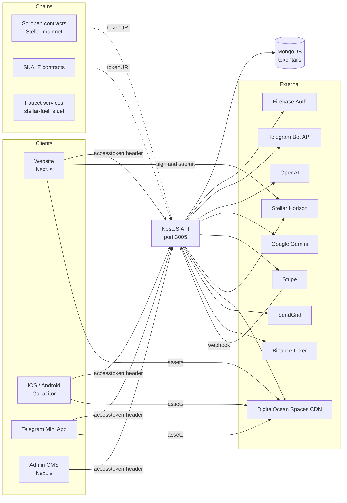

# Architecture

Token Tails is a monorepo with one backend, two web frontends, native mobile shells, and a set of
chain workspaces. This document describes how the pieces fit and where the boundaries are. Each
subsystem has its own deep-dive doc linked from [README.md](README.md).

## System context

## Components

| Component | Path | Runtime | Role |
|---|---|---|---|
| Backend API | `backend/` | NestJS 9, MongoDB | Single service for auth, cats, blessings, shelters, content, games, payments, AI generation, cron jobs |
| Client | `client/` | Next.js 16 | Public website, game shell, portrait funnel, feed, marketplace; also the web bundle for the mobile apps and the Telegram Mini App |
| Mobile shells | `client/android/`, `client/ios/` | Capacitor 7 | Native wrappers around the static export |
| Admin CMS | `cms/` | Next.js 16 | Shelter and staff operations console |
| Soroban contracts | `contracts/stellar/soroban-nft/` | Rust | Cat, Blessing, and Pass NFTs on Stellar mainnet |
| SKALE contracts | `contracts/evm/` | Solidity | Cat and Blessing ERC-721 on SKALE Nebula |
| Faucets | `contracts/stellar/stellar-fuel/`, `contracts/sfuel/` | Node, Express | Fund new player wallets with XLM or sFUEL |
| Archived | `contracts/motoko/`, `contracts/move/` | dfx, Aptos Move | Unused prototypes |

## Core domain

- **User**: identity from Firebase (email) or Telegram (id). Holds $TAILS, catnip, streak, boxes, monthly counters, airdrop claims, per-level game arrays, a custodial Stellar wallet, and a permission level from 1 (user) to 5 (admin).
- **Cat**: the collectible. Elemental type, tier, art URLs, owner, optional link to a blessing. Blueprint cats are templates; adopting clones one to the user.
- **Blessing**: a real rescued animal registered by a shelter. Creating one triggers OpenAI classification and story writing plus Gemini avatar generation, producing the linked cat.
- **Shelter**: partner organisation. Staff users are scoped to their shelter.
- **Order**: a purchase record whose `hash` is a Stellar transaction hash or a Stripe id.
- **Game**: an immutable score submission.

The full schema is in [DATA_MODEL.md](DATA_MODEL.md).

## Authentication

All clients send one lowercase header, `accesstoken`. A Firebase ID token is prefixed with `fb`;
anything else is treated as Telegram Mini App init data. The backend verifies with Firebase Admin
or the Telegram bot token, looks the user up, and creates them on first sight with a generated
Stellar keypair and a starter cat. Roles are enforced per endpoint with a numeric permission
guard. Clients only hide UI; the server is the authority.

## Request flows

### Playing a game

1. The client loads a Phaser scene behind `next/dynamic`.
2. The scene emits `GAME_STOP` on the window event bus with score, time, and level.
3. `GameContext` posts `{ type, points, score, time, level }` to `POST /user/catbassadors/live`.
4. The backend writes a `Game` row, caps the value, updates the per-level best with `$max`, recomputes catnip totals, and returns the snapshot.
5. The client patches the profile and invalidates leaderboard queries.

### Buying with Stripe

1. Client creates a PaymentIntent through `POST /web3/create-payment` (or a Checkout Session for portraits through `POST /image/create-checkout-session`).
2. Stripe.js confirms the payment in the browser.
3. Client calls `POST /web3/confirm-payment`; the backend checks the intent succeeded and belongs to the caller. For Checkout, the Stripe webhook at `POST /image/webhook` completes the order instead.
4. The backend creates a complete `Order`, increments spend counters, and grants a cat (pack roll or portrait-derived).

### Buying with Stellar

1. Client connects a wallet with the Stellar Wallets Kit, builds a payment to the Token Tails recipient account in XLM or USDC, signs in the wallet, and submits to Horizon.
2. Client sends only the transaction hash and order details to `POST /web3/confirm`.
3. The backend loads the transaction from Horizon, confirms a payment operation exists, and grants the item.

### Registering a rescued cat

1. Shelter staff create a blessing in the CMS with a photo.
2. The backend uploads the photo to Spaces as WebP, asks OpenAI to classify the cat and write a story, asks Gemini for an avatar, and creates the cat document.
3. The cat appears in the shelter scene and the marketplace for adoption.

### AI portrait

1. Visitor uploads a photo on `/portrait` with a style.
2. `POST /image/portrait` runs Gemini synchronously and stores the result.
3. The client polls `GET /image/:id`, shows the preview, and offers digital, print, or canvas purchases through Stripe Checkout.
4. The webhook completes the order, emails the buyer through SendGrid, and creates a blessing and cat from the portrait.

## Chains

Stellar is the production chain. Cat, Blessing, and Pass NFTs are Soroban contracts whose token
URIs point at the backend metadata endpoints. SKALE Nebula has ERC-721 deployments of Cat and
Blessing from an earlier phase. The minting call site is not in this repository: the backend
serves metadata and verifies payments but never invokes a contract. See
[CONTRACTS.md](CONTRACTS.md).

## Assets and CDN

Uploaded images and generated art live in a DigitalOcean Space in Frankfurt and are served through
its CDN. The client's `public/` folder is mirrored to the `w/` prefix of the same Space by the
GitLab pipeline on every push to `main`, and `cdnFile()` resolves to the CDN in production and to
local files otherwise. Cat sprites and card art live under an `assets/` prefix on the CDN.

## Environments

| Concern | Switch |
|---|---|
| Backend Stellar network and Telegram bot | `IS_PROD` |
| Client Stellar network and CDN | `NEXT_PUBLIC_IS_PROD` |
| Client app build | `NEXT_PUBLIC_IS_APP` |
| Backend CORS origins | `FRONT_END_URLS` plus hardcoded localhost, Capacitor, and production domains |

Known origins: `tokentails.com`, `cats.tokentails.com`, `test.tokentails.com`, and the API at
`api.tokentails.com`.

## Cross-cutting concerns

- **In-process state**: traction counters and the Paw Match leaderboard cache live in memory on the API and diverge across replicas.
- **Synchronous AI**: portrait and blessing generation run inside the request. There is no job queue.
- **Client-supplied prices**: all payment flows take the amount from the client; see the backend known issues.
- **Duplicated domain code**: caps and reward constants are mirrored between backend and client, and models are duplicated inside the CMS.
- **Testing**: no backend tests, two real client suites, eight CMS suites, 34 Rust tests for Soroban.

## About the settlement rail note

`extra/architecture.md` describes a "Token Tails Settlement Rail": a Stellar-native settlement
and disbursement backend for a family of cat-care iOS apps (CatWatch, CatHealth, CatFood, CatMeds,
CatFind) using the Stellar Disbursement Platform and Bridge. That document is a proposal for a
grant track. Its stack (Vite, Zustand, RevenueCat, port 3006, feature modules) does not match the
code in this repository. Treat it as a roadmap, not a description of the current system. The app family is no longer
shown on the landing page; it lives only in `extra/architecture.md` and the roadmap notes in
[HISTORY.md](HISTORY.md).
