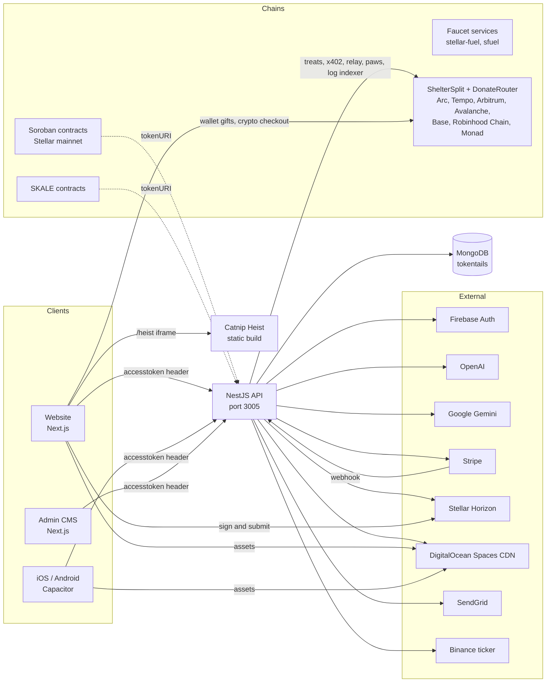

# Architecture

Token Tails is a monorepo with one backend, two web frontends, native mobile shells, and a set of
chain workspaces. This document describes how the pieces fit and where the boundaries are. Each
subsystem has its own deep-dive doc linked from [README.md](README.md).

## System context

```mermaid
flowchart LR
    subgraph Clients
        Web[Website<br/>Next.js]
        App[iOS / Android<br/>Capacitor]
        CMS[Admin CMS<br/>Next.js]
    end

    API[NestJS API<br/>port 3005]
    DB[(MongoDB<br/>tokentails)]

    subgraph External
        FB[Firebase Auth]
        OAI[OpenAI]
        GEM[Google Gemini]
        STR[Stripe]
        HOR[Stellar Horizon]
        SP[DigitalOcean Spaces CDN]
        SG[SendGrid]
        BIN[Binance ticker]
    end

    subgraph Chains
        SOR[Soroban contracts<br/>Stellar mainnet]
        SK[SKALE contracts]
        FUEL[Faucet services<br/>stellar-fuel, sfuel]
        ARC[ShelterSplit + DonateRouter<br/>Arc, Tempo, Arbitrum, Avalanche,<br/>Base, Robinhood Chain, Monad]
    end

    Web & App & CMS -->|accesstoken header| API
    API --> DB
    API --> FB & OAI & GEM & STR & HOR & SP & SG & BIN
    STR -->|webhook| API
    Web -->|sign and submit| HOR
    SOR -.->|tokenURI| API
    SK -.->|tokenURI| API
    Web & App -->|assets| SP
    API -->|treats, x402, relay, paws, log indexer| ARC
    Web -->|wallet gifts, crypto checkout| ARC
    Web -->|/heist iframe| HEIST[Catnip Heist<br/>static build]
```

## Components

| Component | Path | Runtime | Role |
|---|---|---|---|
| Backend API | `backend/` | NestJS 9, MongoDB | Single service for auth, cats, blessings, shelters, content, games, payments, AI generation, cron jobs |
| Client | `client/` | Next.js 16 | Public website, game shell, `/impact` proof page, Heist host, portrait funnel, feed, marketplace; also the web bundle for the mobile apps |
| Catnip Heist | `catnip-heist/` | three.js, Vite | Standalone 3D stealth game; built into `client/public/heist-game/` and hosted on `/heist`; its simulation is vendored into the backend for replay verification |
| Shared contracts | `shared/` | TypeScript | Enums, error codes, caps, storefront parser, Heist bridge, copy, names, analytics core; generated into every package by `scripts/sync-contracts.mjs` |
| Copy lint | `tools/copy-lint/` | Node | Tone and claims lint over client, Heist, backend and CMS copy (CLAIMS.md) |
| Facts registry | `funding/framework/facts/` (private funding checkout, not in this repo) | JSON + Node | Every public claim with its source, generated into the client, backend and Heist |
| Mobile shells | `client/android/`, `client/ios/` | Capacitor 7 | Native wrappers around the static export |
| Admin CMS | `cms/` | Next.js 16 | Shelter and staff operations console |
| Soroban contracts | `contracts/stellar/soroban-nft/` | Rust | Cat, Blessing, and Pass NFTs on Stellar mainnet |
| SKALE contracts | `contracts/evm/` | Solidity | Cat and Blessing ERC-721 on SKALE Nebula |
| Faucets | `contracts/stellar/stellar-fuel/`, `contracts/sfuel/` | Node, Express | Fund new player wallets with XLM or sFUEL |
| Shelter payout contracts | `contracts/shelter-split/` | Solidity 0.8.24, Foundry | ShelterSplit (payout split) and DonateRouter (one-signature gifts). Recorded on the seven testnets in `deployments.json` and `router-deployments.json`; no mainnet split is recorded yet (see "Shelter payout chains") |
| Shelter rail SDK | `shelter-rail/` | Plain JS, MIT | Donate SDK, drop-in widget and x402 agent client for the same chains; the widget is copied to `client/public/rail/` |
| Archived | `contracts/motoko/`, `contracts/move/` | dfx, Aptos Move | Unused prototypes |

## Core domain

- **User**: identity from Firebase, resolved by uid (`firebaseUids`), with verified-email binding for legacy accounts. A user is a registered account or an anonymous guest (`isGuest`). Holds Tails (rescue points: spendable `tails`, lifetime `tailsEarned`, `tailsGiven`), catnip, streak, boxes, monthly counters, progression claims, per-level game arrays and cleared flags, Heist progress, a custodial Stellar wallet, and a permission level from 1 (user) to 5 (admin).
- **Cat**: the collectible. Elemental type, tier, art URLs, owner, optional link to a blessing. Blueprint cats are templates; adopting clones one to the user.
- **Blessing**: a real rescued animal registered by a shelter. Creating one triggers OpenAI classification and story writing plus Gemini avatar generation, producing the linked cat.
- **Shelter**: partner organisation. Staff users are scoped to their shelter.
- **Order**: a purchase record whose `hash` is a Stellar transaction hash, a Stripe id, or `evm:<chainId>:<txHash>` for the crypto checkout.
- **Game**: an immutable score submission (Heist rows carry a `replayDigest`).
- **Impact**: payout events indexed from the ShelterSplit contracts (and DonateRouter gifts) on the main chain and every recorded chain of the same network, treats (`shelterdonations`), paws, attested off-chain payouts, shelter outcomes and an hourly public snapshot.
- **Rescue Goal**: a funded shelter need that players give Tails to.

The full schema is in [DATA_MODEL.md](DATA_MODEL.md).

## Authentication

All clients send one lowercase header, `accesstoken`. A Firebase ID token is prefixed with `fb`;
any other token is rejected with 401. Visitors to `/game` get a silent anonymous Firebase session
(a guest); the token is a Firebase token like any other. `AppAuthGuard` verifies it with Firebase
Admin and resolves the user by uid first, then by a verified email (an unverified token never binds
to an existing account). A new verified identity is created with a generated Stellar keypair and a
starter cat; a guest document is created only by `POST /user/guest/session`. Guests may call only the
routes on the guest allow-list (play, save, feed, Meet your cat, previews); everything else answers
403 `GUEST_FORBIDDEN`, and the client then opens the sign-in sheet. Signing in links the anonymous
user (the guest is promoted in place) or merges the guest into the existing account. Roles are
enforced per endpoint with a numeric permission guard. Clients only hide UI; the server is the
authority. Details: BACKEND.md, "Authentication".

## Request flows

### Playing a game

1. The client loads a Phaser scene behind `next/dynamic`. The scene spawns frozen behind a RunGate; the first input sends `RUN_BEGIN`.
2. The scene emits `GAME_STOP` on the window event bus with score, time, level and `outcome`.
3. `GameContext` applies the save policy and posts `{ type, points, score, time, level, outcome }` to `POST /user/catbassadors/live`, the only score writer.
4. The backend validates the type, level and cap, writes a `Game` row, updates the per-level best with `$max`, marks the level cleared on a win, recomputes catnip totals, and returns the snapshot.
5. The client patches the profile and invalidates leaderboard queries.

### Playing Catnip Heist

1. `/heist` hosts the static Heist build in an iframe and connects to it through the bridge (`shared/heist-bridge.ts`).
2. A won run sends `run-complete` with its input log; the host posts `{type: 'CATNIP_HEIST', replay}` to `/live` (or queues it on the device when there is no Firebase user).
3. The backend re-simulates the log with the vendored sim, refuses duplicates by digest, writes a `Game` row with the server score and updates `heistScore` and `heistStars`. No catnip, caps, loot or lives are involved.

### Public impact numbers

1. A leased job indexes ShelterSplit payout logs and DonateRouter gifts every 5 minutes, with one cursor per chain and contract: the main chain (`SHELTER_CHAIN_ID`) and every chain in `wallet.config.ts` with a recorded split, of the main chain's network class only, so test money never sums with real money. EURC, mUSDC and gas coins stay under their own symbols, out of the USD totals. Treats, paws, attested payouts and outcomes are written by their own flows.
2. An hourly job builds the impact snapshot from MongoDB and the chain cursors and stores it (and optionally mirrors `impact.json` to the CDN).
3. The landing, `/impact` and `/stats` read the snapshot: CDN first, then `GET /impact`, then the bundled baseline; app builds read the committed baseline. Every number is a claim with a registry id (CLAIMS.md).

### Buying with Stripe

1. Client creates a PaymentIntent through `POST /web3/create-payment` (or a Checkout Session for portraits through `POST /image/create-checkout-session`).
2. Stripe.js confirms the payment in the browser.
3. Client calls `POST /web3/confirm-payment`; the backend checks the intent belongs to the caller, succeeded, and covers the server price, and claims the intent id once so a replay grants nothing. For Checkout, the Stripe webhook at `POST /image/webhook` completes the order instead.
4. The backend creates a complete `Order`, increments spend counters, and grants a cat (pack roll or portrait-derived).

### Buying with Stellar

1. Client connects a wallet with the Stellar Wallets Kit, builds a payment to the Token Tails recipient account in XLM or USDC, signs in the wallet, and submits to Horizon.
2. Client sends only the transaction hash and order details to `POST /web3/confirm`.
3. The backend loads the transaction from Horizon, checks it paid the treasury at least the server price in the order's asset under its canonical (outer) hash, and grants the item.

Packs are no longer sold on this path (since 2026-10-04): the client does not offer them, and a pack
payment that still arrives is verified, granted if paid before `STELLAR_PACKS_SUNSET_AT`, else recorded
for a refund (410 `STELLAR_PACKS_DEPRECATED`). Portraits and loot boxes are still sold here.

### Buying with USDC or EURC (crypto checkout)

1. Client creates an order through `POST /payments/crypto/orders` for a pack, a loot box or one shelter cat; the server prices it and lists every accepted chain and token with the exact amount, the recipient and ready-to-send transactions. Accepted on mainnet: USDC on Arc, Base, Arbitrum, Avalanche and Monad, USDC.e on Tempo, USDG on Robinhood Chain, and EURC on Arc, Base and Avalanche (`backend/src/payments/crypto/crypto-chains.ts`). Native coins are never accepted.
2. The buyer pays from their own wallet: a token transfer to the Token Tails treasury (bound to the order by a unique amount, or a TIP-20 memo on Tempo), or, for a shelter cat after the shelter's key handover, straight into the shelter's ShelterSplit with the order memo.
3. Client sends `{chainId, txHash}` to `POST /payments/crypto/orders/:orderId/confirm`; the backend reads the receipt over RPC, checks token contract, recipient, amount or memo, confirmations and expiry, creates the `Order` keyed on the transaction hash and grants once. Details: BACKEND.md "Payments".

### Registering a rescued cat

1. Shelter staff create a blessing in the CMS with a photo.
2. The backend uploads the photo to Spaces as WebP, asks OpenAI to classify the cat and write a story, asks Gemini for an avatar, and creates the cat document.
3. The cat appears in the shelter scene and the marketplace for adoption.

### AI portrait

1. Visitor uploads a photo on `/portrait` with a style.
2. `POST /image/portrait` runs Gemini synchronously and stores the result.
3. The client polls `GET /image/:id`, shows the preview, and offers digital, print, or canvas purchases through Stripe Checkout.
4. The webhook completes the order, emails the buyer through SendGrid, and creates a blessing and cat from the portrait.

## Chains

Stellar is the production chain. Cat, Blessing, and Pass NFTs are Soroban contracts whose token
URIs point at the backend metadata endpoints. SKALE Nebula has ERC-721 deployments of Cat and
Blessing from an earlier phase. The NFT minting call site is not in this repository: the backend
serves NFT metadata and verifies payments but never invokes an NFT contract. See
[CONTRACTS.md](CONTRACTS.md).

### Shelter payout chains

Shelter giving runs on seven EVM chains, each with a mainnet and a testnet: Arc, Tempo, Arbitrum,
Avalanche, Base, Robinhood Chain (USDG) and Monad. Each chain has a ShelterSplit (EURC has its own
instance on Arc, and on Avalanche Fuji among the testnets) and, except on Tempo and Robinhood Chain, a DonateRouter for one-signature gifts.

- **Records.** The deploy wave (private funding checkout, see DEVELOPMENT.md) writes
  `funding/framework/tracks/a-build/deployments.json` and `router-deployments.json`. `fund a:ingest` (or `fund a:backend-deployments`) turns them into the
  public config `backend/src/shelter/onchain/wallet.config.ts` and the client and Heist lists
  (`client/public/shelter-payouts/deployments.json`, `testnet-deployments.json`). Today only the
  testnets are recorded; every mainnet `split` is `null` until the mainnet wave runs.
- **Backend env.** The backend needs only `SHELTER_CHAIN_ID` (default Arc mainnet, 5042) and
  `SHELTER_DONATE_PRIVATE_KEY` (the hot wallet). Splits, routers, RPCs and the treasury come from
  `wallet.config.ts`. Sponsored treats and the x402 agent card are on by default on the main chain and
  on every `wallet.config.ts` chain of the same network class, each health-checked and shown disabled
  with its reason. The `SHELTER_*` overrides and emergency offs are listed in BACKEND.md.
- **Mainnet gate.** On a mainnet, the relay, the match and the `onchain-receipt` x402 open per chain
  only after the shelter's claim is verified on chain (`publicGivingVerified`: every payee of the split
  is a rotated claim for that chain, signed with the v1 or the v2 multi-chain message, and none is a
  wallet Token Tails holds). Testnets are always open.
- **Client.** The give page's treat chain picker, the wallet giving picker, the crypto checkout, the
  impact numbers, the Heist payouts modal (with its separate "Testnet proof" section) and the
  `shelter-rail` SDK and widget all cover the same seven chains.
- **Mainnet wave.** One wallet funds everything: `fund a:mainnet-plan --network mainnet` writes
  `wave/mainnet-all.sh`, which a person runs with `CONFIRM_MAINNET=yes` (it refuses inside an AI agent
  session). Amounts are in `funding-plan.json`; the steps are in
  `funding/framework/tracks/a-build/README.md`.

## Assets and CDN

Uploaded images and generated art live in a DigitalOcean Space in Frankfurt and are served through
its CDN. The client's `public/` folder is mirrored to the `w/` prefix of the same Space by the GitHub
Actions workflow `.github/workflows/cdn-sync.yml` on pushes to `main` that touch `client/public/**`,
once its repository secrets exist (the old GitLab job never ran from the GitHub remote and is
deprecated). `cdnFile()` resolves to the CDN in production and to local files otherwise. Cat sprites
and card art live under an `assets/` prefix on the CDN. New art for this build (catnip sprigs, night
skins, plates, posters, icons, the share card) is served from the app origin, so it works before the
CDN sync runs. New art gets versioned file names; old files are never deleted, because installed
native builds still load them.

## Environments

| Concern | Switch |
|---|---|
| Backend Stellar network | `IS_PROD` |
| Client Stellar network and CDN | `NEXT_PUBLIC_IS_PROD` |
| Client app build | `NEXT_PUBLIC_IS_APP` |
| Look version | `public/look/manifest.json` `lookVersion`, with a per-device `localStorage` override |
| Shelter payout network | `SHELTER_CHAIN_ID` (backend; a testnet id serves the testnets, a mainnet id the mainnets) |
| Feature flags | `NEXT_PUBLIC_HEIST_PICKER` (on unless `0`, `false`, `no` or `off`), `NEXT_PUBLIC_HEIST_LANDING_PILL`, `NEXT_PUBLIC_WALLET_DONATE`, `NEXT_PUBLIC_FIREBASE_AUTH_DOMAIN_PROXY` (client); `TAILS_TOKEN_MODE`, `AUTH_ENFORCE_EMAIL_VERIFIED`, `APP_CHECK_ENFORCE`, `IMPACT_JOBS_ENABLED`, `PAWS_SETTLEMENT_ENABLED` (backend) |
| Backend CORS origins | `FRONT_END_URLS` plus hardcoded localhost, Capacitor, and production domains |

Known origins: `tokentails.com`, `cats.tokentails.com`, `test.tokentails.com`, and the API at
`api.tokentails.com`.

## Cross-cutting concerns

- **In-process state**: traction counters, the storefront, featured and Paw Match leaderboard caches live in memory on the API and diverge across replicas (known issue, kept). Public numbers no longer read the counters: the landing, `/impact` and `/stats` read the Mongo-backed impact snapshot (plan F7). Cron jobs take a lease in `jobruns`, so they run once per tick across replicas.
- **Resilience**: error boundaries at root, page, scene, modal and section level, a Phaser crash guard and scrubbed, consent-gated crash telemetry. See [RESILIENCE.md](RESILIENCE.md).
- **Synchronous AI**: portrait and blessing generation run inside the request. There is no job queue.
- **Client-supplied prices**: fixed. Stripe Checkout, Stripe PaymentIntents and Stellar all verify against the server price table, and spend and affiliate counters use the verified amount; see the backend known issues.
- **Duplicated domain code**: enums, error codes, caps and reward constants are generated from `shared/` into every package (`scripts/sync-contracts.mjs --check` in CI); the remaining hand-kept copies are listed in DEVELOPMENT.md.
- **Testing**: backend jest specs (`npm test`, mocked Mongoose, opt-in real-MongoDB specs), client, CMS and Heist suites (jest and vitest), Playwright end-to-end suites for the client and the Heist, the funding framework tests, 34 Rust tests for Soroban, Foundry tests for ShelterSplit and DonateRouter, and the `shelter-rail` tests. GitHub Actions (`.github/workflows/ci.yml`) runs the backend, client (with its Playwright suite), CMS, Heist vitest and funding framework tests; the Heist Playwright suite, Rust, Foundry and `shelter-rail` tests run locally only.

## About the settlement rail note

`extra/architecture.md` describes a "Token Tails Settlement Rail": a Stellar-native settlement
and disbursement backend for a family of cat-care iOS apps (CatWatch, CatHealth, CatFood, CatMeds,
CatFind) using the Stellar Disbursement Platform and Bridge. That document is a proposal for a
grant track. Its stack (Vite, Zustand, RevenueCat, port 3006, feature modules) does not match the
code in this repository. Treat it as a roadmap, not a description of the current system. The app family is no longer
shown on the landing page; it lives only in `extra/architecture.md` and the roadmap notes in
[HISTORY.md](HISTORY.md).
