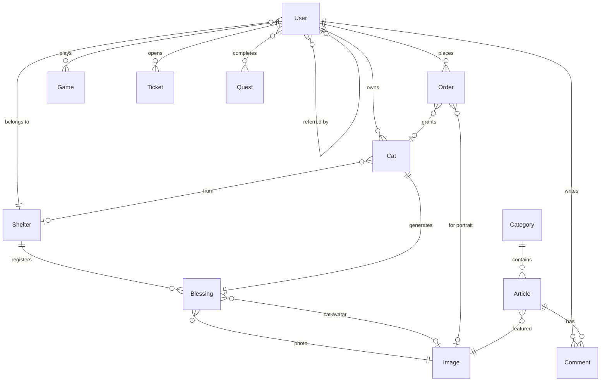

# Data Model

MongoDB database `tokentails`. Every schema extends the shared base (`_id`, `createdAt`,
`updatedAt`) and uses Mongoose timestamps plus `mongoose-unique-validator`. Collection names are
Mongoose defaults: the lower-cased plural of the class name. Schema files live next to their
domain folder in `backend/src/<domain>/<domain>.schema.ts`.

## Entity relationships

## users

Identity and profile:

| Field | Type | Notes |
|---|---|---|
| `name` | string, required | |
| `email` | string | Firebase users |
| `telegramId`, `telegramUsername` | string | Telegram users |
| `twitter`, `discord` | string | Set by the user for giveaways |
| `discount` | string | Affiliate code owned by this user |
| `permission` | number | 1 user, 2 moderator, 3 editor, 4 manager, 5 admin. Default 1 |
| `shelter` | ref Shelter | Scopes what shelter staff see |
| `cat` | ref Cat | Active cat |
| `cats` | ref Cat[] | Owned cats |
| `referrals`, `referredBy` | ref User[], ref User | |
| `wallets` | object | `stellar.walletAddress` and an encrypted `walletPrivateKey { iv, content }` |
| `likes` | `{ entity, type }[]` | |
| `interactedAt` | Date | |

Economy and progression:

| Field | Type | Notes |
|---|---|---|
| `tails` | number | Soft currency |
| `affiliated` | number | Affiliate earnings in USD |
| `spent` | number | Lifetime spend in USD |
| `boxes` | number | Loot boxes held |
| `streak` | number | Daily check-in streak |
| `canRedeemLives` | boolean | Reset to true nightly |
| `codex` | number[] | Monthly $TAILS guard phases earned |
| `quests` | (string \| ref Quest)[] | Completed quest keys and ids |
| `catnipCount` | number | Derived: capped sum of Catnip Chaos and Paw Match catnip |
| `catnipChaos`, `catnipChaosCount` | number[], number | Per-level best catnip for 97 levels |
| `seasonEvent`, `seasonEventCount` | number[], number | Per-level best for the 14-level Pixel Rescue event |
| `match3`, `match3Count` | number[], number | Per-level catnip earned in Paw Match |
| `match3Score`, `match3ScoreCount` | number[], number | Per-level raw Paw Match score |
| `referralsCount` | number | |
| `portraitPurchases` | number | |
| `airdropRewardsClaimed`, `airdropChallengesClaimed`, `airdropMilestonesClaimed` | string[] | Claim idempotency |
| `monthTails`, `monthCatsAdopted`, `monthBoxes`, `monthSpent`, `monthFeeded`, `monthStreak`, `monthReferrals`, `monthTailsCrafted`, `monthPacks`, `monthPortraitPurchases` | number | Monthly counters reset by cron |

Indexes: `email`, `likes`, `shelter`, `cat`, `twitter`, `spent`, `discount`, `telegramId`,
`createdAt` descending, `tails`, `catnipCount`, `canRedeemLives`.

## cats

| Field | Type | Notes |
|---|---|---|
| `name` | string, required | |
| `type` | enum, required | `ICE`, `ELECTRIC`, `FIRE`, `WIND`, `DARK`, `WATER`, `GRASS`, `SAND`, `FAIRY`, `STELLAR` |
| `tier` | enum, required | `COMMON`, `RARE`, `EPIC`, `LEGENDARY` |
| `packType` | enum | `STARTER`, `INFLUENCER`, `LEGENDARY` when granted from a pack |
| `isBlueprint` | boolean | Template cats shown in the store. Default false |
| `packed` | boolean | True until the owner opens the pack |
| `resqueStory` | string | AI-written rescue story |
| `spriteImg`, `catImg` | string, required | CDN URLs for in-game sprite and card art |
| `staked` | Date | Unlock time when staked |
| `status` | `{ EAT: number }` | 0 to 4 |
| `tokenId` | number | On-chain token id |
| `token` | `{ stellar?, sei? }` | Chain-specific mint references |
| `owner` | ref User | |
| `blessing` | ref Blessing | |
| `shelter` | ref Shelter | |

Indexes: `tokenId`, `nftId` (stale, field removed), `name`, `packed`, `updatedAt` descending,
`isBlueprint`, compound `{ blessing, owner }`.

The schema file also defines `CatOriginType` (22 breed looks) and `EmoteType` (10 emotes) used to
build CDN asset paths.

## blessings

A rescued animal registered by a shelter.

| Field | Type | Notes |
|---|---|---|
| `name`, `description` | string, required | |
| `status` | enum, required | `WAITING`, `RECOVERING`, `ADOPTED`, `HEAVEN` |
| `instagram` | string | |
| `tokenId` | number | |
| `token` | `{ stellar?, evm? }` | |
| `image` | ref Image, required | Photo of the animal |
| `savior` | ref Image | Adopter photo |
| `catAvatar` | ref Image | Gemini-generated avatar |
| `creator` | ref User | |
| `cat` | ref Cat | The generated collectible |
| `shelter` | ref Shelter | |

Indexes: `shelter`, `nftId` (stale).

## shelters

| Field | Type | Notes |
|---|---|---|
| `name`, `slug`, `description`, `address` | string, required | |
| `country`, `website`, `facebook`, `twitter`, `tiktok` | string | |
| `foundedAt` | Date, required | |
| `image` | ref Image, required | Logo |
| `blessing` | ref Blessing[] | |
| `users` | ref User[] | Staff accounts |
| `wallets` | object | Generated Stellar wallet |

Index: `name`.

## images

| Field | Type | Notes |
|---|---|---|
| `url` | string, required | Spaces CDN URL of the uploaded WebP |
| `aiUrl` | string | Generated portrait URL |
| `style` | enum | `highness`, `monarch`, `aristocrat`, `commander` |
| `title`, `name`, `caption` | string | |
| `isTemporary` | boolean | Default false |

Index: `createdAt`.

## orders

| Field | Type | Notes |
|---|---|---|
| `status` | enum, required | `COMPLETE`, `PENDING`, `LOCKED`, `FAILED` |
| `hash` | string, required | Stellar transaction hash, Stripe session id, or PaymentIntent id |
| `chainType` | enum | `STELLAR`, `FIAT` |
| `currencyType` | enum | `USDT`, `USDC`, `XLM`, `USD` |
| `price` | number, required | In `currencyType` units |
| `priceUsd` | number | |
| `walletAddress` | string | |
| `discount` | string | Code used |
| `id` | ObjectId or string | Overloaded: holds a `PackType` or a `ProductType` |
| `ref` | string | |
| `entityType` | enum, required | `PACK`, `IMAGE`, and so on |
| `cat`, `image`, `user` | refs | |

Indexes: `chainType`, `entityType`, `price`, `status`, `ref`, `id`, `image`, compound
`{ user, entityType, status }`.

## games

Immutable log of every submitted game result.

| Field | Type | Notes |
|---|---|---|
| `type` | enum, required | `SHELTER`, `HOME`, `PURRQUEST`, `CATBASSADORS`, `CATNIP_CHAOS`, `PIXEL_RESCUE`, `MATCH_3` |
| `points` | number | Catnip earned |
| `score` | number | Raw score (Paw Match) |
| `time` | number | |
| `level` | string | Level key |
| `user`, `cat` | refs | |

Indexes: `user`, `cat`, compound `{ type, score }`.

The same file holds the level tables and caps: 97 Catnip Chaos levels, 14 season event levels,
30 Paw Match levels, per-level catnip caps, and the global caps used to filter leaderboards.

## quests

| Field | Type | Notes |
|---|---|---|
| `name` | string, required, unique | |
| `link` | string, required | |
| `tails` | number | Reward |
| `image` | ref Image, required | |
| `users` | ref User[] | Completers |

No slug field, although the delete route filters on one.

## tickets

| Field | Type |
|---|---|
| `message` | string, required |
| `answer` | string |
| `user` | ref User |

Indexes: `user`, `answer`.

## articles, categories, comments

**articles**: `title` (unique), `slug` (unique), `content`, `excerpt`, `isDisabled`,
`featuredImage` ref, `images` refs, `category` ref, `user` ref, `likes` refs, `comments` refs.
Indexes on `{ slug, createdAt }`, `category`, `content`, `isDisabled`.

**categories**: `name` (unique), `slug` (unique), `description`, `image` ref, `articles` refs,
`articlesCount`. Also `quizes` and `quizesCount`, which reference a model that does not exist.
Index on `{ slug, articlesCount }`.

**comments**: `text` (unique, which prevents identical comments anywhere), `user` ref, `likes`
refs, `likesCount`, `entity` (polymorphic ObjectId), `type` (`EntityType`), `comments` refs for
replies.

## changelog

Written by `migrate-mongo`. See the migrations section of [BACKEND.md](BACKEND.md).
