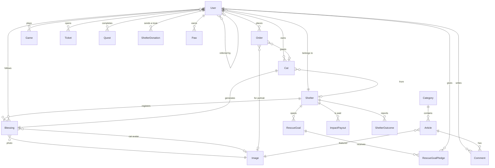

# Data Model

MongoDB database `tokentails`. Every schema extends the shared base (`_id`, `createdAt`,
`updatedAt`) and uses Mongoose timestamps plus `mongoose-unique-validator`. Collection names are
Mongoose defaults: the lower-cased plural of the class name. Schema files live next to their
domain folder in `backend/src/<domain>/<domain>.schema.ts`.

## Entity relationships

```mermaid
erDiagram
    User ||--o{ Cat : owns
    User }o--|| Shelter : "belongs to"
    User ||--o{ Order : places
    User ||--o{ Game : plays
    User ||--o{ Ticket : opens
    User ||--o{ Comment : writes
    User }o--o{ Quest : completes
    User }o--o| User : "referred by"
    Shelter ||--o{ Blessing : registers
    Blessing ||--|| Cat : "generates"
    Blessing }o--|| Image : photo
    Blessing }o--o| Image : "cat avatar"
    Cat }o--o| Shelter : from
    Order }o--o| Cat : grants
    Order }o--o| Image : "for portrait"
    Category ||--o{ Article : contains
    Article }o--|| Image : "featured"
    Article ||--o{ Comment : has
    User }o--o{ Blessing : follows
    Shelter ||--o{ RescueGoal : "opens"
    RescueGoal ||--o{ RescueGoalPledge : receives
    User ||--o{ RescueGoalPledge : gives
    User ||--o{ ShelterDonation : "sends a treat"
    User ||--o{ Paw : earns
    Shelter ||--o{ ImpactPayout : "is paid"
    Shelter ||--o{ ShelterOutcome : reports
```

## users

Identity and profile:

| Field | Type | Notes |
|---|---|---|
| `name` | string, required | |
| `email` | string | Firebase users. Lowercased and trimmed on every write since plan F5 |
| `emailCanonical` | string | Gmail and googlemail dots and `+tag` removed, for abuse checks (aliases count as one inbox); unset on deletion |
| `emailVerifiedAt` | Date | When a verified token was last seen |
| `firebaseUids` | string[] | Firebase uids bound to this account (uid-first resolution). Absent on legacy documents until `backfill-firebase-uid.ts` |
| `isGuest` | boolean | `false` written explicitly for registered users; `true` for an anonymous guest |
| `pendingTails` | number | A guest's Tails, credited on promotion or merge, capped at 2,000 for life |
| `guestMergedTails`, `lastGuestMergeAt`, `mergedGuestIds` | number, Date, ref User[] | Merge accounting (one merge per 30 days) |
| `mergedInto`, `mergeState` | ref User, string | Set on a guest while it is merged into an account |
| `promotedAt`, `promotionUnnotified` | Date, boolean | Guest promoted to an account; the one-shot `promotedNow` notice |
| `lastSeenAt` | Date | Written at most daily; drives the 30-day guest cleanup |
| `lastPlayedAt` | Date | Set by `/live` on every save; feeds `active30d` |
| `onboarding` | `{ state: 'pending' \| 'done', starterChosenAt?, skipped?, version? }` | Meet your cat |
| `following` | ref Blessing[] | Followed rescue cats, at most 50 |
| `deletedAt` | Date | Anonymised by `DELETE /user/me` |
| `boardExcludedAt`, `boardExcludedReason` | Date, `'staking-abuse'` | Off every board (decision #35) |
| `twitter`, `discord` | string | Set by the user for giveaways |
| `discount` | string | Affiliate code owned by this user |
| `permission` | number | 1 user, 2 moderator, 3 editor, 4 manager, 5 admin. Default 1 |
| `shelter` | ref Shelter | Scopes what shelter staff see |
| `cat` | ref Cat | Active cat |
| `cats` | ref Cat[] | Owned cats |
| `referrals`, `referredBy` | ref User[], ref User | |
| `wallets` | object | `stellar.walletAddress` and an encrypted `walletPrivateKey { iv, content }` |
| `likes` | `{ entity, type }[]` | |
| `interactedAt` | Date | |

Economy and progression:

| Field | Type | Notes |
|---|---|---|
| `tails` | number | Spendable Tails (rescue points). Never decremented except by a give |
| `tailsEarned` | number | Lifetime Tails earned, never decremented; ranks and tiers read it (`backfill-tails-earned.js` for legacy documents) |
| `tailsGiven`, `goalsHelped` | number | Tails given to Rescue Goals; goals helped |
| `affiliated` | number | Affiliate earnings in USD |
| `spent` | number | Lifetime spend in USD (legacy values are inflated, see BACKEND.md) |
| `spentUsd` | number | Verified USD spend only, written at the payment sites |
| `spentUsdLegacyAt` | Date | Guard for the legacy estimate written by `backfill-spent-usd.js` into `spentUsdLegacy` (not declared in the schema yet); `spentUsdSource` is declared but unused |
| `boxes` | number | Loot boxes held |
| `streak` | number | Daily check-in streak |
| `canRedeemLives` | boolean | Reset to true nightly |
| `codex` | number[] | Monthly $TAILS guard phases earned |
| `quests` | (string \| ref Quest)[] | Completed quest keys and ids |
| `catnipCount` | number | Derived: capped sum of Catnip Chaos and Paw Match catnip |
| `catnipChaos`, `catnipChaosCount` | number[], number | Per-level best catnip for 97 levels |
| `seasonEvent`, `seasonEventCount` | number[], number | Per-level best for the 14-level Pixel Rescue event |
| `match3`, `match3Count` | number[], number | Per-level catnip earned in Paw Match |
| `match3Score`, `match3ScoreCount` | number[], number | Per-level raw Paw Match score |
| `catnipChaosCleared`, `seasonEventCleared`, `match3Cleared` | number[] (0 or 1) | Server cleared state (decision #67), set by a `won` `/live` save; never for Purrsuit `01`. Missing reads as zeros; the grandfather migration fills them from best scores |
| `heistScore` | number[8] | Best server-verified Catnip Heist score per level |
| `heistStars` | number[8] | Star bit mask per Heist level (OR-ed) |
| `referralsCount` | number | |
| `portraitPurchases` | number | |
| `airdropRewardsClaimed`, `airdropChallengesClaimed`, `airdropMilestonesClaimed` | string[] | Claim idempotency |
| `monthTails`, `monthCatsAdopted`, `monthBoxes`, `monthSpent`, `monthFeeded`, `monthStreak`, `monthReferrals`, `monthTailsCrafted`, `monthPacks`, `monthPortraitPurchases`, `monthTailsGiven`, `monthGoalsHelped` | number | Monthly counters reset by the codex cron (`monthSpent` is not in the reset list: it is a lifetime figure today) |

Indexes: `email`, `firebaseUids` (non-unique multikey lookup), `likes`, `shelter`, `cat`, `twitter`,
`spent`, `discount`, `createdAt` descending, `tails`, `catnipCount`, `canRedeemLives`; partial board
indexes `board_tails`, `board_catnip`, `board_tails_earned`, `board_tails_given`,
`board_month_tails_given` (all on `isGuest: false`) and guest indexes `guest_idle` (`lastSeenAt`) and
`guest_merge` (`mergedInto`), both on `isGuest: true`. Built by the identity migration only:
`firebaseUids_unique` (partial on `firebaseUids.0` existing), `email_unique` (partial on a string
email) and `email_canonical`. Rescue Goal holds (`pledgeHolds`, `pledgeCancelRefunds`) are written
through the native driver and not declared in the schema.

Legacy data: `telegramId` and `telegramUsername` were removed from the schema when Telegram
support was dropped (2026-09). Existing documents still hold them, and the `telegramId_1` index is
still on the collection; no migration removes either. Users who only ever signed in through
Telegram have no email and can no longer log in: the auth strategy rejects registered (non-anonymous)
Firebase tokens without an `email` claim, so no lookup ever runs with an empty email. Anonymous
guest tokens have no email and resolve by uid only.

## cats

| Field | Type | Notes |
|---|---|---|
| `name` | string, required | |
| `type` | enum, required | `ICE`, `ELECTRIC`, `FIRE`, `WIND`, `DARK`, `WATER`, `GRASS`, `SAND`, `FAIRY`, `STELLAR` |
| `tier` | enum, required | `COMMON`, `RARE`, `EPIC`, `LEGENDARY` |
| `packType` | enum | `STARTER`, `INFLUENCER`, `LEGENDARY` when granted from a pack |
| `isBlueprint` | boolean | Template cats shown in the store. Default false |
| `packed` | boolean | True until the owner opens the pack |
| `resqueStory` | string | AI-written rescue story |
| `spriteImg`, `catImg` | string, required | CDN URLs for in-game sprite and card art |
| `staked` | Date | Unlock time when staked |
| `status` | `{ EAT: number }` | 0 to 4 |
| `tokenId` | number | On-chain token id |
| `token` | `{ stellar?, sei? }` | Chain-specific mint references |
| `owner` | ref User | |
| `blessing` | ref Blessing | |
| `shelter` | ref Shelter | |
| `isStarter`, `isGuestStarter` | boolean | The account's starter; a guest's starter (dropped on merge, excluded from traction) |
| `starterLockedAt`, `starterBreed` | Date, `StarterBreed` | Set once by `POST /user/starter` |
| `origin` | `CatOrigin` | `starter`, `pack`, `redeem`, `adopt`, `portrait` |
| `sourceCat` | ref Cat | The catalogue cat a copy was made from (ownership dedupe) |
| `nameChangedAt`, `renameOffer` | Date, boolean | 30-day rename window; the one-time legacy rename offer |
| `nameModeratedAt`, `nameModeratedBy` | Date, ref User | Last moderator action on the name |
| `releasedAt`, `releasedSourceCat` | Date, ref Cat | Released to the shelter pool by an account deletion |

Indexes: `tokenId`, `nftId` (stale, field removed), `name`, `packed`, `updatedAt` descending,
`isBlueprint`, compound `{ blessing, owner }`, unique partial `starter_per_owner` (one starter per
owner), unique partial `copy_per_owner_source` (`{owner, sourceCat}`; it treats a missing and a null
owner alike, which is why released copies move `sourceCat` to `releasedSourceCat`) and partial
`cat_nap_owner` (`{owner, staked}`, for the three-cat nap cap).

The schema file also defines `CatOriginType` (22 breed looks) and `EmoteType` (10 emotes) used to
build CDN asset paths.

## blessings

A rescued animal registered by a shelter.

| Field | Type | Notes |
|---|---|---|
| `name`, `description` | string, required | |
| `status` | enum, required | `WAITING`, `RECOVERING`, `ADOPTED`, `HEAVEN` |
| `instagram` | string | |
| `tokenId` | number | |
| `token` | `{ stellar?, evm? }` | |
| `image` | ref Image, required | Photo of the animal |
| `savior` | ref Image | Adopter photo |
| `catAvatar` | ref Image | Gemini-generated avatar |
| `creator` | ref User | |
| `cat` | ref Cat | The generated collectible |
| `shelter` | ref Shelter | |
| `kind` | `rescue` \| `portrait` | Set at creation from the shelter; legacy rows get it from `backfill-blessing-kind.js` (counted as the backfill would classify them until then) |
| `statusUpdatedBy`, `statusUpdatedAt` | ref User, Date | Written on every status change |

Indexes: `shelter`, `{ kind, status }`, `nftId` (stale).

## shelters

| Field | Type | Notes |
|---|---|---|
| `name`, `slug`, `description`, `address` | string, required | |
| `country`, `website`, `facebook`, `twitter`, `tiktok` | string | |
| `foundedAt` | Date, required | |
| `image` | ref Image, required | Logo |
| `blessing` | ref Blessing[] | |
| `users` | ref User[] | Staff accounts |
| `wallets` | object | Generated Stellar wallet. Never in a response (whitelist projection) |
| `countryCode` | string | ISO 3166 alpha-2 (validated in the schema and the DTO) |
| `partnerStatus` | `active` \| `past` \| `prospect` | Only `active` counts as a partner and a partner country |
| `role` | `partner` \| `house` | House zones (Token Tails' own) never count as partners or rescues |
| `handoverStatus`, `handoverAt`, `handoverTx`, `publicWallet` | string, Date, string, string | Custody (ADMIN-only writes); money is `held-by-token-tails` until handover |
| `members` | ref User[] | Shelter members who confirm payouts (ADMIN-granted); never in a public projection |

Indexes: `name`, `{ partnerStatus, countryCode }`, `members` (sparse).

## images

| Field | Type | Notes |
|---|---|---|
| `url` | string, required | Spaces CDN URL of the uploaded WebP |
| `aiUrl` | string | Generated portrait URL |
| `style` | enum | `highness`, `monarch`, `aristocrat`, `commander` |
| `title`, `name`, `caption` | string | |
| `isTemporary` | boolean | Default false |

Index: `createdAt`.

## orders

| Field | Type | Notes |
|---|---|---|
| `status` | enum, required | `COMPLETE`, `PENDING`, `LOCKED`, `FAILED`, `FAILED_GRANT` (paid, but the cat could not be granted) |
| `hash` | string, required | Stellar transaction hash, Stripe session id, PaymentIntent id, or `evm:<chainId>:<txHash>` (crypto checkout) |
| `failedHash`, `failureReason` | string | A released hash after a failed verification; the grant failure reason (`EMPTY_POOL`, `ADOPT_FAILED: …`, `NO_CAT`, `PAID_AFTER_EXPIRY`, `DUPLICATE_PAYMENT`, `NOT_FOR_SALE`, `STELLAR_DEPRECATED`) |
| `refund` | `{ state: 'due' \| 'refunded' \| …, reason, amountUsd?, requestedAt, refundedAt?, refundId?, error? }` | Set when a failed grant is refunded (Stripe automatically, Stellar and crypto checkout by hand) |
| `chainType` | enum | `STELLAR`, `FIAT`, `EVM` (crypto checkout) |
| `chainId`, `checkoutId` | number, string | Crypto checkout only: the EVM chain and the `cryptocheckouts.orderId` |
| `currencyType` | enum | `USDT`, `USDC`, `XLM`, `USD`, `EURC` |
| `price` | number, required | In `currencyType` units |
| `priceUsd` | number | |
| `walletAddress` | string | |
| `discount` | string | Code used |
| `id` | ObjectId or string | Overloaded: holds a `PackType`, a `ProductType`, or the catalogue cat id of a shelter cat (`entityType: CAT`) |
| `ref` | string | |
| `entityType` | enum, required | `PACK`, `IMAGE`, and so on |
| `cat`, `image`, `user` | refs | |

Indexes: `chainType`, `entityType`, `price`, `status`, `ref`, `id`, `image`, compound
`{ user, entityType, status }`, unique partial `hash_unique`, partial `refund.state`.

## cryptocheckouts

One crypto checkout order (`src/payments/crypto/crypto-checkout.schema.ts`, API in API.md). The paid
item is an `orders` row created on verification. A `rail: 'card'` row is a card-paid shelter cat kept
only for its shelter share (no options, no payment; never returned by the order API).

| Field | Type | Notes |
|---|---|---|
| `orderId` | string, unique | `co_<16 hex>`, the public id |
| `user` | ref | The buyer; never in a response |
| `sku` | object | `{ kind: PACK \| CAT \| LOOT_BOX, packType?, catId?, tier?, name?, shelter? }` |
| `priceUsdCents`, `discount`, `discountPercentage` | | Server price; cats are never discounted |
| `network` | string | `mainnet` or `testnet`; `card` for a card row |
| `rail`, `cardIntent` | string | `card` rows only: the rail and the Stripe PaymentIntent id (unique partial `card_intent_unique`) |
| `accepted` | array | Every payment option (chain, token, exact `amount` in base units, recipient, route, binding, memo, steps) |
| `amountKeys`, `reserved` | string[], bool | `chainId:token:amount` of the amount-bound options; unique while `reserved` (index `amount_reserved`), released 2 h after expiry, or 24 h with a confirm attempt |
| `confirmAttemptAt` | date | First confirm call on the order |
| `status` | enum | `OPEN`, `EXPIRED`, `PAID`, `COMPLETE`, `FAILED_GRANT`, `LATE` |
| `expiresAt` | date | |
| `payment` | object | `{ chainId, txHash, from, token, tokenAddress, amount, blockNumber, blockTime, route, verifiedAt, toShelters?, toTreasury? }` (the last two on the split route) |
| `order`, `grantStartedAt`, `grant`, `spendCounted` | | The `orders` row, the grant lease (renewed by the recovery sweep), the grant result, spend counted once |
| `shelterShare` | object | Shelter cats: `{ shelterId, route, bps, evidenceTier, state, amountUsdCents, amountBase, sentBase, decimals, chainId, memo, txHash, nonce, from, lockedAt, sentAt, confirmedAt, attempts, error }`. `amountBase` / `amountUsdCents` is what reached the shelter (the batch's `toShelters` once confirmed); `sentBase` what the keeper sent |

Indexes: unique `orderId`, `{ user, createdAt }`, `{ user, status, expiresAt }`, unique partial
`amount_reserved`, partial `{ reserved, expiresAt }`, partial `paid_grant_started` (`{ status, grantStartedAt }`
on `PAID`), unique partial `card_intent_unique`, partial `shelterShare.state`.

## games

Immutable log of every submitted game result.

| Field | Type | Notes |
|---|---|---|
| `type` | enum, required | `SHELTER`, `HOME`, `PURRQUEST`, `CATBASSADORS`, `CATNIP_CHAOS`, `PIXEL_RESCUE`, `MATCH_3`, `CATNIP_HEIST`. New rows are only `CATNIP_CHAOS`, `PIXEL_RESCUE`, `MATCH_3` (`scoredGameTypes`) or a replay-verified `CATNIP_HEIST`; the rest exist on old rows |
| `points` | number | Catnip earned; for the Heist, the server score |
| `score` | number | Raw score (Paw Match) |
| `time` | number | Seconds; for the Heist `ticks / 30` |
| `level` | string | Level key |
| `platform` | enum | `web`, `ios`, `android`. Set on every row saved since 2026-09; `web` when the client sends none. Older rows have no value |
| `outcome` | `won` \| `died` \| `timeout` \| `quit` | When the client sent one; Heist rows are always `won` |
| `replayDigest` | string | Heist only: sha256 of the canonical input log (crew excluded) |
| `stars` | number | Heist only: the star mask of the run |
| `user`, `cat` | refs | |

Indexes: `user`, `cat`, compound `{ type, score }`, unique partial `replayDigest_unique` (global, on
`replayDigest` of type string, declared after the unique-validator plugin).

The level tables and caps come from `shared/caps.ts`: 97 Catnip Chaos levels, 14 season event levels,
30 Paw Match levels, 8 Heist levels, per-level caps, and the global caps used to filter leaderboards.
Guest rows are re-parented to the account on a merge; idle-guest cleanup leaves their rows behind as
play history.

## Identity, guests and jobs

**accountdeletions**: one audit row per `DELETE /user/me` with ids and counts only (cats released,
cats to the shelter pool, Apple revoke result); no personal data.

**jobruns**: one document per cron job, `{ _id: jobName, lockedUntil, lockedAt, lockedBy, status,
finishedAt }` (the F8 lease), plus the codex reset's period claims.

**name_reports**: player reports of cat names: `cat`, `catOwner`, `reporter`, `nameSnapshot`, `reason`
(`offensive`, `impersonation`, `personal-info`, `other`), `note` (at most 200 characters), `status`
(`open`, `actioned`, `dismissed`), `action`, `resolvedBy`, `resolvedAt`. Unique partial
`open_report_per_reporter`, `{ status, createdAt }`. Responses never include reporters.

## Treats and the Arc rail

**shelterdonations**: one treat per user and UTC day (`user_day_unique`): `status` (`PENDING`, `SENT`,
`CONFIRMED`, `FAILED`), `failedReason`, `source` (`heist`, `page`), `memo`, `txHash`, `txNonce`,
`txFrom`, `signedAt`, `lastCheckedAt`, `attempts[]` (earlier failed attempts of the same day). Indexes
`status_updated`, `status_checked`, `txhash`, `attempts_txhash` (sparse).

**shelterdonatedays**: the per-day budget slots (`day_unique`). **x402nonces** (TTL on `expiresAt`,
600 s) and **x402usedtxs** (unique `txHash`): the agent card.

## Impact (plan F7, G4, G11)

| Collection | Holds | Indexes |
|---|---|---|
| `shelterpayoutevents` | One ShelterSplit payout log: `chainId`, `contract`, `txHash`, `logIndex`, `blockNumber`, `blockHash`, `kind` (`Disbursed` or `NativeDisbursed`), shelter (recipient), `amount` (18-decimal wei string), `symbol`, `memo`, `bucket` (`heist`, `page`, `paws`, `x402`, `direct`), `txFrom` for paw memos | unique `chain_tx_log_unique`, `{ chainId, contract, blockNumber }` |
| `impactchaincursors` | The indexer's cursor per chain and contract: `fromBlock`, `lastScannedBlock`, `totals` recomputed from the rows, `eventCount`, `lastTxHash`, last success and error | |
| `sheltergoalcursors` | One row per campaign goal (`_id` = fact id, `C-001`): `configKey` (the counted wallet set; a change restarts the scan), `lastScannedBlock`, `raised18` (18-decimal USDC that came in, integer string), `transfers`, `head`, `lastSuccessAt`, `lastError` (class only). Public chain data only; written by `ShelterGoalService` with a compare-and-set on `lastScannedBlock` | |
| `impactsnapshots` | One public snapshot per hour bucket (`_id`), compacted to daily after 48 hours | |
| `paws` | One paw per eligible player and UTC day: `pawId`, user, day, the leaf salt | unique `user_day_unique`, `{ day, pawId }` |
| `pawsettlements` | One per day: paw count, Merkle root, memo, budget and amount, `suggestedBudgetWei`, send status and tx hash | `status` |
| `impactpayouts` | Off-chain payouts: `publicId` (`p-…`), shelter, purpose, amount and currency, dated USD equivalent, receipt SHA-256 (the file is never stored), attestation hash, purpose (`outcome`, `purchase-pledge`, `general`), author, `editors`, confirmations, signature, status (`DRAFT`, `SHELTER_CONFIRMED`, `SHELTER_SIGNED`, `VOID`) | unique `public_id_unique`, `{ shelter, status, paidAt }`, `{ purpose, status, pledgeMonth }` |
| `shelteroutcomes` | Published or draft outcomes: `publicId` (`o-…`), shelter, type, date, amount, animal name only, payout link, redaction marks, author, redactor, approver, `published`, `image.key`, `unpurgedImageKeys` | unique `public_id_unique`, `{ published, date }`, `{ shelter, date }` |
| `shelteroutcomeimages` | The processed private image of an unpublished outcome | |

## Rescue Goals (plan G5)

| Collection | Holds | Indexes |
|---|---|---|
| `rescuegoals` | Shelter, wording, cover image, `targetTails`, `raisedTails`, `pledgeCount`, `status` (`OPEN`, `FILLED`, `DELIVERED`, `CANCELLED`), `endsAt`, `budgetMonth`, funding (`fundingSetAside`, line, amount, currency; CMS only), proof owner, delivery photo, receipt SHA-256, saga fences | `goal_status_created`, `goal_budget_month` |
| `rescuegoalpledges` | One give: user, goal, amount, `clientId` (the client UUID), status (`PENDING`, `CONFIRMED`, `REJECTED`, `REFUNDED`), deadline, recheck time | unique `pledge_client_id` (`{ user, clientId }`), `pledge_sweep`, `pledge_goal_status`, `pledge_user_recent` |
| `rescuegoalpledgedays` | A player's daily cap reservations | TTL `pledge_day_ttl` (8 days after the day) |
| `rescuegoalhelpers` | First give per player and goal (`goalsHelped`) | `helper_goal` |
| `rescuegoalreceipts` | The private delivery receipt (up to 10 MB) | |

## quests

| Field | Type | Notes |
|---|---|---|
| `name` | string, required, unique | |
| `link` | string, required | |
| `tails` | number | Reward |
| `image` | ref Image, required | |
| `users` | ref User[] | Completers |

No slug field, although the delete route filters on one.

## tickets

| Field | Type |
|---|---|
| `message` | string, required |
| `answer` | string |
| `user` | ref User |

Indexes: `user`, `answer`.

## articles, categories, comments

**articles**: `title` (unique), `slug` (unique), `content`, `excerpt`, `isDisabled`,
`featuredImage` ref, `images` refs, `category` ref, `user` ref, `likes` refs, `comments` refs.
Indexes on `{ slug, createdAt }`, `category`, `content`, `isDisabled`.

**categories**: `name` (unique), `slug` (unique), `description`, `image` ref, `articles` refs,
`articlesCount`. Also `quizes` and `quizesCount`, which reference a model that does not exist.
Index on `{ slug, articlesCount }`.

**comments**: `text` (unique, which prevents identical comments anywhere), `user` ref, `likes`
refs, `likesCount`, `entity` (polymorphic ObjectId), `type` (`EntityType`), `comments` refs for
replies.

## changelog

Written by `migrate-mongo`. See the migrations section of [BACKEND.md](BACKEND.md).
