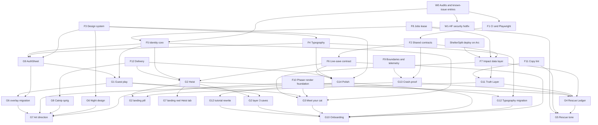

# Landing and Game Alignment: Master Plan

This plan closes every gap between what the landing page (`client/pages/index.tsx`) promises and what
a player or judge meets in `/game` and `/heist`. It merges fourteen per-gap designs (G1 to G14) into
one build. Shared pieces are designed once in section 2, and the gap sections point at them.

- **Scope:** client (Next.js 16, Phaser 4 rc.5, Capacitor 7), backend (NestJS 9, MongoDB), CMS, and
  the standalone Catnip Heist build.
- **Audience:** players and grant, hackathon and accelerator judges.
- **Order:** by dependency, not by calendar. There are no week or month boxes. Quality comes first.
- **Evidence:** every file:line reference was checked in code on 2026-09-30 on branch
  `feat/funding-winning-strategy`. Items marked **(D)** need a founder decision (section 5).
- **Status:** implemented in the working tree on 2026-10-03 (waves W1 to W7: task 7a docs
  consolidation and task 7b blocking gates and golden path; not committed, not deployed). Task 7b
  is recorded in `docs/plans/alignment-log/7b.md`, and the section 7 rows it closes (the
  `yellow-300` override, the unhandled `loadStripe()` rejection, the E2E hooks in the production
  bundle) are refreshed. Every founder decision was applied as its recommendation (section 5,
  "Applied"), every section 7 row has a status, and the docs were consolidated from the task logs in
  `docs/plans/alignment-log/` (the audit trail). Production steps, console work, CDN uploads, store
  builds and emails were not executed; they are listed in section 5 and in the logs' manual steps.

Source material: the landing and game consistency report and the screenshots in
`scratchpad/consistency/` for the run that produced this plan.

---

## Start here

One screen for the founder. Everything below it is detail.

**1. Ship the W1 security hotfix now** (section 4.2, row W1-HF). Four live holes, each with its own
spec and labelled commit:

| Hole | Fix | Spec |
|---|---|---|
| `GET /shelter` and `GET /shelter/:id` return `wallets`, including the encrypted Stellar private key (`shelter.controller.ts:15-32`) | The F7.7 whitelist projection, pulled forward | No response contains `wallets`, `walletPrivateKey`, `users` or `code` |
| Staking reward can be claimed again and again (`cat.controller.ts:156-178` never touches the cat and `$unset`s `staked` on the user) | G5 P1 owner-filtered atomic stake and claim | Another user's cat gives 404; five parallel claims credit once |
| A manager can set any `shelter` (`profile-write.dto.ts:25-37`) | `ProfileWriteDto` without `shelter` (the G4 scheduled fix) | A manager write with `shelter` gives 400 |
| Email-only account binding takes over legacy docs | Refuse to bind an unverified token to a doc with no uid (the F5.2 step 2.2 no-uid rule); needs no uid backfill | Unverified token plus uid-less doc gives 403 `EMAIL_UNVERIFIED` and writes nothing |

**2. External dates inside the plan** (details in 4.2, "External-date preconditions"):

- 2026-10-02: the unreachable 500 USDC goal in `campaign.json` starts. Needs decision #76.
- Oct 1 to 8: codex freeze and reset. No season-field deploy in that window (F8).
- Now: the Heist's present-tense impact claims (`ui.ts:274, 732`) are live. A copy-only future-tense
  change ships as a labelled G11 seed change.
- 2026-11-19: the hardcoded TGE date (`Codex.tsx:22`) in a live countdown. Needs decision #39 before
  it becomes a public broken promise.

**3. Ten decisions that block W0 and W1** (marked "W0/W1" in section 5):

| # | Decision | Recommendation |
|---|---|---|
| 1 | Read-only production audits | Approve; counts only |
| 2 | Merge duplicate users by hand | Approve after reviewing the audit |
| 3 | Unverified password users | Verify on next sign-in, heads-up email |
| 33 | Security and data fixes (incl. W1-HF) | Approve all; hotfix now |
| 34 | Rescue points, Rescue Goals, POINTS Vault | Approve option A |
| 35 | Staking rule and clawback | Flat cat nap, no clawback, flagged accounts off boards |
| 59 | GitHub Actions replaces GitLab CI | Approve |
| 76 | Campaign goal C-001 (starts 2026-10-02) | A goal reachable at the cap, before the 2nd |
| 96 | First mode after Meet your cat | Cupid Cat level 1 with the starter shield |
| 97 | Deploy ShelterSplit on Arc | Yes, in W1 |

**4. Waves** (a wave is a dependency tier, not a time box):

```
W0 audits, known issues, rc.5 spike, replica-set check
 └ W1 foundations (F1 F2 F3 F8 F9) + W1-HF security hotfix + G13 hotfix + ShelterSplit deploy
    └ W2 F4 F5 F6 F7 F10 F11(warn) F12(+SeoHead) + G13 client
       └ W3a G9, G6 codemods, G12 call sites, G8, G11, G2 layers 1-2
          └ W3b G1
             └ W3c G6 overlay migration
                └ W4a G14, G4, G3, G2 layer 3
                   └ W4b G10, G5, G12 tutorial rewrite
                      └ W5 G7, reel, G2 landing pill, native train, store
```

---

## 1. Goal and principles

### 1.1 What "the game matches the landing" means

The landing tells one story: a night sky, a cat waiting on a glowing altar, real shelter cats, real
help. Today the first click leads somewhere else.

| Landing promise | What the player meets today | Target |
|---|---|---|
| PLAY GAME opens a game | A forced, unclosable sign-in wall (`FirebaseAuthContext.tsx:116-123, 211`) | Play instantly as a guest; sign in only to save or claim (G1, G9) |
| "YOUR CAT AWAITS" on an altar | A hardcoded Cleocatra the player never sees being given (`user.service.ts:75-92`) | A "Meet your cat" altar ceremony: choose, name, reveal (G3) |
| Real-world impact | Impact hidden behind `spent > 0` and derived from spend (`ProfileModal.tsx:301, 312`) | Verifiable impact with honest tiers, visible from the first session (G4, G11) |
| Rescue tone | TGE countdown, "AIRDROP COMMAND CENTER", "$TAILS" everywhere (`Codex.tsx:22, 1067-1073, 1221`) | "Tails are rescue points" given to real, pre-funded goals; token only in an off-by-default web Vault (G5) |
| Night palette | Pastel daytime modals, a white 50% scrim, a daytime pink lobby (`globals.scss:230-232`, `hooks.ts:25-53`) | One night design language from landing to lobby to modals to native chrome (G6) |
| Painterly night world | Bright daytime tiles, blurry fractional zoom, no depth (`map.ts`, `utils.ts:87-88`) | Night tile skins, in-engine parallax plates, crisp integer zoom (G7) |
| A cat charity | A cannabis-leaf catnip icon and a 420 cap (`logo/catnip.webp`, `game.schema.ts:139`) | A botanical catnip sprig; drug cues removed (G8) |
| Catnip Heist as the newest game | Nothing links to it; no account link (`GameSelectModal.tsx:41-63`) | A picker card, a landing entry, a host page and replay-verified saves (G2) |
| Passion One, Nunito, Bebas | Undeclared families, Arial Black, monospace, 1x blurry canvases (`Match3Scene.ts:1024`) | One typography system across DOM, Phaser and 2D canvas (G12) |
| A polished product | Shelter crash on a missing key, no error boundaries (`Shelter.tsx:103-106`) | Crash-proof surfaces with telemetry and a CI resilience gate (G13) |
| First run is fun | Purrsuit 1-1 kills the player in 2-4 s (`CatnipChaos.ts:605, 1207`) | Scene-owned start gates, teach-at-hazard, soft deaths, "cleared" state (G10) |
| Details are right | A CLOSE X over ABOUT ME, clipped hints, a "no new levels" notice, wrong favicons (`GameSelectModal.tsx:201`) | A polish pass with one modal system and one icon and meta set (G14) |

### 1.2 Principles

1. **One source per fact.** Colours, fonts, z-layers, enums, public numbers and copy words each live
   in one edited file. Everything else is generated from it and checked in CI.
2. **Honest by construction.** No real-world impact claim renders without a registry ID, a date and
   an evidence tier. Money totals equal the chain.
3. **Play before paperwork.** The first real action needs no account. Sign-in appears only when the
   player wants to keep or claim something.
4. **The scene owns run state.** React mirrors Phaser; it never drives it.
5. **One score write path.** `POST /user/catbassadors/live` stays the only score writer. Heist saves
   ride it with backend replay verification. Guest merges only re-parent rows it already accepted.
6. **Known bugs are named, then fixed.** Every fix of a listed or newly found bug is added to the
   relevant known-issues list first and closed in its own labelled commit (section 7).
7. **Accessibility is a gate, not a pass.** axe, keyboard, reduced motion, contrast and 44 px targets
   are tested on every new surface.
8. **Nothing ships unmeasured.** Every step of the first session has an analytics event and a target
   (section 6).
9. **Rules from `CLAUDE.md` hold.** Lowercase `accesstoken`, `fb`-prefixed Firebase tokens, one
   `AppModule`, Phaser and Stellar behind `next/dynamic` with `ssr:false`, every enum copy updated.
   Telegram is never proposed.

### 1.3 North-star first session

This is the story every workstream serves. Timings are targets (section 6).

1. **Landing, 0 s.** A visitor sees the night sky and the tabby on the altar: "YOUR CAT AWAITS".
   Under the hero, a short reel shows the real game in the same night palette (G7). Numbers on the
   page carry dates and evidence chips; tapping one opens its source (G11).
2. **PLAY GAME, about 1 s.** `/game` opens behind a night intro curtain that stays until `authReady`
   (the anonymous guest session and profile are ready), at least 700 ms and at most 2.5 s (G14, G1).
   If `onboarding.state === 'pending'`, the curtain hands straight to the altar loading state of
   Meet your cat (G3), never to the lobby. There is no sign-in wall. The browser tab, theme colour
   and native splash are all night `#0b0820` (G6, G14).
3. **Meet your cat, about 20 s.** The altar from the landing appears. The painted tabby crossfades to
   the pixel tabby, Scout. The player picks one of five starters, names it and watches the reveal
   (G3). A skippable step shows three real shelter cats to follow.
4. **First run, about 30 to 90 s.** The lobby shows the named starter large in a hero slot, then
   the player lands on the first mode chosen in decision #96 (recommended: Cupid Cat level 1 with the
   starter shield; Purrsuit 1-1 only once G10's soft deaths ship) behind a start gate. At the first
   hazard the scene freezes with a prompt ("JUMP!" in Purrsuit). A mistake costs a respawn, not the run
   (G10). Text is crisp and on-brand (G12). The world is a moonlit night with parallax (G7). Catnip is
   a lavender sprig (G8).
5. **First clear.** The win card says the level is cleared. The server records it through the same
   `/live` save (G10). "Save your cat" appears as a soft, dismissible nudge (G1, G9).
6. **Rescue payoff.** The PROGRESS button opens on IMPACT: this season's funded shelter goal, the
   player's Tails, the day's paw progress ("1 more run for today's paw"), and delivered-goal photos
   with receipts (G4, G5). Every number shows its tier, such as CUSTODIAL or SHELTER-REPORTED.
7. **Keep it.** The player taps "Save your cat" and continues with Google or Apple. The same uid and
   the same backend document are kept, so no progress is lost (G1, G9).
8. **Try Heist.** The game picker shows "CATNIP HEIST · NO SIGN-UP". It opens in the same shell
   and reuses the existing Firebase session, anonymous or not (F5.7 `optional`). A won run saves to
   the same uid after the backend replays it, guest or registered (G2).
9. **Judge path.** From any page, `/impact` shows every public claim with value, date, status,
   source and on-chain links, plus a CI badge for the resilience suite (G11, G13).

---

## 2. Shared foundations

Each foundation is built once. Gap sections reference them as **F1** to **F12**. Where two gap designs
disagreed, the resolution is recorded in section 2.13.

### F1. Test and CI harness

Several gaps (G1, G2, G3, G6, G7, G8, G10, G12, G13, G14) independently added Playwright and CI. This
is the single version.

- **Client Playwright.** Add `@playwright/test`, `@axe-core/playwright`, `client/playwright.config.ts`
  and `client/e2e/`.
  - Projects: 390x844 at DPR 3, 360x740 at DPR 3, 844x390 landscape, 1440x900 at DPR 1.
  - Runs in a pinned `mcr.microsoft.com/playwright` Docker image with `--use-gl=angle` (or
    swiftshader) for WebGL.
  - Determinism: `page.clock` fixed, `animations: 'disabled'`, `Math.random` seeded by an init
    script, masks on Phaser canvases and GIFs, backend mocked with `page.route`.
  - Fixtures come from the typed contracts in F2, so they cannot drift from the API shape.
  - Test hooks (`window.__TT_TEST__`, forced-crash flags, capture mode) exist only when
    `NEXT_PUBLIC_E2E=1` or `NEXT_PUBLIC_CAPTURE=1`. CI greps the production bundle for their markers
    and fails if found.
- **Firebase Auth emulator** for identity tests (G1, G9) and deterministic capture (G7). No server-side
  auth bypass exists anywhere.
- **Heist** keeps its existing Playwright and Vitest setup. `catnip-heist/` is already tracked in git
  (306 files) with `.github/workflows/catnip-heist-pages.yml`; that workflow is extended, not replaced.
- **`.github/workflows/ci.yml`** on push and pull request:

| Job | Steps |
|---|---|
| `contracts` | `node scripts/sync-contracts.mjs --check`, `sync-fonts --check`, `fund facts build --check` |
| `backend` | `npm ci && npm run lint && npm run build && npm test` |
| `client` | `npm ci && npx tsc --noEmit && npx eslint . && npm test && npm run test:e2e` |
| `heist` | `npm ci && npx vitest run && npm run build:client` plus the vendored sim sha check (G2). Build and test only: the existing `.github/workflows/catnip-heist-pages.yml` keeps the Pages deploy, and this job must not duplicate it |
| `copy-lint` | the tone and claims lint (F11) |
| `bundle-guards` | test-hook marker grep, `check-app-export.mjs`, `check-palette.mjs`, `check-meta.mjs` |

  All jobs become required checks on `main`. Date-dependent checks (fact staleness, chain
  reconciliation) run on a weekly schedule, never on pull requests (F7).
- Turning the gate on will surface existing lint or test failures. Fix them first. ESLint disables
  rules-of-hooks globally (known issue); this plan does not flip that.

### F2. Shared contracts and generated copies

The repo duplicates enums and caps across packages on purpose (`CLAUDE.md`, `docs/DEVELOPMENT.md`).
The plan keeps separate packages but stops hand-editing copies.

- **New repo-root `shared/`** with framework-free TypeScript that compiles under the backend's TS 4.8
  (no `satisfies`, no const type parameters).
- **`scripts/sync-contracts.mjs`** copies each file into `backend/src/shared-contracts/`,
  `client/shared-contracts/`, `cms/shared-contracts/` and `catnip-heist/src/shared-contracts/` as
  needed, each with a GENERATED header. `--check` fails on drift (F1).
- **Contents:**

| File | Holds | Used by |
|---|---|---|
| `enums.ts` | `GameType` (plus `CATNIP_HEIST`), `LiveGameOutcome`, `StarterBreed`, `CatOrigin`, `OrderStatus` (plus `FAILED_GRANT`), `RescueGoalStatus`, `DonateSource`, `ShelterDonationStatus` (plus `CONFIRMED`, `FAILED`), `ShelterRole`, `PartnerStatus`, `HandoverStatus` | G1-G5, G10, G13 |
| `errors.ts` | Error codes (F5.6) | G1, G2, G3, G5, G9 |
| `caps.ts` | Catnip caps (endless 500, G8), heist level caps (imported from the vendored sim, G2), `GUEST_TAILS_LIFETIME_CAP`, pledge caps | G1, G2, G5, G8 |
| `storefront.ts` | `/cat/sale` types and `parseStorefront` (G13) | G13, G3 |
| `heist-bridge.ts` | The host and iframe message types (G2) | G2 |
| `copy.ts` | Currency words and `formatTails` (G5) | G5 |
| `analytics-core.ts` | Event names, the scrubber and dedupe (F9) | client, Heist |
| `name.ts` | `normalizeCatName` and its test vectors (G3) | backend, client |

- Existing hand-kept copies that move under the script: `catnip-accounting.ts` (both),
  `client/models/game.ts`, `shelter-onchain.schema.ts:5` and `client/api/shelter-api.ts:6`, the CMS
  model copies.
- `docs/DEVELOPMENT.md` gets a new table: every generated location, what generates it, and the
  remaining hand-kept copies (tokens, fonts, facts, Heist HTML).

### F3. Design system: tokens, layers, GameModal, CloseButton, game suspension

G6, G9, G12 and G14 each proposed their own token file, z scale and modal primitive. This is the one
set.

**F3.1 Tokens: `client/design/tokens.ts`** (pure data, loaded by `tailwind.config.ts` through jiti).

| Group | Tokens |
|---|---|
| Night | `tt-night-950 #07051a`, `900 #0b0820` (page), `800 #120d1f`, `700 #1e1633` (panel), `600 #2a1f45`, `500 #3a2d5c` |
| Gold | `tt-gold-400 #ffcc55` (CTA), `500 #e2c05a` (hairlines, input borders), `tt-gold-ink #4a1d08` (text on gold, 9.53:1), `tt-gold-shadow #713f12` (bevel only) |
| Ink | `tt-cream #fcecbb`, `tt-lilac #f0c5fd`, `tt-muted #9a88c9` (6.11:1 on 800) |
| States | `tt-rust #ee642a` (danger text), `tt-pink #ff7aa2`, `tt-ember #c1260f` (fills only), `tt-mint #7fd66b`, `tt-sky #90c5e9` |
| Dusk | `--tt-dusk-top #2a1f45`, `--tt-dusk-mid #7a3e6e`, `--tt-dusk-horizon #ee8a5c` |
| Parchment | `--tt-parchment-from`, `--tt-parchment-to` |
| Fonts | `FONT_FAMILIES`, `FONT_FILES`, `TYPE_ROLES` (F4) |
| Layers | the z scale below |

- `tokens.css` (generated) declares `--tt-*` RGB triplets. Tailwind maps them under `colors.tt` as
  `rgb(var(--tt-x) / <alpha-value>)`.
- `client/art/palette.json` and `palette.gpl` (G7) are generated from these tokens plus the art ramps.
- Existing names `gold`, `gold-muted`, `gold-light` and `cream` (`tailwind.config.ts:84, 93-95`)
  belong to the portrait feature and stay. New tokens use the `tt-` namespace.
- The `yellow.300` override (`tailwind.config.ts:27-28`) is removed only after the codemod in G6
  brings `rg "yellow-300" client` to zero.

**F3.2 Layers.** Tailwind `theme.extend.zIndex`, mapped from the real inventory
(`grep -rhoE 'z-\[[0-9]+\]'`).

| Layer | Value | Replaces |
|---|---|---|
| `hud` | 40 | lobby HUD, z-30 |
| `gate` | 80 | RunGate inside each mode container (G10), so `check-palette` never needs an arbitrary `z-[80]` |
| `modal` | 100 | the 77 z-[100] panels |
| `modal-nested` | 110 | z-[101], z-[102], z-[120] |
| `auth` | 200 | SignIn z-[10000] |
| `intro` | 300 | intro z-[9999] |
| `reveal` | 400 | RevealAnimation, OpeningAnimation, TailsCardPack z-[9999] and z-[10000] |
| `celebration` | 450 | Celebration z-[9000] |
| `toast` | 500 | Toast z-[110], which today renders behind SignIn (a bug, section 7) |
| `system` | 600 | the root error fallback (F9) |

  The CloseButton's `z-[200000]` and the `z-[100000]` use are removed. EpicCardEffects' z-[120] and
  z-[250] are card-local and stay, documented as such.

**F3.3 GameModal: `client/components/ui/GameModal.tsx`**, on `@radix-ui/react-dialog` as a direct
dependency.

- Props: `open`, `onOpenChange`, `title`, `description?`, `surface: 'panel' | 'art' | 'sheet'`,
  `size`, `dismissible = true`, `canClose = true` (for example a Wheel spin), `modal = true`,
  `allowOutside?`, `initialFocus?`, `suspendGame = true`.
- Visuals: scrim `bg-tt-night-950/70` with a 4 px blur, dropped under the `lowfx` class (Android, or
  `hardwareConcurrency <= 4`) and under `prefers-reduced-transparency`. The panel surface is a
  night-700 to night-800 gradient in `PixelFrame` (layered clip-path shapes so focus rings are not
  clipped), with a Passion One title in gold-400.
- Accessibility: Radix gives focus trap, Esc and scroll lock. `aria-labelledby` points at the title.
  Focus returns to the opener. While a modal is open, toast text is repeated in a visually hidden
  `aria-live` region. While the AuthSheet is open, toasts are queued instead of rendered, and their
  text appears in the sheet's single `role="alert"` region (G9, G14).
- Dismissal: `dismissible={false}` hides the X and blocks Esc and scrim. `canClose={false}` keeps the
  X visible but `aria-disabled` (used during a Wheel spin, so a tap cannot kill the reveal).
- Third-party portals: while a payment step is active, PacksModal passes `modal={false}` plus an
  `allowOutside` predicate for the Stellar Wallets Kit host, `iframe[name^="__privateStripeFrame"]` and
  the 3DS container (G6).
- Error isolation: every GameModal renders its children inside a `ModalBoundary` (F9).
- `useModal` from the G14 design is not built. GameModal covers it.

**F3.4 CloseButton: `client/components/shared/CloseButton.tsx`** (rewrite from G14). A
`<button type="button" aria-label>` wrapping a decorative ``, at least 44x44 CSS px after
transforms, with a gold focus ring. `placement: 'inside' | 'outside' | 'viewport' | 'sticky'`.
`inside` is the default for every `overflow-hidden` panel. `viewport` alone applies safe-area insets.
GameModal uses it; all 15 current callers migrate, then the `absolute` prop is deleted.

**F3.5 Game suspension: `client/lib/game/gameRegistry.ts` and `useSuspendGame(open)`.**

- Every `new Phaser.Game` site registers on create and clears on destroy (catbassadors, Match3,
  CatnipChaos, PixelRescue, shelter). The registry imports no Phaser at runtime.
- While any GameModal with `suspendGame` is open: `keyboard.enabled = false`,
  `disableGlobalCapture()`, `game.loop.sleep()`, `sound.pauseAll()`. On close, all are reversed.
- This fixes the Phaser key capture that swallows w, a, d, z, q and space in form fields
  (`Catbassador.ts:167-175`, G9) for every modal, not only sign-in.
- Heist runs no Phaser and uses its own `pause` and `resume` bridge messages (G2).

**F3.6 Primitives updated once.**

- `PixelButton`: real `size: 'sm' | 'md' | 'lg'`, `fullWidth`, `type`, `icon`, `busy`, `as: 'button'
  | 'span'`, `clsx` class building. Fixes the dropped `!important` (`PixelButton.tsx:77`), the
  `false`/`undefined` classes (81-90) and the stray `'` (112). A jscodeshift codemod migrates the 117
  `isSmall`/`isMedium`/`isBig` call sites (G9).
- `PixelIcon` replaces boxicons, which is never loaded: 26 `bx` uses in 13 files render empty (G9). An
  ESLint rule blocks `bx` classes.
- Toast drops the unused `icon` prop (`Toast.tsx:9`, `ToastContext.tsx:13`) and moves to `z-toast`.

### F4. Typography runtime

Designed in G12. G14 and G10 use it for the Paw Match hint; G9 uses it for Roboto.

- **Self-hosted faces.** `client/scripts/sync-fonts.mjs` copies woff2 from pinned Fontsource packages
  into `client/public/fonts/` with OFL files:
  - Bebas Neue 400, Passion One 700 and 900, Nunito variable (200-1000), each latin and latin-ext
    (Lithuanian shelter names need latin-ext).
  - Roboto 500 latin for the Google button (G9), instead of `next/font/google`, so every face comes
    from one pipeline.
  - Pixelify Sans is **not** added by default **(D)**. Its five labels move to the `label` role.
- The script writes `styles/fonts.generated.scss` (our own `@font-face`, family names unchanged,
  `font-display: swap`, unicode-range), metric-matched fallback faces from `@capsizecss/metrics`, the
  Heist copy (`catnip-heist/public/fonts/` and `src/ui/fonts.generated.ts`), and optionally the CMS
  copy **(D)**. The Google `@import` at `globals.scss:133` is deleted. `_document` preloads three
  faces.
- **Loader.** `components/typography/loadGameFonts.ts` is SSR-safe and memoised. It uses
  `document.fonts.load` per face (never `document.fonts.check`, which returns true for undeclared
  faces), with a 3000 ms timeout, and sends a consent-gated `game_font_fallback` once.
- **Phaser gate.** A `TTFontsFile extends Phaser.Loader.File` blocks `create()` until fonts resolve.
  Every scene calls `preloadTTFonts(this)` first in `preload`. React effects stay synchronous, so there
  is no StrictMode race and no orphaned Game.
- **SSR isolation.** `TTFontsFile` and `preloadTTFonts` live in `components/Phaser/typography/`, imported
  only by scenes. `components/typography/` (`loadGameFonts`, `ttCanvasFont`, role data) stays
  Phaser-free, so the landing can import it. An ESLint `no-restricted-imports` rule bans `phaser` in
  `components/typography/**` and `design/**`, with a fixture test. `ttText`, `ttStyle`, `ttFit` and
  `installFontHealing` take Phaser objects and also live under `components/Phaser/typography/`.
- **Factory.** `ttText(scene, x, y, text, role, opts)`, `ttStyle`, `ttFit` (drops low-priority
  segments before shrinking, never below the role minimum) and `ttCanvasFont(role, size)` for 2D
  canvas. Text resolution is `camera.zoom × canvasPixelRatio` (F10), capped at 3, with a LINEAR
  texture filter. `installFontHealing(game)` re-fits registered texts on `loadingdone`.
- **Roles** (from `TYPE_ROLES`): `title` Passion One 900, `hud` Bebas, `label` Bebas min 12, `caption`
  Nunito 700 min 12, `hint` Nunito 800 min 14 sentence case, `burst` Passion One 900 with a bark stroke,
  `code` system mono (tx hashes only).
- **Enforcement.** ESLint `no-restricted-syntax` on `fontFamily`, `font:`, `setFontFamily()` and
  `ctx.font =` outside `components/typography/`, `components/Phaser/typography/` and `design/`. This replaces the G14 monospace grep.

### F5. Identity: uid-first accounts, guests, verified email, one guard

G1, G3 and G9 each redesigned `getFirebaseUser`. This is the merged model.

**F5.1 Schema** (`backend/src/user/user.schema.ts`).

| Field | Purpose |
|---|---|
| `firebaseUids: string[]` | Unique multikey index, partial on `$exists`. A doc can own several uids (legacy Google plus password). Replaces G9's single `firebaseUid`. |
| `email` | Lowercased on write. After the audit, a unique partial index `{email:1}` on `{email:{$type:'string'}}` (G3). Guest docs have no email. |
| `emailVerifiedAt` | Set from a verified token. |
| `isGuest` | Default `false`, written explicitly. Backfilled on existing users. |
| `pendingTails`, `guestMergedTails`, `lastGuestMergeAt` | Guest economy (G1). |
| `mergedInto`, `mergeState` | The resumable guest merge (G1). |
| `lastSeenAt` | Set by the auth path, at most once a day. Drives guest cleanup. |
| `lastPlayedAt` | Set only inside `/live` (G11). |
| `onboarding` | `{state:'pending'|'done', starterChosenAt, skipped, version}` (G3). |
| `following` | Up to 50 Blessing ids (G3). |

Cat gets `isStarter`, `isGuestStarter`, `starterLockedAt`, `starterBreed`, `origin`, `sourceCat`,
`nameChangedAt` (G3, G1).

**F5.2 Resolution** (`user.service.ts`, replacing `:25-57`). The strategy splits on
`payload.firebase.sign_in_provider`:

1. `anonymous`: `resolveGuest(uid)`. Returns the persisted guest doc if a doc owns the uid; otherwise
   a transient request user `{isGuest:true, transient:true, firebaseUid}`. Nothing is written.
2. Any other provider (email required, as today), `resolveRegistered(token)`:
   1. Find by `firebaseUids: uid`. A registered doc resolves as is. If the doc is `isGuest:true`
      (the uid was linked from an anonymous user), promote it:
      - **1a. Verified or OAuth required.** `email_verified === true`, or the provider is
        `google.com` or `apple.com`. Otherwise 403 `EMAIL_UNVERIFIED`; the guest doc is untouched and
        keeps playing, and `requireAccount` does not resolve.
      - **1b. Email collision check.** Look up the lowercased token email among docs other than this
        one. A match (a legacy or registered doc) gives 409 `ACCOUNT_CONFLICT`; the client runs the
        merge path (G1). Nothing is written.
      - **1c. Atomic promote.** One `findOneAndUpdate({_id, isGuest:true}, …)`:
        `$set` `isGuest:false`, `email` (lowercased), `emailVerifiedAt`, `wallets` (generated before
        the call), `tails` via `$inc` of `min(pendingTails, GUEST_TAILS_LIFETIME_CAP − guestMergedTails)`
        and `tailsEarned` by the same amount, `guestMergedTails` by the same amount;
        `$unset` `pendingTails`. The guest starter cat gets `$unset isGuestStarter` in a follow-up
        idempotent write keyed on `{owner, isStarter:true, isGuestStarter:true}`, so it stops being
        excluded from public lists. A doc that matched nothing (already promoted by a parallel
        request) is re-read and returned.
      - **1d. Unique index backstop.** An E11000 on the email index maps to 409 `ACCOUNT_CONFLICT`.
      - **1e. Response.** The profile carries `promotedNow:true` on the request that performed the
        promotion only, which triggers the referral send (F5.7).
   2. Else find by lowercased email:
      - The doc has other uids: attach this uid only if `email_verified`. Otherwise 403
        `EMAIL_UNVERIFIED`.
      - The doc has no uids (legacy, or a portrait-order user from `image.controller.ts:309-319`):
        bind only if `email_verified`. Otherwise 403 `EMAIL_UNVERIFIED`. This closes the account
        takeover in section 7. This rule alone ships in the W1 security hotfix, before the uid
        backfill, as a check in today's email lookup: an unverified token never binds to or resolves a
        doc that has no uid.
   3. No doc and not verified: 403 `EMAIL_UNVERIFIED`. No write, no cat, no wallet.
   4. No doc and verified: `findOneAndUpdate({firebaseUids: uid}, {$setOnInsert: …}, {upsert:true})`
      with `onboarding:{state:'pending'}`, then create the starter cat idempotently on
      `{owner, isStarter:true}`, retry on E11000, and self-heal a dangling `user.cat`. The wallet is
      generated before the upsert and persisted only on insert. A `NewAccountThrottle` caps new users
      per IP per hour.
3. `createUser` and the MANAGER `POST /user/profile` never write `onboarding`, and their cats are
   created locked.

**F5.3 Rollout order.** Three read-only audit scripts run first (dry run by default, counts only, no
personal data leaves the database): `audit-identity.js` (G1), `audit-duplicate-users.js` (G3),
`backfill-firebase-uid.ts --dry-run` (G9). Then: backfill `isGuest:false` and lowercase emails, merge
duplicates by hand **(D)**, bind uids for verified or Google/Apple Firebase users, build the unique
indexes, and only then enforce `email_verified`.

**F5.4 Guard.** `AppAuthGuard extends AuthGuard('appauth')` replaces all 71 uses of the raw guard
across 12 controllers. `live-game-throttle.guard.ts` is not a controller but depends on the raw guard
running first (its contract comment names it) and returns `true` when `req.user._id` is missing
(`:17-19`); it moves to "runs after `AppAuthGuard`" and fails closed without a user.

- Guests are denied by default: 403 `GUEST_FORBIDDEN` unless the handler has `@AllowGuest()`.
- A transient guest on a route without `{transient:true}` gets 428 `GUEST_SESSION_REQUIRED`.
- `handleRequest` and `validateDecodedIdToken` rethrow `HttpException` as is, so 403 and 409 codes
  reach the client (G9). Expired or bad tokens stay 401.
- The allow-list is reviewed in one constant. A reflection spec asserts that the `@AllowGuest` set
  equals it and that no handler still uses the raw guard. Because reflection checks handlers only, a
  source grep spec also scans `src/**/*.guard.ts`, `*.strategy.ts` and `*.controller.ts` (specs
  excluded) for `AuthGuard('appauth')` outside `app-auth.guard.ts`, and asserts every guard that reads
  `req.user` is listed after `AppAuthGuard` in its `@UseGuards`. The list is G1's plus two additions:
  `POST /user/starter` (G3) and `PUT /cat/:id/name` for the caller's own starter.

**F5.5 Guest lifecycle endpoints** (in UserController): `POST /user/guest/session` (App Check header
`x-firebase-appcheck`, throttled per IP as a backstop), `POST /user/guest/merge` (header
`x-guest-token`), `DELETE /user/guest`, `DELETE /user/me` for registered users (G9, Apple 5.1.1(v)).
Guest docs hold no email and no wallet. A leased cron (F8) deletes guests idle for 30 days.

- **What `POST /user/guest/session` creates** (idempotent on `firebaseUids: uid`, upsert with
  `$setOnInsert`): `{firebaseUids:[uid], isGuest:true, onboarding:{state:'pending', version},
  pendingTails:0, guestMergedTails:0, lastSeenAt}`, no `email`, no `wallets`. Then a guest starter
  cat, idempotent on `{owner, isStarter:true}`, with `isStarter:true`, `isGuestStarter:true`, no
  `starterLockedAt` (so G3 can commit it) and the default breed. The anonymous token must have
  `sign_in_provider === 'anonymous'`; a registered token gets 409.
- **Transient template profile** (before the session exists): `{isGuest:true, transient:true,
  onboarding:{state:'pending'}, cat:{_id:'guest-starter', isStarter:true, isGuestStarter:true}}`.
  Without `onboarding:'pending'` here, G3 would never show to guests.

**F5.6 Error codes** (`shared/errors.ts`), one uppercase vocabulary:
`GUEST_FORBIDDEN`, `GUEST_SESSION_REQUIRED`, `ACCOUNT_CONFLICT`, `EMAIL_UNVERIFIED`,
`STARTER_LOCKED`, `NAME_TOO_SHORT`, `NAME_TOO_LONG`, `NAME_CHARS`, `NAME_RESERVED`, `NAME_BLOCKED`,
`HEIST_REPLAY_INVALID`, `HEIST_NOT_WON`, `HEIST_TRAILING_INPUT`, `HEIST_SIM_VERSION`,
`HEIST_DUPLICATE`, `DONATE_PAUSED`, `DONATE_BUDGET_SPENT`, `DONATE_SEND_FAILED`,
`DONATE_ALREADY_TODAY`. G9's lowercase `email-unverified` and `account-conflict` are dropped.

**F5.7 Client auth runtime** (`client/context/FirebaseAuthContext.tsx`).

- Prop `authMode: 'guest' | 'optional'`. `/game` uses `guest` (silent `signInAnonymously` behind a
  module-level singleton promise). `/heist`, articles, feed, cats, box and shelter-payouts use
  `optional`: reuse an existing Firebase session, including an anonymous one, but never create one,
  and never force a modal. This merges G1's `guestMode` and G2's `authMode`.
- Heist saves under `optional`: with an anonymous Firebase user that already has a guest doc, runs go
  to `/live` directly (`@AllowGuest` on `/live` is already in the allow-list); with an anonymous user
  and no doc yet, the 428 path creates the session once. The local queue (`tt.heist.queue.v1`) is used
  only when there is no Firebase user at all. A Playwright case covers it: a guest plays on `/game`,
  opens `/heist`, wins level 1, and the row saves under the same uid.
- Derived `authStatus: 'unknown' | 'guest' | 'signed-out' | 'needs-verification' |
  'loading-profile' | 'ready' | 'profile-error'`. Additive `authReady` for the intro (G14).
- `requireAccount(reason): Promise<'signed-in' | 'dismissed'>` is the one API. It resolves only when a
  refreshed `GET /user/profile` returns `isGuest === false`. It never uses the forever-polling
  token-wait helper (a known issue, left unchanged and mentioned in the PR).
- The force-open effect (`:116-123`) and `close={() => {}}` (`:211`) are removed.
- One sheet: `AuthSheet` (G9 layout and brand buttons, G1 states), built on GameModal. See G1 and G9.
- The API wrapper handles 428 (create the session once, retry once), 403 `GUEST_FORBIDDEN` (open
  `requireAccount`, then retry), 403 `EMAIL_UNVERIFIED` (verification state) and 409
  `ACCOUNT_CONFLICT` (conflict state).
- Referral: `?ref` from any page is stored once in `localStorage` key `tt.pendingRef` and sent to the
  new `POST /user/catbassadors/referral` only when promotion returns `promotedNow:true` (G1). G2's
  "send after first profile load" is dropped.

### F6. Run lifecycle and the live-save contract

G2 and G10 both change the one score route. Both changes land together.

- **DTO** (`backend/src/user/dto/live-game.dto.ts`): add `outcome?: LiveGameOutcome` (G10) and
  `replay?: HeistReplayDto` (G2). `points` is ignored for `CATNIP_HEIST`.
- **Resolution** (`utils/live-game.ts`): `won` on a non-INFINITE level adds
  `${field}Cleared.${i} = 1` to the same `$max` update. Heist runs take the replay branch (G2).
- **Schema:** `catnipChaosCleared`, `seasonEventCleared`, `match3Cleared` (G10), `heistScore`,
  `heistStars` (G2), `Game.outcome`, `Game.replayDigest` with a global unique partial index.
- **Array safety:** before any dotted `$max` or `$bit`, a conditional `$set` creates missing arrays,
  so a user without the field never gets a sub-document (G2).
- **Body limit:** a route-specific 64 KB JSON parser registered before the global 50 MB parser
  (`main.ts:63`). The global limit is an existing issue, mentioned, not changed.
- **Replay CPU bound.** Anonymous accounts are free, so per-user limits do not bound replay CPU. The
  replay branch adds a per-IP throttle (behind a correct `TRUST_PROXY`) on top of the per-user one,
  and runs `verifyRun` through a bounded worker queue (fixed concurrency, fixed queue length); a full
  queue rejects with 429 and `Retry-After` before any simulation starts. The queue exists whether or
  not the G2 benchmark calls for `worker_threads`.
- **Deploy order:** backend first, because `liveGamePipe` uses `forbidNonWhitelisted` and would 400
  every save from a newer client. Then the migrations, then the client.
- **Client event contract** (`components/Phaser/events.ts`): `RUN_READY`, `RUN_BEGIN` (the only start
  signal for `gameRun.start`), `GAME_RESTART`, `LIFE_LOST`, and `GAME_STOP` with a required `outcome`.
  `GAME_START` stays as a deprecated alias for `ShelterScene.ts:192-199` until Shelter migrates.
- **One writer spec:** with `GameRepository` mocked across controllers, only `/live` calls `create`,
  only the guest merge calls `updateMany`, and only `/live` sets `lastPlayedAt`.

### F7. Impact and truth data layer

G4 (Rescue Ledger v2) and G11 (Truth Layer) designed overlapping systems: two registries, two
snapshot models, two public pages and two chip vocabularies. They merge as follows.

**F7.1 One registry: `funding/framework/facts/facts.json`** (G11 format, zero dependencies).

- Entry fields: `id`, `claim`, `value`, `unit`, `display`, `source`, `asOf`, `checkedAt`, `status`,
  `maxAgeDays`, `surfaces`, `chain?`, `tense`, `live?`.
- Families: `F-###` facts, `P-###` product claims, `C-###` campaign and config, `L-###` live metrics.
- G4's `impact-claims.json` keys fold in: `strays_saved` is F-024, `partner_countries` is derived from
  shelters (L-countries), and `purchase_share`, `paw` and `campaign` become `C-` entries.
- `fund facts build` generates `FACTS.md` (same table format, so `verify.mjs` and
  `facts-refresh.mjs` keep working), `client/public/facts/facts.json` (public subset),
  `client/lib/facts.generated.ts` (a typed ID union), `campaign.json`, and the backend import.
- The Heist reads facts from `HEIST_FACTS_URL` with a baked fallback, never a stale copy.
- The generator rejects email, phone and IBAN patterns.

**F7.2 One evidence vocabulary.** `Claim` renders two things. Money figures carry an evidence tier
(G4). Facts carry a status (G11).

| Money tier | Meaning |
|---|---|
| ON-CHAIN · SHELTER-HELD (green) | Indexed Disbursed event to a shelter wallet with `handoverStatus: handed-over` |
| ON-CHAIN · CUSTODIAL (amber) | The same while Token Tails holds the key for Pink Paw |
| SHELTER-SIGNED (green) | Off-chain payout signed with the shelter's key (EIP-191) |
| SHELTER-CONFIRMED (amber) | Off-chain payout confirmed by a shelter member, receipt SHA-256 stored |
| PLEDGED (grey) | Purchase share committed but not yet covered |
| SHELTER-REPORTED (grey) | The shelter's own historic figure, with source and date |
| IN-GAME (blue) | Paws, Tails and runs. Never money |

  Fact statuses: `verified`, `company-reported` **(D)**, `sei-era`, `live`. `unverified` and
  `retired` can never have surfaces. Chips use text plus an icon, never colour alone, and meet 4.5:1.

  **App-build rendering rule.** App builds (Capacitor) render the same data without chain words:
  money shows as a USD equivalent with its FX date ("$12.40 · FX 2026-09-30"), never "USDC"; the
  on-chain tiers read "HELD BY TOKEN TAILS" (for ON-CHAIN · CUSTODIAL) and "HELD BY SHELTER" (for
  ON-CHAIN · SHELTER-HELD), with no "ON-CHAIN"; the other tiers keep their labels. Tapping any chip
  opens web `/impact` through `@capacitor/browser`. The lobby, MY IMPACT and IMPACT tab follow it. One
  `Claim` component picks the label set from the build target, and F11's app rules test it.

**F7.3 One backend module: `backend/src/impact/`** (registered in the one `AppModule`).

- **Indexer.** A leased cron every 5 minutes reads Disbursed and NativeDisbursed logs from
  `SHELTER_SPLIT_FROM_BLOCK` in `SHELTER_LOG_CHUNK` chunks, with a 12-block reorg rescan. It upserts
  `shelterpayoutevents` (unique `chainId, txHash, logIndex`) and a per-chain cursor
  (`impactchaincursors`) with cumulative totals.
- **Attribution by tx hash:** `ShelterDonation.txHash` by `source` (heist, page), paw settlements
  (memo `tt:paws:`), `X402UsedTx.txHash` (x402 agent cards, `shelter-x402.service.ts:156`), and
  everything else as `direct`. Unmatched logs are never dropped.
- **Snapshot.** An hourly leased job writes `impactsnapshots` with `_id` equal to the hour bucket
  (G11), so N replicas make one row. The latest row is the one served. Older rows compact to daily.
  On RPC failure it carries totals forward with the old `asOf` and `sources.chain = 'error'`; it never
  writes zeros.
- **Snapshot contents:** money by symbol and bucket, chain range, players (registered all time and
  active in 30 days, from Mongo, excluding guests), heists verified (null until G2 layer 2 ships),
  shelters and ISO countries, outcomes, rail state, pledge table, paw settlements, and a summary of
  open Rescue Goals (G5) so the landing needs one fetch.
- **CDN mirror.** After each snapshot, `impact/impact.json` goes to the existing Spaces bucket with
  `Cache-Control: public, max-age=300`. It is the landing's primary source.
- **Routes:** `GET /impact`, `GET /impact/history`, `GET /impact/me` (auth; paws, treats, sponsored
  rescue cats, pledge), `GET /impact/outcomes`, and the MANAGER and ADMIN routes for payouts,
  confirmations, signatures, members and outcomes. A privacy spec asserts no public response contains
  `email`, `wallets`, `walletPrivateKey`, `users` or raw user ids.
- **Parity fixture:** the backend indexer, `client/components/shelter-payouts/logs.ts` and
  `catnip-heist/src/ui/payouts.ts` decode the same recorded logs to identical totals. The fixture
  includes a paw settlement with its full `tt:paws:<day>:<root>` memo (about 85 bytes; the contract
  allows 256). `shelter-rail/src/widget.js:111` truncates memos to 64 characters for the widget; the
  decoders must not reuse that truncation, and the fixture asserts the full memo round-trips.

**F7.4 Donations and rail state** (merging G4 3a, G5 P3 and G11).

- `ShelterDonationStatus` becomes `PENDING, SENT, CONFIRMED, FAILED` in every copy. G4's `REVERTED`
  is `FAILED` with a `reason`.
- A reconcile step marks SENT as CONFIRMED on a success receipt and FAILED on a revert or after 30
  minutes, and releases the user-day slot and the budget slot on a same-day failure. This fixes the
  documented "slot stays used" issue (`BACKEND.md:359`).
- `GET /shelter/donate/status` stays public and user-free, and gains `dailyBudgetWei`,
  `giftsPerDayCap`, `resetsAt`, a cached `communityTotalConfirmedWei` and `treatsLeftToday`.
  `GET /shelter/donate/me` is added (auth).
- Donate errors carry the F5.6 codes.
- Downstream counts use CONFIRMED only. SENT shows as "on its way".

**F7.5 Eligibility, one policy: `src/impact/eligibility.ts`.**

| Action | Requires |
|---|---|
| Instant treat (`POST /shelter/donate`, sources `page`, `heist`) | Registered (not guest), `email_verified`, account at least 24 h old, at least 1 saved game |
| Daily paw (nightly settlement) | Registered, `email_verified`, at least 24 h old at settlement, at least 2 `/live` rows with `points > 0` at least 3 minutes apart that UTC day |
| Rescue Goal pledge (G5) | Registered, at least 72 h old, at least 3 saved games, daily cap, per-user throttle |

  All three reject guests before the policy runs (F5.4).

**F7.6 Public page: `/impact`.** One page absorbs G4's `/impact` and G11's `/proof`. `/proof`
redirects to it on web. Sections: headline per tier and currency; custody; live money buckets and the
last tx; payout and outcome timeline; pledged vs paid; paw settlements with a Merkle verifier; rescue
cats (`Blessing.kind: 'rescue'` only); where we run now (Stellar NFTs, Arc ShelterSplit); SEI track
record labelled historical; reach; methodology. Web uses ISR (`revalidate: 600`). App builds read a
committed `public/impact/snapshot.json` stamped with its date and link to the web page through
`@capacitor/browser`, with no explorer or wallet wording in-app.

**F7.7 Shelters.** `countryCode` (ISO alpha-2, validated), `partnerStatus: active | past | prospect`,
`handoverStatus`, `handoverAt`, `handoverTx`, `publicWallet`, and `role: partner | house` (G13). The
public GET projection becomes an explicit whitelist, which closes the `wallets` exposure in section 7.
The projection ships first, alone, in the W1 security hotfix: `GET /shelter` and `GET /shelter/:id`
select only `_id, name, slug, description, image, country, countryCode, partnerStatus, role,
publicWallet` (the fields that do not exist yet are simply absent), and a spec fails on `wallets`,
`walletPrivateKey`, `users`, `code` or `blessing` in either response. The remaining F7.7 fields land
in W2. The globe maps ISO codes to world-atlas ids and highlights exactly the active partner set.

**F7.8 Blessing discriminator** (moved here from G4 so G3 does not wait on G4). `Blessing.kind:
'rescue' | 'portrait'`, set at creation, backfilled by a dry-run script, with `statusUpdatedBy` and
`statusUpdatedAt`. Impact counts and featured cats use `rescue` only.

### F8. Jobs and crons

- `src/shared/jobs/lease.ts` generalises the existing `jobruns` pattern from `codex-reset.ts`:
  `findOneAndUpdate({_id: jobName, lockedUntil: {$lt: now}}, …, {upsert:true})`.
- Every new cron uses it: impact indexer, snapshot, compaction, donation reconcile, paw settlement,
  pledge sweeper, guest cleanup, merge resume.
- The existing unleased crons (`cat.controller.ts:64`, `user.controller.ts:282-304`) are a known issue,
  and wrapping them is its own labelled task.
- Guest filters: `resetCheckIn` and the `status.EAT` reset touch `{isGuest:false}` only, via an
  optional filter on `BaseRepository.updateAll` (G1).
- Deploy timing: season-field changes (G5) deploy with or after the codex cron fix
  (`BACKEND.md:377`), never across the Oct 1 to 8 window without `skip-codex-cycle.js`. With today at
  2026-09-30, that window is open now: no season-field deploy until after the 8th (4.2 external-date
  preconditions).

### F9. Error boundaries, telemetry and the event catalog

- **Boundaries** (G13): `RootBoundary` (context-free, inline styles, `z-system`), `PageBoundary` keyed
  by route, `SceneBoundary` around every Phaser mount (TRY AGAIN remounts, BACK TO MENU exits),
  `ModalBoundary` inside GameModal, silent `SectionBoundary` around landing sections. RELOAD on app
  builds uses `location.assign('/')` and lets `AppRouteRestore` restore the route.
- **Phaser crash guard:** wraps `GameEvents` listeners, runs a stall watchdog that is disarmed until
  `GAME_LOADED` and reset on visibility and resume, and reports only same-origin window errors.
- **Telemetry:** `app_error` with scrubbed fields (emails, JWTs, Stellar seeds and addresses, hex
  addresses, ObjectIds, query strings, quoted names), at most 5 per session, one per code. Never
  `posthog.captureException`.
- **One event catalog** in `client/analytics/events.ts`, consent-gated, mirrored for the Heist through
  `shared/analytics-core.ts`. The Heist sends only when the same-origin consent key
  `tt-analytics-consent` is granted, and is compiled out of replay and verify builds.

| Area | Events |
|---|---|
| Entry | `landing_cta {from}`, `game_loaded`, `intro_lifted {ms}` |
| Identity (G1, G9) | `guest_session_created`, `auth_sheet_shown {reason}`, `auth_linked {provider}`, `auth_merged`, `auth_error {code}`, `save_nudge_shown` |
| Onboarding (G3) | `onboarding_shown`, `onboarding_step_viewed`, `starter_selected`, `starter_named`, `starter_committed`, `onboarding_skipped`, `featured_cat_followed`, `cat_name_rejected`, `cat_name_reported` |
| Runs (G10) | `ftue_gate_shown`, `game_start` (on RUN_BEGIN), `ftue_hint_shown`, `ftue_hint_done`, `life_lost`, `game_fail`, `game_finish`, `ftue_first_clear`, `ftue_abandon` |
| Heist (G2) | `heist_open {from}`, `heist_run_complete`, `heist_save {status}`, `heist_signin_prompt`, `heist_guest_claim` |
| Impact (G4, G5) | `impact_tab_viewed`, `paw_earned`, `treat_sent {status}`, `pledge_made`, `claim_opened {id}`, `impact_page_viewed` |
| Health (G12, G13) | `app_error`, `game_font_fallback`, `storefront_degraded` |

### F10. Phaser render foundation

G7 and G12 both redesigned canvas resolution. One implementation, in G7's `look/` folder.

- `makeGameConfig` used by all five configs: backing store `innerWidth × dpr` by `innerHeight × dpr`,
  `scale.mode: NONE`, `zoom: 1/dpr`, and a debounced resize, orientation and `visualViewport` handler
  that emits `LOOK_RESIZE`. `registry.set('canvasPixelRatio', dpr)`.
- DPR cap by render tier (G7 `tier.ts`): LOW 2 (and 1.5 when `deviceMemory <= 4`, G12), MID and HIGH
  2 by default, 3 only if the founder allows it on flagship iOS **(D)**.
- Platformer and hub scenes pick an integer zoom `k` with `pickZoom`. Match3 uses `px(n) = n × dpr`
  and one `layoutHud()` called on create, font changes and resize (G12).
- Texture and animation keys are id-based everywhere: `player-cat-${_id}-${shortHash(spriteImg)}`
  (G3), `npc-${_id}` (G13, G3). `CatNpc.initAnimations` stops destroying global `PlayerAnimation.*`
  keys (`base/objects/Cat.ts:86-115`), fixed in its own commit.
- Seeded RNG (`look/rng.ts`) for deterministic capture (G7) and tests.

### F11. Copy lint: tone and claims

G5 (tone guard) and G11 (claims lint) merge into one tool, `tools/copy-lint/`, which parses TSX and TS
with the TypeScript AST (string literals, template spans, JSX text and text-bearing attributes).

- **Tone rules (G5):** outside `components/legacy/**` and the Vault, fail on
  `/\$TAILS|\bairdrop\b|\bTGE\b|\blisting\b|\bMNT\b|\ballocation\b|\btokens?\b/i`. The backend rule set
  covers `message`, `label`, `name`, `description` and `revealTitle` values.
- **Claim rules (G11 R1 to R12):** a real-world noun paired with a money or impact verb needs a claim
  ID within 3 lines, or `// claim:fiction <reason>`. Money verbs take Token Tails as subject. No giver
  counts. Goals must be reachable.
- **App-build rules:** no USDC, `0x` hashes, explorer, wallet or chain names, and no "ON-CHAIN" in
  app strings; money renders by the F7.2 app-build rendering rule (USD equivalent with FX date,
  "HELD BY TOKEN TAILS" and "HELD BY SHELTER" tiers, chips open web `/impact`).
- **Banned everywhere:** `/Tails per/i` and any Tails-to-money rate. The internal budgeting ratio in
  decision #37 never appears in public copy, because "Tails have no cash value".
- Scanned: client components and pages, `client/public/**/*.json`, `catnip-heist/src/**`, backend
  templates, CMS public text.
- Runtime layer: a Playwright copy scan of `/game` and its modals against a seeded backend, run on
  web and app builds, catches copy sent by the backend.
- Seed fixtures are the current lines (for example `ui.ts:274`, `ui.ts:732`, `AboutUsModal.tsx:51-53`,
  `ProofSection.tsx:253-255`), which must fail before the copy change and pass after.

### F12. Delivery: CDN, caching, SeoHead, Heist build path, native release train

- **CDN sync** (G8): `.github/workflows/cdn-sync.yml` on pushes to `main` touching `client/public/**`.
  `s3cmd sync` with `Cache-Control: public, max-age=3600`, and a second pass for versioned files
  (`*-v2-*`, `*.v1.*`) with `max-age=31536000, immutable`. Optional CDN flush. The GitLab file
  `client/.gitlab-ci.yml` is retired **(D)**. The claims release gate (G11) runs in this workflow and
  in the app build scripts instead of GitLab.
- **Asset rule:** new art gets versioned names; old files are never deleted, because installed native
  builds reference them. Legacy names may be overwritten only when a hash test pins them (G8).
- **SeoHead foundation** (moved from G14 so G2 layer 1 does not wait on W4): `SeoHead` becomes the
  single meta source with `siteOrigin()`, `new URL()` joins, keyed tags, absolute `og:image` with
  dimensions, Twitter tags only when configured, and `noindex`. This fixes the `https:/` and
  `@undefined` known issue as a labelled commit. G2's host page and G14's page adoption consume it.
- **Heist build path** (G2): the static build moves to `/heist-game/`
  (`catnip-heist/package.json:19`, output `client/public/heist-game`). `/heist` is a Next host page.
  `/heist/index.html` redirects permanently to `/heist` on web. Every gap that touched
  `client/public/heist` (G6, G8, G12, G14) now targets `heist-game`.
- **Native release train:** changes that only reach iOS and Android through a store release are
  batched: G6 native chrome, G14 icon and splash, G8 bundled Heist art, G3 keyboard plugin, G10
  haptics, G1 App Check plugin, G13 boundary UX. The backend hotfix in G13 protects old builds before
  that.
- **Unknown to confirm (D):** whether app builds set `NEXT_PUBLIC_IS_PROD` (then installed apps load
  CDN art), and how the web server is deployed. `.env` files are not read by this plan.

### 2.13 Conflicts resolved

| # | Conflict | Designs | Resolution |
|---|---|---|---|
| 1 | `firebaseUid` (single) vs `firebaseUids[]` | G9, G1 | `firebaseUids[]` (F5.1). Legacy multi-provider users keep working. |
| 2 | Upsert by email vs by uid | G3, G1 | Upsert by uid; email is a verified-only fallback for legacy docs, plus G3's unique partial email index after the audit (F5.2, F5.3). |
| 3 | Error code spelling | G9, G1 | One uppercase list in `shared/errors.ts` (F5.6). |
| 4 | Provider mode prop | G1 `guestMode`, G2 `authMode` | `authMode: 'guest' \| 'optional'` (F5.7). |
| 5 | Sign-in entry API | G1 `requireAccount`, G9 `requireAuth`, G2 `requestSignIn` | `requireAccount(reason)` returning `'signed-in' \| 'dismissed'` (F5.7). |
| 6 | Save Sheet vs AuthSheet; `<dialog>` vs Radix | G1, G9, G6 | One `AuthSheet` with G9 layout and G1 states, built on GameModal (Radix). |
| 7 | Referral trigger | G1, G2 | Stored in `tt.pendingRef`, sent once on promotion (F5.7). |
| 8 | Guest draft for Meet your cat | G3 (localStorage), G1 (backend guest doc) | Guests commit through `POST /user/starter` after the session exists. The localStorage draft is only an offline fallback. |
| 9 | Token files | G6 `palette.ts`, G12 `design/tokens.ts`, G7 `palette.gpl` | One `client/design/tokens.ts`; the others are generated (F3.1). |
| 10 | Night token names | G9 `--night-950 #0b0820`, G6 `tt-night-900 #0b0820` | G6 names. `#0b0820` is `tt-night-900`. |
| 11 | z scale; toast under sign-in | G6 (toast 60), G14 (toast 10100) | Toast on top at 500; intro 300 above auth 200 (F3.2). AuthSheet also shows errors inline. |
| 12 | Modal primitive | G6 GameModal, G14 `useModal`, G9 `<dialog>` | GameModal only. |
| 13 | Scrim colour | G14 `bg-yellow-300/50`, G6 night | Night scrim, plus G14's `lowfx` blur rule. |
| 14 | Font loading | G14 async `useLayoutEffect` plus Pixelify, G12 loader File | G12's preload gate; Pixelify dropped by default (D). |
| 15 | Hint font and case | G14 Bebas caps, G10 display 18-20 px, G12 Nunito sentence | G12 `hint` role, sentence case (D for tone). G14's glove pointer and single-message plate kept. |
| 16 | Roboto for Google button | G9 `next/font/google` | Fontsource copy through `sync-fonts` (F4). |
| 17 | Monospace guard | G14 grep, G12 ESLint | ESLint rule (F4). |
| 18 | HiDPI implementation | G7, G12 layer 5 | G7 `makeGameConfig`; G12 text reads `canvasPixelRatio` (F10). |
| 19 | Lobby look | G6 dusk plates via CSS, G7 in-engine plates | G7 owns world art; G6's CSS grade is the fallback; the dusk pipeline merges into G7's plate pipeline. Home night vs dusk (D). |
| 20 | Heist URL | G14 rewrite `/heist` to static, G2 host page | G2 host page at `/heist`, static build at `/heist-game/`. G14 meta moves to the host page's SeoHead. |
| 21 | Impact registry | G4 `docs/impact-claims.json`, G11 `facts.json` | G11 `facts.json`; G4 keys become entries (F7.1). |
| 22 | Snapshot model | G4 single `global` doc, G11 hourly buckets | Hourly buckets; latest served (F7.3). |
| 23 | Public proof page | G4 `/impact`, G11 `/proof` | `/impact`; `/proof` redirects (F7.6). |
| 24 | Chip vocabulary | G4 tiers, G11 statuses | Tiers for money, statuses for facts, one `Claim` component (F7.2). |
| 25 | Shelter country and partner flag | G4 `countryCode` and `partnerStatus`, G11 `country` ISO and `partner` | `countryCode` and `partnerStatus`; partner means `active` (F7.7). |
| 26 | Failed donation status name | G4 `REVERTED`, G5 `FAILED` | `FAILED` with a reason (F7.4). |
| 27 | Treat eligibility | G4 (verified, 24 h, 2 runs), G5 (24 h, 1 session) | One policy table (F7.5): instant treats need 1 game; paws need 2 runs. |
| 28 | In-game source `game` for treats | G5 | Dropped. Play-driven giving is the paw (G4); instant treats stay for `page` and `heist`. `DonateSource` is unchanged. |
| 29 | In-game impact home | G4 RESCUE modal and lobby strip, G5 PROGRESS IMPACT tab, G4 ProfileModal MY IMPACT | IMPACT tab is the home. The lobby RESCUE tile badge opens PROGRESS on IMPACT. ProfileModal shows a one-row summary linking there. |
| 30 | Landing data fetches | G4, G5, G11 | One `getStaticProps` (revalidate 300) reading the CDN `impact.json`, which includes open goals and rail state. |
| 31 | Lock pattern | G4 `jobs` collection, G5 `jobruns` | Generalised `jobruns` lease (F8). |
| 32 | Two copy lints | G5, G11 | One tool with two rule sets (F11). |
| 33 | GitLab vs GitHub CI | G8 retire, G11 add a stage | GitHub Actions only (F12), founder confirms (D). |
| 34 | Landing crew CTA label | G14 "PLAY TO SAVE" | State-dependent: "MEET YOUR CAT" when signed out or `onboarding.state === 'pending'`; "BACK TO YOUR CAT" when done (revised Oct 3, founder: "{catName} IS WAITING" was redundant; it must not repeat the hero's PLAY GAME either). Never "PLAY TO SAVE", which is the Heist line the claims lint flags. |
| 35 | Intro frequency | G6 once per session, G14 readiness-driven | Readiness-driven (min 700 ms, max 2.5 s, tap to skip), so it covers real loading and needs no flag. |
| 36 | Heist analytics | G10 `app/analytics.ts`, G13-H `analytics-core` | One `shared/analytics-core.ts` (F9). |
| 37 | Identity Platform | G9 upgrade for blocking functions, G1 avoid (anonymous MAU) | Not upgraded by default; disposable-domain check runs in `resolveRegistered`; App Check is the main defence (D). |
| 38 | Paw Match level-1 grace | G10 (+15 s once), G12 and G14 (layout only) | G10 owns the timer and grace; G12 owns the text; G14 owns the pointer. |
| 39 | Two playable-cat texture key schemes | G3, G13 | Both adopted: players and NPCs have distinct prefixes (F10). |
| 40 | Toasts while the sheet is open | G9 "no toast", G14 "toast above sheet" | Toasts render above the curtain; while AuthSheet is open they are queued and shown in its `role="alert"` region (F3.3). |
| 41 | Where Blessing `kind` lives | G4, G3 | F7.8, so G3 does not depend on G4. |
| 42 | Where SeoHead is rebuilt | G14, G2 | F12, so G2 layer 1 does not depend on G14. |

### 2.14 Superseded per-gap criteria

The per-gap design documents that fed this plan contain acceptance criteria that this plan replaces.
**The acceptance text in this master plan is normative.** Where a per-gap document says otherwise, the
row below wins, and a reviewer checks against this plan, not the per-gap file.

| Gap | Per-gap criterion (superseded) | Replacement | 2.13 row |
|---|---|---|---|
| G14 | Fonts verified with `document.fonts.check('15px "Pixelify Sans"')` | `document.fonts.load` per face through `loadGameFonts` (F4); Playwright asserts the three brand faces loaded | 14 |
| G14 | "KITTEN STARTER" and Paw Match labels in Pixelify Sans | `label` role (Bebas, min 12); Pixelify not added (decision #92) | 14 |
| G14 | Toast at z 10100 | `z-toast` 500, above `z-intro` 300; queued into the AuthSheet alert region while it is open | 11, 40 |
| G14 | Crew CTA "PLAY TO SAVE" | State-dependent "MEET YOUR CAT" or "BACK TO YOUR CAT" (revised Oct 3) | 34 |
| G14 | `useModal` hook | GameModal (F3.3) | 12 |
| G14 | Rewrite `/heist` to the static build | G2 host page at `/heist`, static build at `/heist-game/` | 20 |
| G14 | Monospace grep guard | ESLint rule (F4) | 17 |
| G6 | `palette.ts` token file | `client/design/tokens.ts` (F3.1) | 9 |
| G6 | Intro plays once per session | Readiness-driven curtain, every load | 35 |
| G6 | Toast at z 60 | `z-toast` 500 | 11 |
| G9 | Lowercase `email-unverified`, `account-conflict` | Uppercase `EMAIL_UNVERIFIED`, `ACCOUNT_CONFLICT` (F5.6) | 3 |
| G9 | Single `firebaseUid` | `firebaseUids[]` | 1 |
| G9 | `requireAuth`, `<dialog>` sheet, `next/font/google` Roboto | `requireAccount`, GameModal AuthSheet, Fontsource Roboto | 5, 6, 16 |
| G1 | `guestMode` prop | `authMode: 'guest' \| 'optional'` | 4 |
| G2 | `requestSignIn`; referral sent after first profile load | `requireAccount`; referral sent on `promotedNow:true` | 5, 7 |
| G3 | Upsert by email; localStorage guest draft as the main path | Upsert by uid; backend guest doc, draft only as offline fallback | 2, 8 |
| G4 | `REVERTED` donation status | `FAILED` with a `reason` | 26 |
| G4 | `docs/impact-claims.json` registry | `funding/framework/facts/facts.json` | 21 |
| G4 | Single `global` snapshot doc; `jobs` lock collection | Hourly buckets; `jobruns` lease | 22, 31 |
| G4 | Treats need 2 runs (same as paws) | Instant treats need 1 saved game; paws need 2 runs | 27 |
| G5 | In-game `game` donation source | Dropped | 28 |
| G5 | Separate client and backend copy-tone scripts | One `tools/copy-lint/` with two rule sets (F11) | 32 |
| G11 | `/proof` as the public page; `country` and `partner` fields | `/impact` (`/proof` redirects); `countryCode`, `partnerStatus` | 23, 25 |
| G10 | Hint in the display font at 18 px or more | F4 `hint` role, Nunito 800 min 14, sentence case | 15 |
| G10 | Heist analytics in `app/analytics.ts` | `shared/analytics-core.ts` | 36 |
| G7, G12 | Two HiDPI implementations | G7 `makeGameConfig` (F10) | 18 |

---

## 3. Gaps

Each section lists the problem, the chosen solution, rejected options, changes, API, acceptance,
dependencies and risks. Detail that belongs to a foundation is not repeated.

### G1. Real guest play

**Problem.**
- `FirebaseAuthContext.tsx:116-123` forces the sign-in modal whenever the profile has no cat, and
  `:211` renders `<SignIn close={() => {}} />`, so it cannot close. `Game.tsx:52-56` renders nothing
  until a profile exists. Logout (`:146-155`) reopens the wall.
- The same provider walls `pages/game.tsx`, `cats/index.tsx`, `box.tsx`, `feed/*`,
  `shelter-payouts/give.tsx` and article pages (`ArticlePageLayout.tsx:21`).
- The backend keys identity on email: `auth-app.strategy.ts:15` rejects tokens without an email, and
  `user.service.ts:29-32` looks up by email only, with a non-unique index (`user.schema.ts:272`) and a
  cat-before-user race (`:44-45`). Nothing checks `email_verified`.
- About 72 guard uses assume "signed in = real user". Side-effecting GETs pay rewards
  (`user/catbassadors/lives/redeem`, `referralw/:id` at `:923`, quest and cat routes).
- `TreferralWeb` (`:923-953`) never checks `referredBy`, so any account can be referred by each
  referrer once, with 100 + 100 paid each time.
- `resetCheckIn` (`:282-287`) and the public counts (`app.controller.ts:49-54`) include everyone.

**Solution.** Firebase Anonymous Auth, lazy guest persistence, a default-deny guard and in-place
promotion (F5).

- `/game` signs in anonymously and silently. A HUD pill says "Guest · Save your cat".
- The transient guest profile (a template starter cat with `_id:'guest-starter'`) lets menus and the
  G3 ceremony render without writing anything. The first write (`/live`, feed, starter commit) creates
  the guest doc through `POST /user/guest/session`.
- `requireAccount(reason)` opens the AuthSheet for claims, purchases, adopt, stake, redeem, gifts,
  referral share, Twitter, tickets, and a deliberate tap on the pill. Referral rule (decision #12):
a referral pays once per referred account, ever, and only if it is claimed within 7 days of that
account's promotion; `referredBy` is set once and never overwritten. Soft nudges (at most one per
  session) follow the first clear, the first codex entry and 10 minutes of play **(D)**.
- AuthSheet states from G1: `choose`, `linking`, `pendingVerification` (resend with 60 s cooldown, poll
  every 5 s), `conflict`, `merged`, `fallback` (anonymous sign-in failed; offers sign-in and the Heist
  link).
- Linking keeps the uid: web `linkWithPopup`; native `linkWithCredential` built exactly as
  `nativeGoogleSignIn` and `nativeAppleSignIn` do, with `skipNativeAuth` kept; email via
  `EmailAuthProvider.credential`, then verification.
- `credential-already-in-use` or `email-already-in-use`: capture the guest token, sign in to the
  existing account, call `POST /user/guest/merge` with `x-guest-token`, show `merged`.
- Guest menu: "Save progress" and "Erase guest progress" (`DELETE /user/guest`). A registered user who
  logs out on `/game` becomes a fresh lazy guest.
- Guests earn no spendable Tails: feed rewards go to `pendingTails`, credited on promotion or merge
  under a lifetime cap (default 2000) **(D)**.
- Merge without transactions: a resumable state machine (`started`, `gamesMoved`, `bestsMerged`,
  `done`). It re-parents Game rows, re-derives bests through the extracted `recomputeGameTotals`
  shared with `/live` (so it cannot exceed caps), merges codex, credits capped pending Tails, at most
  one merge per target per 30 days. The guest starter cat is dropped by default **(D)**.
- Leaderboards, traction counts, crons, `/cat/sale`, `/cats`, public cat pages and NFT metadata
  exclude guests and guest starter cats. Guest positions return "you would be #N". A separate
  `guestSessions` metric is reported.
- Native: the Heist fallback link goes to `/heist` (now a real export page, G2).

**Rejected.** A: closable wall but no play. C: local-only guest, which needs a second score path.
D: custom guest tokens, which break the `fb` token rule.

**Changes.** `FirebaseAuthContext.tsx`, new `context/auth/link.ts`, `components/shared/auth/*` (with
G9), `GiveTreat.tsx`, `Game.tsx`, the API wrapper, `strategies/auth-app.strategy.ts`,
`user.service.ts`, `user.schema.ts`, `cat.schema.ts`, `user/guards/app-auth.guard.ts`, every controller
using the raw guard, `app.controller.ts`, `BaseRepository.updateAll`, `backend/scripts/*` (audits and
backfills).

**API.** `POST /user/guest/session`, `POST /user/guest/merge`, `DELETE /user/guest`,
`POST /user/catbassadors/referral` (the old GET gets the same `referredBy` check, then is deprecated
and removed). Headers `x-guest-token` and `x-firebase-appcheck`, both lowercase. Codes as F5.6.

**Acceptance.**
- Playwright: a fresh context clicks PLAY GAME and within 5 s has an interactive canvas and no
  AuthSheet. The first clear sends exactly one `POST /user/guest/session` then one `/live`.
- Reload keeps the same uid, doc and scores.
- Claim on an airdrop tier or the Daily Spin opens the sheet; Esc, X and backdrop close it; focus
  returns; axe passes.
- Emulator: linking Google keeps `_id`, sets `isGuest:false`, keeps scores, credits `pendingTails` up
  to the cap and unsets it, creates a wallet, clears `isGuestStarter` on the kept starter, binds the
  email, and returns `promotedNow:true` once. Email linking waits in `pendingVerification` and
  `requireAccount` does not resolve until verified (F5.2 1a). A guest whose token email matches a
  legacy doc gets 409 `ACCOUNT_CONFLICT` (F5.2 1b).
- Emulator: linking an existing account merges; bests equal the elementwise max; the guest doc and
  Firebase user are deleted.
- Unit: `resolveRegistered` cases (legacy conflict, unverified attach refused, parallel first
  requests create one user and one cat); the guard reflection spec; merge retry at each state without
  double counting; referral pays once per referred account and is refused after 7 days from
  promotion; cleanup deletes only guests idle over 30 days;
  traction excludes guests; leaderboard queries use the partial `isGuest:false` indexes (IXSCAN).
- Native iOS and Android: guest plays, linking keeps the uid.

**Dependencies.** F1, F5, F8, G9 (sheet UI), confirmed `TRUST_PROXY` hop count, Firebase console
(Anonymous provider, App Check, email-enumeration setting), the W0 replica-set check (the design works
either way).

**Consumed by.** G3 (ceremony on the transient profile), G2 (Heist guest saves), G6 (sheet overlay
migration).

**Risks.** The guard migration touches every controller (the reflection spec is the net). The unique
index fails on duplicates (audit first). Enforcing `email_verified` can block some legacy password
users (the verification state handles it). Native App Check setup lags web; until then pending Tails,
the cap and the 30-day merge limit bound farming. Scores stay client-reported for existing modes;
docs say "accepted by cap validation", not "verified". Privacy policy must cover the anonymous device
id and reCAPTCHA.

### G2. Catnip Heist discoverable and linked to accounts

**Problem.**
- `GameSelectModal.tsx:41-63` lists three cards; `handleGameSelect` can only `setGameType`. The only
  in-app Heist link is `ShelterPayouts.tsx:21, 284-288` (`data-testid="play-heist"`), on a page
  nothing links to. The landing hero has
  one CTA (`index.tsx:96-100`).
- `/heist` is a web-only redirect (`next.config.js:22-24`), skipped for the Capacitor export
  (`:11-16`), and absent from `check-app-export.mjs:10-20`.
- `GameType` has no Heist value; `/live` has no replay field and `forbidNonWhitelisted` rejects
  extras. Progress lives in Heist localStorage (`progress.ts:17`).
- Farming risk: the solver (`tools/solver.ts`) produces winning runs, and loot-drop eligibility
  starts at `catnipCount >= 60` (`web3.controller.ts:60`). Solution-hash rejection is bypassable
  (`hashState` folds in `s.tick`, `sim.ts:844-848`).
- Embedding in the `/game` shell collides with GameContext overlays (`GameContext.tsx:254-290`) and
  saves with a null level (`:120-126`). `saveMatch` returns null on most errors and awaits a helper
  that polls forever (`user-api.ts:183-215`, `api.ts:3-14`).
- Stale doc claim: the plans say unknown types are accepted at the 420 cap; `@IsIn(scoredGameTypes)`
  now rejects them.

**Solution.** Option C, in three independently shippable layers.

- **Layer 1, discovery and host.**
  - Move the static build to `/heist-game/` (F12). `/heist/index.html` redirects to `/heist`.
  - New `client/pages/heist.tsx` with `authMode="optional"` and `HeistHost`: a full-bleed iframe
    `/heist-game/index.html?embed=1` rendered in the static HTML (it contains no Phaser or Stellar
    code, so the browser-only rule does not apply). SeoHead from F12 supplies title, OG and canonical
    `/heist`.
  - Typed bridge (`shared/heist-bridge.ts`): host sends `hello` (retried every 500 ms up to 10 s),
    `session {signedIn, progress, insets}`, `save-result`, `pause`, `resume`; Heist sends `ready`,
    `run-complete {runId, won, levelId, log}`, `request-sign-in`, `exit`. Origin and source checks are
    hygiene only; the doc states the same-origin iframe is not a security boundary.
  - Embed mode forces seed 1, ignores `?replay=solution` without `qa=1`, applies insets as CSS
    variables (because `env(safe-area-inset-*)` is 0 in an iframe), and merges server progress.
  - Picker card: `href` and `badge` fields; "CATNIP HEIST · NO SIGN-UP" **(D)**, navigating with
    `window.location.assign` (full load, matching the Phaser shell comment at `index.tsx:96-97`).
    Grid 2x2 on mobile; the odd-count `col-span-2` hack goes.
  - Landing pill "Or play Catnip Heist now, no sign-up", gated on the strategy's 40% completion gate
    for levels 1-3 and on G11 rail copy **(D)**.
  - Save chip (`role="status"`) and `inert` on the iframe while the sheet is open.
  - Capacitor: `heist.html` and `heist-game/index.html` required by `check-app-export.mjs`; a restore
    test; a device test.
- **Layer 2, backend replay verification** (inert until layer 3).
  - `catnip-heist/src/sim/server.ts` exports `verifyRun` (no per-tick hashes, early exit on a tick
    cap), `computeStars` (star rules move from UI into `src/sim/score.ts`), `LEVELS`, `SIM_VERSION`,
    `CAT_IDS`. A rolldown build vendors it to `backend/src/vendor/heist-sim/` with a sha; CI fails on
    drift.
  - `CATNIP_HEIST` in every copy via F2; level ids and caps (250, 240, 220, 270, 240, 240, 240, 310)
    imported from the bundle. Heist stays **out** of `catnipCount`, `totalCatnipCap` and loot-drop
    eligibility **(D)**.
  - DTO `replay` with strict validation (seed 1, current sim version, two known cat ids, tick and run
    limits). `/live` canonicalises runs, requires `sum(counts) === ticks`, a per-level tick cap of
    `min(4 × parTicks, 18000)`, `won && finalTick === ticks`, then sets `points` from the server score
    and writes `replayDigest` (global unique). `$max heistScore.i` and `$bit heistStars.i {or}`.
  - Migration under `backend/migrations/tokentails/` for the index and array backfill. A CPU benchmark
    decides whether `worker_threads` is needed (threshold p95 50 ms). Either way, the F6 replay CPU
    bound applies: a per-IP throttle and a bounded queue that returns 429 when full, because sybil
    guests make per-user limits meaningless for CPU.
- **Layer 3, client saves.**
  - `saveMatchDetailed` returns `{ok, status, code}` without the polling helper; `saveMatch` stays
    byte-for-byte for current callers.
  - Saves follow F5.7 `optional`: an existing Firebase user (anonymous included) saves to `/live`
    directly; the local queue is used only with no Firebase user at all.
  - `useHeistSaves` queue in `tt.heist.queue.v1`, owner-tagged; guest runs drain only after "Add 3
    heists played on this device to your account?" with "Not mine". 409 means done, 400 dropped,
    401 kept, 429 and network back off. Stale sim versions are purged with a visible message.

**Rejected.** A: link only, no accounts or app route. B: embed in the `/game` shell, which collides
with every GameContext overlay.

**API.** `/live` `replay` field and heist codes (F5.6, F6). No new write route; the read-only `GET /user/catbassadors/heist-sim` serves the sim version and bundle hash for the Pages deploy gate (task 3b).

**Acceptance.**
- The picker shows four cards; tapping Heist loads `/heist` with no modal. Landing to first playable
  level in 3 taps or fewer.
- `/heist` server HTML contains the iframe; p75 landing tap to Heist title at most 3 s on a Moto G
  Power profile.
- Old URLs redirect; Capacitor export and device tests pass; the notch HUD is clear.
- Backend: a valid replay makes one row; client `points` ignored; trailing input, wrong seed, wrong
  sim version, unknown cat id, tick-cap overrun give 400; body over 64 KB gives 413; the same canonical
  log from any account gives 409; missing arrays become arrays; `catnipCount` and loot eligibility are
  unchanged after any number of Heist saves.
- Client: status mapping unit tests; guest runs drain only after confirmation; uid A runs never drain
  for uid B; a guest arriving at `/heist?ref=X` who signs up later is attributed to X; a guest on
  `/game` who opens `/heist` and wins level 1 saves under the same uid with no queue entry.
- Replay abuse: with the queue full, a new replay gets 429 before any simulation runs; per-IP limits
  apply across many anonymous uids from one address.

**Dependencies.** F2, F5 (`optional` mode), F6, F12 (build path and SeoHead), G1 for layer 3 guest
saves, G11 rail copy before the landing pill (W5), and extending the existing
`.github/workflows/catnip-heist-pages.yml` for the new `/heist-game/` output (the Heist is already
tracked in git with 306 files).

**Risks.** Replay proves a legal input exists, not that a human played it; this is acceptable only
because Heist feeds no economy value. Sim drift is caught by the vendored sha and golden logs. The
planned Poki submission may conflict with a prominent tokentails.com entry **(D)**. Deleting
`public/heist` breaks any external `/heist/assets/*` links.

### G3. "Your cat awaits" gets a payoff

**Problem.**
- `getFirebaseUser` (`user.service.ts:25-56`) creates a hardcoded Cleocatra (`generateACat`,
  `:75-92`). The client never shows it being given (`GameSelect.tsx:131, 143`).
- Ownership dedupe compares names (`cat.controller.ts:196`, live) and the service copy
  (`cat.service.ts:86`) populates `_id` only, so it never fires.
- `grantBoughtCat` sets COMPLETE regardless of the adopt result (`web3.controller.ts:88-97`); the pack
  `$sample` ignores owned, ADOPTED and HEAVEN cats and crashes on an empty pool (`:198-206`).
- `createCatToTheOwner` spreads `...catToAdopt` (`cat.service.ts:27-39`), so new flags would leak into
  pack copies.
- Phaser keys derive from `cat.name` (`ShelterScene.ts:277-282, 329`, `Catbassador.ts:70`,
  `NpcCat.ts:40`), so rename breaks sprites.
- `RevealAnimation.tsx:45, 51` has no reduced-motion path; `output:'export'` empties `router.query` on
  first render; there is no `@capacitor/keyboard`.

**Solution.** A server-authoritative "Meet your cat" altar ceremony.

- **Flow** (`components/onboarding/MeetYourCat.tsx`), shown to `onboarding.state === 'pending'`
  accounts, guests included:
  1. Loading: altar background only, never a lobby flash.
  2. "Your cat awaits…": the painted `hero-cat.webp` crossfades to pixel Scout after about 1.2 s.
  3. "Choose your companion": five starters, Scout preselected ("The one from the altar"), Pinkie,
     Shadow, Misty, Sunny **(D)**. "All starters play the same. Pick the one you love."
  4. "Name your cat": nameplate with "Surprise me" and inline validation.
  5. Reveal with `RevealAnimation` (new `reducedMotion` prop) and an `aria-live` "Meet {name}!".
  6. "Real cats are waiting too": three featured shelter cats with "Follow {name}", skippable. Footer:
     "These cats are also in rescue packs". Only `Blessing.kind: 'rescue'` cats appear (F7.8).
  7. "Start playing" shows the lobby with the named starter large in a hero slot, rendered at an
     integer zoom through F10 (never fractional), then hands off to first-time routing (G10) into the
     mode set by decision #96, and suppresses the second intro.
  - SKIP is first in focus order and commits the default, so the flow never reappears.
    `/game?meet=1` replays it, gated on `router.isReady`.
- **Starter commit:** `POST /user/starter {breed, name?, skipped?}` (auth, guests allowed after the
  session exists, throttled). An atomic `findOneAndUpdate` on `{owner, isStarter:true,
  starterLockedAt: {$exists:false}}`; no match gives 409 `STARTER_LOCKED`, which the client treats as
  done. It never targets `user.cat`.
- **Names:** `normalizeCatName` in `shared/name.ts` (NFKC, smart apostrophes, 2-16 characters, Latin
  plus digits, reserved list including featured real-cat names, EN and LT profanity on a folded
  skeleton) **(D)** for charset. `PUT /cat/:id/name` (owner, starter only, one free rename per 30 days,
  frozen after mint), `PUT /cat/:id/name/moderate` (MODERATOR), `POST /cat/:id/report` into
  `name_reports`, listed in the CMS (App Store 1.2).
- **Featured and follow:** `GET /blessing/featured?limit=3` (public, 10 min cache, Pink Paw and
  catfluencers, WAITING or RECOVERING, HTML-stripped 140-character excerpt; shelter constants moved out
  of `web3.controller.ts:199-203`). `POST`/`DELETE /user/following/:blessingId`.
- **Explicit fixes** (listed as known issues first): dedupe by `blessing` or `sourceCat`; pack copies
  strip starter flags and set `origin` and `sourceCat`; pack `$sample` excludes owned and non-WAITING
  cats, with an empty-pool policy **(D)**; `grantBoughtCat` sets `FAILED_GRANT` on failure; audit
  scripts for orders before and after.
- **Phaser:** id-keyed textures and animations (F10), `textures.remove` on re-skin, the CatNpc global
  animation fix in its own commit.
- **Legacy:** `backfill-starter-cats.js` marks exact-match Cleocatra cats as locked PINKIE starters;
  eligible owners get a one-time rename offer **(D)**. A missing `onboarding` field means done, so the
  gate never depends on the script.
- **Art:** Scout ships on the RASCAL base spritesheet from the cat-assets pipeline; the backpack and
  bandana layer is commissioned **(D)**. If the frame layout does not match, Scout temporarily uses the
  yellow family's sheet.
- **Mobile:** `@capacitor/keyboard` with `resize: 'body'`.
- ~~**Landing tie-back:** signed-in players who are done see "{catName} is waiting for you" in the hero
  area.~~ Removed Oct 3 (founder: redundant with the hero art's "Your cat awaits"). No hero line; the
  crew CTA label follows state (2.13 #34): "MEET YOUR CAT" when signed out or pending, "BACK TO YOUR
  CAT" when done, so the label matches what `/game` shows and never repeats the hero's PLAY GAME.

**Rejected.** A: copy only. B: client-only reveal with a generic rename endpoint. D: free real shelter
cat as starter, which undermines packs and renames a real animal.

**Acceptance.**
- Six parallel first requests create one user and one starter.
- `createUser` and manager-created accounts never onboard; existing users never see it and get 409.
- Ten concurrent commits give one update and nine 409s; retries are safe.
- Pack and redeem copies never inherit starter flags; a starter named "Luna" does not block adopting
  a real Luna; owning Blessing X blocks adopting X twice.
- 60+ shared name vectors pass on backend and client (O’Malley, Žvaigždutė accepted; Cyrillic "аdmin"
  rejected).
- Rename and re-skin mid-session keep sprites correct; two NPCs keep distinct animations.
- axe zero serious violations per step; keyboard-only completion; reduced motion shows no spin; iOS
  keyboard does not cover the nameplate.
- Playwright golden path: choose Misty, name "Nimbus", reveal, follow one cat, see Nimbus large in
  the lobby hero slot at an integer zoom, land in the decision #96 mode, see Nimbus in the shelter.
- A fresh guest sees the curtain until `authReady`, then the altar loading state, never the lobby.

**Dependencies.** F2, F3, F5, F7.8 (`Blessing.kind`), F10, G1 (guest session), decision #96, CMS
page for reports, duplicate-user audit.

**Consumed by.** G10 (hand-off), G14 (CTA label reads onboarding state).

**Risks.** The Phaser key refactor touches every scene that loads cats. Latin-only names exclude some
players. The duplicate-user merge touches orders and payouts and needs manual review. Pack pool
exhaustion for heavy buyers.

### G4. Rescue Ledger v2: verifiable impact

**Problem.**
- The only in-game impact view is gated on `profile?.spent > 0` (`ProfileModal.tsx:301`) and converts
  spend to surgeries (`:312`) with no link to any payout.
- `spent` has five inflating write sites: `web3.controller.ts:169` plus `:91` (+1), `cat.controller.ts
  :203` (+1), `web3.controller.ts:363`, `image.controller.ts:636` (falls back to non-USD `price`).
- Paid portraits are stored as ADOPTED shelter blessings (`cat.service.ts:99-157`).
- The rail is empty and custodial: `deployments.json` is `[]`, `campaign.json` has `wallet: null`,
  and `BACKEND.md:213` confirms Token Tails holds Pink Paw's wallet.
- `ProfileWriteDto` lets a manager set any `shelter` and permission (`profile-write.dto.ts:25-37`,
  known issue `BACKEND.md:344`).
- `GET /shelter` and `GET /shelter/:id` return `wallets`, including the encrypted Stellar private key,
  to any signed-in user (`shelter.controller.ts:15-32`). This is a new security finding.
- Crons have no lease; `/live` accepts `points: 0` with no gate for impact purposes.

**Solution.** The impact data layer (F7) plus these gap-specific parts.

- **Paws.** A daily engagement token, created only by the nightly settlement (00:30 UTC, leased),
  which reads `games` read-only. Eligibility per F7.5. Settlement inserts `paws {user, day}` (unique),
  builds a Merkle tree over `pawId|keccak(userId+salt)|day`, sends one ShelterSplit
  `donate('tt:paws:<day>:<root>')` for `min(dailyBudget, paws × amount)` **(D)**, and stores
  `pawsettlements`. Pro-rata allocation means no one is told "budget used up". A spec fails if
  `src/impact/**` creates Game rows or imports the live path.
- **Blessing discriminator:** F7.8. Impact counts only rescue.
- **Attestation.** Before handover, SHELTER-CONFIRMED: DRAFT payouts with a server-computed receipt
  hash, confirmed only by a shelter member granted through the new admin members route, never by the
  draft author. After handover, SHELTER-SIGNED via `ethers.verifyMessage`.
- **Scheduled fixes** (known issues first): remove `shelter` from `ProfileWriteDto` and whitelist the
  shelter GET projection, both pulled forward into the W1 security hotfix; only ADMIN grants MANAGER
  or above; validate the shelter PUT with a DTO.
- **Spend.** Stop the +1 increments; add `spentUsd` written only at verified payment sites (USD only);
  a dry-run legacy estimate flagged `spentUsdSource:'legacy-estimate'`, used only by the leaderboard.
  `calculateDonationBreakdown` is deleted. *Decision (3c review):* the estimate is written to its own
  field `spentUsdLegacy` instead of a `spentUsdSource` flag, so `spentUsd` stays verified-only; the
  leaderboard shows `spentUsd + spentUsdLegacy` (`leaderboardSpentUsd`).
- **Purchase pledge.** For COMPLETE orders after `C-purchase_share.effectiveAt`: pledged versus paid
  per month, with the shortfall shown.
- **Client.**
  - IMPACT tab (G5 owns layout) shows shelter card, today's paw progress with a local-time countdown,
    latest settlement, "See the proof".
  - Lobby: a RESCUE tile badge (paw count or NEW) opens PROGRESS on IMPACT. At md and up, a static
    strip (no auto-rotation, pause control, `aria-live="off"`) with tier chips.
  - Lobby SHELTER entry: shelter cats become reachable from the lobby, not only from inside Home. The
    RESCUE tile gets a second action, "MEET SHELTER CATS", that opens the Shelter scene directly;
    at md and up it is its own lobby tile. Both use the G13 crash-proof storefront.
  - ProfileModal: a one-row summary with the `spent > 0` gate removed and a `cat == null` guard.
  - End of run (`EndGameModal.tsx`, `PixelRescueEndGameModal.tsx`): "Paw earned: tonight Token Tails
    pays a treat to Pink Paw" only when eligible, otherwise progress. The instant treat CTA only when
    status allows.
  - `/impact` (F7.6). `/shelter-payouts` stays and links to it; fix the contrast of the Heist link
    at `ShelterPayouts.tsx:286`.
  - Landing: the "800+" block gets a SHELTER-REPORTED chip or is removed **(D)**; the country count
    comes from shelters.
- **Store copy rule.** App builds name the payer ("Token Tails sends"), show no explorer or wallet
  wording, render money and tiers by the F7.2 app-build rendering rule, and link to web `/impact`.

**Rejected.** A: copy-only honesty pass. B: v1 ledger that labelled custodial transfers green,
counted portraits as adoptions and raced 100 slots at midnight.

**API.** `GET /impact`, `/impact/me`, `/impact/history`, `POST /impact/payouts`,
`/impact/payouts/:id/confirm`, `/impact/payouts/:id/signature`, `PUT /shelter/:id/members` (ADMIN).

**Acceptance.**
- With handover `held-by-token-tails`, every on-chain figure on every web surface renders
  ON-CHAIN · CUSTODIAL; a fixture flip renders ON-CHAIN · SHELTER-HELD. In app builds the same figures
  render as a USD equivalent with its FX date and "HELD BY TOKEN TAILS" or "HELD BY SHELTER", no
  "USDC" and no "ON-CHAIN", and a tap opens web `/impact` in `@capacitor/browser`.
- The lobby SHELTER entry opens the Shelter scene in one tap from the lobby.
- Indexer parity fixture passes; re-running over the reorg window adds no rows; two instances run
  each cron once per tick.
- A status-0 receipt moves SENT to FAILED and restores slots; a second run is a no-op.
- After the backfill, rescue counts exclude every portrait.
- A manager cannot set `shelter`; a draft author cannot confirm; a tampered receipt cannot be
  confirmed; bad signatures give 400.
- Settlement creates paws only for eligible users, sends one tx per day, is idempotent, and every paw
  proof verifies client-side.
- A Stellar pack purchase increments `spentUsd` by `priceUsd` and `spent` by nothing extra.
- No mixed-currency sums; USD equivalents only with an FX date and source.
- MY IMPACT renders with `spent=0` and `cat=null`.
- Lobby at 390x844 and 360x740 has no scroll; axe passes on lobby, `/impact` and `/shelter-payouts`.
- Empty states show future tense and the claims date, or no date if unset.

**Dependencies.** F7, F8, the W1 ShelterSplit deploy (decision #97), Pink Paw key handover for green
tiers, written confirmation of "800+", G1, G2 layer 2 (heist attribution), G11, G13 (storefront for
the SHELTER entry), `hash_unique` on `Order.hash` and `priceUsd` on orders (platform fix 1 in
`core-game-strategy.md` §5).

**Consumed by.** G5 (shared IMPACT surfaces).

**Risks.** Sybil farms dilute the pro-rata share (the budget caps loss). Per-paw values can fall below
a cent (show "your share", never sub-cent per-paw figures). Arc RPC outages (carry-forward). Heuristic
backfills need human review. Store review of donation wording. Removing the surgeries breakdown takes
away a feel-good element existing buyers saw.

### G5. Rescue tone: Tails are rescue points

**Problem.**
- Speculation vocabulary throughout the play layer: `Codex.tsx:22` (TGE date), `:1067-1073` (TGE
  COUNTDOWN), `:1221` (AIRDROP COMMAND CENTER), `:1586`, `:1578`, `:1711`, `:1096-1097` ("maximize your
  allocation"), `GameStatsSection.tsx:91`, `WheelModal.tsx:207, 210`, `GameOptionsModal.tsx:56`,
  `MysteryBoxCat.tsx:127`, `QuestsModal.tsx`, `TailsCardModal.tsx:89`, `ProfileModal.tsx:262`,
  `Leaderboard.tsx:22, 33, 45`.
- `LeaderboardRescuer.tsx:28, 40` shows "TOP 100 SHARE 3000 MNT" (Mantle, an excluded program).
- `LeaderboardCatnip.tsx:22` promises a weekly payout no cron makes (new finding).
- Backend messages override client copy (`Codex.tsx:972, 1002, 1032`) from `user.controller.ts:378,
  422, 466`, `quest.controller.ts:183-217`, `cat.controller.ts:152, 177`, `airdrop-progression.ts`.
- Tier requirements still need purchases (`airdrop-progression.ts:234-235, 272-273, 310-317`) and a
  `monetizationScore`.
- `tails` is never decremented, so it equals lifetime earned, and every ranking reads it.
- **Staking exploit (new):** `GET /cat/stake/:_id` has no owner filter (`cat.controller.ts:138-153`),
  and `stakeReward` (`:155-178`) unsets `staked` on the **user**, never the cat, so it can be claimed
  repeatedly for up to 10,000 Tails per call. The client hides the amount (`CatsModal.tsx:747`).
- Season countdown targets the 1st of the month (`Codex.tsx:24, 844`), but the real freeze is 22:00
  UTC on the 8th (`codex-reset.ts:6-13`).
- `/airdrop` links are dead (`Stats.tsx:44`, `Footer.tsx:25`).
- `core-game-strategy.md` §6 already decided: off-chain points with sinks, postpone TGE, drop paid
  tiers, no chain copy in apps, publish odds.

**Solution.** Option A: rescue points, funded Rescue Goals, a web-only Vault off by default.

- **Preconditions** (each listed as a known issue, then fixed):
  - P1 staking: owner-filtered atomic stake and claim in a new `CatStakingService`, cat-level unset,
    real reward in the response, audit script; clawback **(D)**. Ships in the W1 security hotfix, not
    with the rest of G5. The confirmed hole is `cat.controller.ts:156-178`: the claim reads the cat,
    never writes it, and `$unset`s `staked` on the user.
  - P2 staking rule: flat "cat nap" 50 Tails per cat per week, up to 3 cats, or sunset **(D)**.
  - P3 donation reconciliation: F7.4.
  - P4 per-user throttling: `UserThrottlerGuard` tracking `req.user._id`, on donate and pledge.
  - P5 false catnip promise: change to "TOP CATNIP COLLECTORS" **(D)**.
  - P6 season: `season {freezeAt, resetAt, anchorAt}` in the progression response; delete
    `getNextMonthStartUtc` and `TGE_TARGET_DATE`.
  - P7 dead links: web redirects `/airdrop` to `/shelter-payouts` and `/old-landing` to `/`; direct
    links in Stats and Footer; legacy components move to `components/legacy/` **(D)** for retirement.
- **Vocabulary.** `shared/copy.ts` (F2): "Tails" without `$`. Definition: "Tails are rescue points.
  Earn them by playing. Give them to a shelter goal to choose what we fund next." Small print "Tails
  have no cash value. You can't buy, sell or withdraw them." ships only after P2 and the tier rewrite.
  The full old-to-new copy map from the G5 design applies, including backend messages, published wheel
  odds from `user.controller.ts:887-904`, and "SAVE CATS / EARN BADGES · Top 100 rescuers this season
  get the Golden Paw" once the Mantle campaign is honoured or confirmed unpaid **(D)**.
- **Ledger split.** `tailsEarned` (never decremented), `tailsGiven`, `monthTailsGiven`,
  `monthGoalsHelped`, `goalsHelped`. `earnTailsInc` helper at every credit site (about 20), enforced by
  an AST spec. Backfill `tailsEarned = tails`, which is exact only before the first pledge; the script
  refuses if any pledge exists. This is an explicit exception to "no data migration".
- **Progression.** Thresholds, eligibility, REACH_TAILS quests, leaderboard and position read
  `tailsEarned`, so giving never costs rank. New rescuers leaderboard by `tailsGiven`. BIG_HEART and
  GOAL_GETTER replace the wallet and purchase challenges. Purchase tier requirements become Tails given
  and goals helped; `monetizationScore` is removed **(D)**.
- **Rescue Goals** (`backend/src/rescue-goal/`, `@Controller('rescue-goals')` to avoid
  ShelterController's `:id`). A goal opens only when its money is already set aside **(D)** for budget.
  Pledges are idempotent by client UUID, with a daily cap reservation, a guarded balance debit, a
  pipeline update that turns FILLED in the same write, and a leased sweeper that refunds stuck PENDING
  pledges. Transactions if Atlas confirms a replica set, the saga otherwise. Managers deliver with a
  photo and receipt; the txHash appears on web only.
- **Treats.** The treat card (IMPACT tab) shows the seven states from the G5 design driven by error
  codes; no Tails are given for treats; a cosmetic "Treat Giver" badge for five CONFIRMED treats a
  season. No `game` donation source (section 2.13 #28).
- **Vault.** `GET /user/token-status` (public, cached) returns `mode` from `TAILS_TOKEN_MODE`
  (default POINTS) and `tgeAt`. The VAULT tab renders only on web in TOKEN mode; any fetch error falls
  back to POINTS. App builds never call it.
- **PROGRESS restructure.** Tabs IMPACT (default), REWARDS, MISSIONS, TIERS, PET ART (keeps the app
  filter at `Codex.tsx:69-71`), BADGES, VAULT. The button stays "PROGRESS" pending a hallway test.
  IMPACT layout: season band, current goal card with 100 / 1,000 / MAX chips at least 44 px and a
  confirm sheet ("giving never lowers your rank"), treat card, today's paw (G4), MY IMPACT, DELIVERED
  strip.
- **Explainer** "Tails are rescue points", queued to open only on a menu or game-over screen, never
  over a running scene.
- **Tone guard:** F11.

**Rejected.** B: relabel only. C: stay token-forward (MiCA and Apple risk). D: remove Tails, wiping
progress. E: non-burning vote weight (kept as fallback if spending is rejected).

**API.** `GET /rescue-goals`, `GET /rescue-goals/:id`, `POST /rescue-goals/:id/pledge`,
`GET /rescue-goals/pledges/me`, MANAGER create, deliver and cancel, `GET /user/leaderboard/rescuers`
and `/position`, `GET /user/token-status`, `GET /shelter/donate/me`.

**Acceptance.**
- Staking: another user's cat 404; five concurrent claims credit once; the user doc never gets
  `staked`.
- AST spec catches a `tails` increment without `tailsEarned`.
- Backfill dry run prints counts and refuses when pledges exist.
- Pledging 1,000 Tails keeps rank, tier progress and top-200 membership.
- Route spec: `/shelter/:id` still reaches ShelterController.
- Twenty parallel pledges never overfill; the same pledge id debits once; a crash after debit is
  refunded within 10 minutes.
- Season band shows 22:00 UTC on the 8th in local time.
- Copy lint passes; app runs show no USDC, explorer, hash or wallet text; app builds never request
  token-status; the Vault is hidden when the request is blocked.
- Wheel shows published odds; no MNT; the catnip claim is removed or backed by a cron.
- No 404 from any in-app link (crawler).
- The explainer never opens during a running scene.

**Dependencies.** F2, F7, F8, F11, G1 (guests excluded), G4 (shared IMPACT surfaces), a funding line
for goals and a delivery process, counsel review of treat wording and the Vault notice.

**Risks.** Past staking abuse inflates `tailsEarned` (consider excluding flagged accounts). Without a
goal budget the IMPACT tab shows its empty state. Pledge sybils can only reorder sponsor-funded goals.
Removing purchase tiers may lower pack conversion. Hiding the Vault removes TGE hype; communicate the
postponement off-product before deploy.

### G6. One night design language

**Problem.**
- The night palette lives as hard-coded hex in `index.tsx`, `ProofSection.tsx`, `TeamSection.tsx`.
- `yellow.300` is overridden to `#FCECBB` (`tailwind.config.ts:27-28`); `yellow-300` appears in about
  55 files, `text-yellow-900` in about 40, `bg-yellow-300/50` in about 16 (the codemod counts at run
  time and reports its own numbers).
- `globals.scss:230-232` forces a white `[data-testid="modal-content"]` that matches nothing (dead
  code); `:268-277` sets `bg-gray-900` and `text-gray-800` everywhere.
- 24 `fixed inset-0` overlays with ad hoc z values (90 to 200000).
- Sign-in: dead close (`FirebaseAuthContext.tsx:211`), Apple icon on the Password button
  (`SignIn.tsx:134`), red boxicons Google glyph (`:102`).
- The intro ignores reduced motion (`Game.tsx:24-29`); Snowfall always runs (`:50`).
- CloseButton is an `` (`CloseButton.tsx:13-22`).
- `theme-color #1f2937` (`_document.js:18`); zoom disabled on every route (`:10`, WCAG 1.4.4);
  Capacitor paints white between splash and first paint (no `backgroundColor`); targetSdk 36 forces
  edge-to-edge with no status-bar plugin; the legacy splash drawable (`styles.xml:31`).
- Stripe uses `theme: "stripe"` (`StripePayment.tsx:198`); the wallet kit is not themed
  (`web3/web3-config.tsx`).

**Solution.** Night chrome over the G7 world, using F3.

- **Scope gating:** only the background changes globally (to night-900, plus an inline first-paint
  style in `_document`). Cream ink and `color-scheme: dark` apply only under `[data-sky]`, set per route
  in `_document.getInitialProps`: `night` for `/`, `/packs`, `/shelter-payouts`, `/impact`, `/heist`,
  `/game`. Feed, cats, stats, giveaway, 404 and old-landing stay out of scope and are covered by visual
  snapshots.
- **Viewport:** zoom enabled by default; only `/game` adds `maximum-scale=1, user-scalable=no`.
- **Codemod** in three steps: add `tt-cream`, migrate `yellow-300` (about 55 files) and `text-yellow-900`
  (about 40 files, each reviewed for surface), delete the override when the grep is zero.
- **Overlay migration:** the 17 modal overlays move to GameModal (CatsModal, PixelRescueEndGameModal,
  EndGameModal, SuccesPaymentModal, InviteModal, ProfileModal, WheelModal art, PacksModal art with the
  payment step, CodexModal, QuestsModal, GameSelectModal, SupportModal, ShareModal, AuthSheet,
  ProgressStylePickerModal, CatsInNeed (deleted by G13 instead), VideoPlayer). Reveal and effect
  overlays move to `z-reveal` and `z-celebration`. Portrait overlays are out of scope. The HUD gets
  night plates at `z-hud`. Level-select cards and `HomePage.tsx:10` are allowlisted for G7.
- **Guard:** `scripts/check-palette.mjs` fails on `fixed inset-0` with `bg-yellow-300`, `bg-white` or
  arbitrary z outside the allowlist, and on night hex literals outside tokens and Heist HTML.
- **Third parties:** Stripe `theme: "night"` with token variables; the wallet kit `theme` in `init`.
- **Sign-in visuals:** the AuthSheet (G9) uses the Packs starfield layer; meme GIFs are dropped
  (G9 keeps one static hero cat); `bxs-key`-equivalent PixelIcon on the email button.
- **Intro:** G14's IntroCurtain in night-900 with a gold glow.
- **Lobby:** the CSS dusk grade (`[data-sky=dusk]` gradient plus vignette) ships as the v0 fallback; the
  world repaint is G7. Snowfall becomes a seasonal toggle, off by default **(D)**.
- **Native chrome:** theme-color `#0b0820`; Capacitor `backgroundColor`, `ios.backgroundColor` and
  `android.adjustMarginsForEdgeToEdge: 'auto'` on a pinned Capacitor 7 minor; `@capacitor/status-bar`
  with `Style.Dark` only; `values-v31/styles.xml` system splash in night; `app:assets` splash colours
  in night; the icon background **(D)**; `docs/MOBILE.md:47` updated.
- **Heist parity:** `--coin` aligned to gold-400 **(D)**, `--night` added, outline kept; a
  palette-parity test against `catnip-heist/index.html` and the built `heist-game/index.html`.

**Rejected.** B: recolour modals only. C: move everything to daytime.

**Acceptance.** Tokens and z scale exist; the yellow grep gate passes before the override is removed;
`check-palette` passes; all modal overlays render through GameModal; the dead override is gone; out-of-
scope routes unchanged apart from background; axe `color-contrast` and `button-name` zero on every
migrated modal; keyboard behaviour per F3; Stripe 3DS test card 4000 0027 6000 3184 completes inside
Packs and the wallet kit is clickable; zoom works outside `/game`; a CDP screencast shows no frame
brighter than the night threshold from landing to `/game`; Android 15+ and iOS devices show no white
frame; Heist parity test passes; docs list every duplicated value.

**Dependencies.** Codemods, tokens, native chrome and third parties: F1, F3 (W3a). Overlay migration:
G9 (AuthSheet) and G1 (the forced wall removed), so it runs in W3c. Spaces upload access.

**Consumed by.** G7 (world art replaces the CSS dusk fallback).

**Risks.** Radix against third-party portals (payment e2e). Codemod mistakes in template literals.
`adjustMarginsForEdgeToEdge` depends on the Capacitor minor.

### G7. Gameplay art direction matches the landing

**Problem.**
- Backdrops are CSS images behind transparent canvases (`hooks.ts:25-53`; Shelter uses the hot-pink
  `bg-10.webp`). No parallax or depth.
- Home and Shelter load `CoreMap = Map.SPRING`, which also skins Purrsuit chapters 21-26.
- Fractional zoom everywhere (`ZOOM` 1.25 or 2 at `utils.ts:87`, `ZOOM_PIXEL` at `:88`, Purrsuit 1.1 or
  1.5 at `CatnipChaos.ts:354`, tutorial `ZOOM*1.1` at `TutorialManager.ts:118, 326`), 1x canvases
  upsampled by DPR, no resize handling.
- Camera follow has no lerp, deadzone or bounds; the Tiled maps are infinite chunked maps, so
  `widthInPixels` is wrong.
- The cat has no shadow or halo (`Catbassador.ts:162-165`).
- Phaser rc.5 has no GradientMap, Vignette or Bloom filters.
- Art sources ship publicly (`public/base/*.aseprite`, `base.tmx`); `scripts/a.js` and `b.js` hard-code
  Windows paths (known issue).

**Solution.** Option D: an art-direction system (G7 design in full), on F10.

- Palette and art bible generated from F3 tokens plus hero-derived ramps; hazards get a distinct
  silhouette; collidables keep 3:1 luminance against their plate band.
- `client/scripts/art/build.mjs`: palette validation (hard for plates), extrusion to the exact runtime
  grid, a contrast gate from the Tiled layers, versioned names and `public/look/manifest.json`.
  `tile-legend.mjs` replaces `a.js` and `b.js` (labelled fix). Sources move to `client/art/src/`.
- Night tile skins at the same indices: `Map.SPRING_NIGHT` via a new `HubMap` for Home and Shelter
  only; `valentine-night` for Cupid; one plate set and palette pass per Purrsuit family, including
  `combined.png` with its own extrude profile **(D)** for scope. Catnip tiles redrawn with G8 at the
  same indices.
- Parallax plates on a backdrop camera (far, mid, near, fog) at native art resolution, derived from the
  hero layers and cleaned by an artist **(D)**. G6's dusk-plate pipeline (quantise, edge-SSIM ≥ 0.85)
  applies to these plates. CSS backgrounds become a flat night colour plus a poster until boot.
- Camera: integer `k` from `pickZoom` (hub 12x8 tiles, platformer 14x9), `computeWorldBounds` from
  chunk extents, follow lerp 0.12 with a deadzone and look-ahead. `ZOOM` and `ZOOM_PIXEL` are deleted.
  Portrait orientation policy for platformers **(D)**.
- Light and presence: point lights at emissive tiles, a halo and shadow under every cat, Glow on the
  player on HIGH only, a pre-rendered vignette, seeded fireflies (40/20/8 by tier). No global grade.
- Render tiers (Auto, High, Low setting; `localStorage` with try/catch) and reduced motion as a separate
  flag that freezes parallax and particles.
- Look presets per scene, `lookVersion` flag v0 or v1 for rollback, source **(D)**. Home night and
  Shelter dusk by default **(D)**.
- Deterministic capture mode (compiled out of production) with Playwright stepping frames, page.route
  fixtures and the Auth emulator; `render.mjs` adapted from the Heist promo renderer.
- Landing reel `components/landing/GameplayReel.tsx` after the hero: lazy `src`, muted, looped, a visible
  pause control (WCAG 2.2.2), aria labels, posters for reduced motion, clips at most 1.5 MB each, tagged
  with `lookVersion`. The Heist tab says "scores aren't saved yet" until G2 layer 3 ships **(D)**.
- Store preview videos from the same pipeline **(D)**.
- Optional Phaser 4.0.x stable upgrade as its own PR **(D)**; nothing depends on it.

**Rejected.** A: clips only. B: CSS night filter. C: full repaint with new levels and a 64 px cat.

**Acceptance.** A Tiled JSON diff shows unchanged indices; a Purrsuit replay posts an identical `/live`
payload before and after; palette and contrast gates; integer zoom table in Jest; backing store equals
CSS size × DPR after rotation and keyboard; no void at view edges; lerp and integer tweens; halo and
shadow per cat with no render-target filter on MID; MID p95 frame time at most 16.7 ms on the reference
Android device and LOW at least 30 fps; reduced motion and the graphics setting work without storage;
capture frames byte-identical across runs; no capture markers in production; reel requirements;
rollback to v0 with no rebuild; art sources out of `public/`.

**Dependencies.** F1, F3, F10, G8 (catnip tiles), G6 (tokens), G13 (Shelter crash fix first), an
artist.

**Risks.** A DPR 3 backing store is about 9x the fill; the tier cap and perf gate guard it. Phaser DOM
elements may shift under the new scale mode. Darker scenes can hurt sunlight readability. Old installs
cache old sheets, so versions are mandatory.

### G8. Botanically correct catnip, no drug cues

**Problem.**
- Two cannabis-leaf rasters: `logo/catnip.webp` (320 px, with Heist copies generated by
  `import-assets.mjs:132-134`) and the Purrsuit pickup `catnip-chaos/items/catnip-coin.png`
  (`CatnipChaos/config.tsx:75`, loaded at `CatnipChaos.ts:114`).
- Used in about 20 DOM sites, Match3 tiles and objective icons (NEAREST-shrunk from 320 px, dropping
  rows), the Heist UI and voxel pickup (`render/level.ts:462`), and a constantly spinning pickup
  (`CatnipChaos.ts:377-391`).
- The endless cap is 420 (`game.schema.ts:139`, `catnip-accounting.ts:20`, hardcoded at
  `CatnipChaosLevels.tsx:175` and `Phaser/map.ts:122`); `seasonEventLevelPointCaps = 420`
  (`game.schema.ts:31`).
- "Stash" copy (`Codex.tsx:636, 1299`) and the Heist tagline "Loot the catnip" (`ui.ts:269`).
- No delivery path: `s3cmd sync` runs only on GitLab main; no Cache-Control headers.
- A previous sprig prototype read as a pine tree at 16 px.

**Solution.** Option A (G8 design in full).

- Art spec for Nepeta cataria: angled heart-shaped leaves with gaps between pairs, a lavender spike at
  least 25% of height, an asymmetric stem, soft mint greens, no face. Hand-drawn 16, 24 and 32 masters;
  only integer nearest upscales derived. Legacy names overwritten with pinned hashes.
- A blind recognition gate with a control group (0 cannabis answers, at most 1 tree answer, at least
  9 of 15 plant answers; control at least 5 cannabis answers) blocks everything else. Fallback: a
  lavender backplate on the Match3 tile only.
- `CatnipIcon` with exact 1x/2x/3x srcSet and correct alt text at every DOM site.
- Match3: CATNIP texture from the 64 master with LINEAR filtering; objective icons from the 16 master at
  integer sizes. Other NEAREST-shrunk tiles are a logged follow-up, not silently fixed.
- Purrsuit pickup: bob ±2 px and sway ±8°, de-synchronised, with a pickup sparkle **(D)**; the dead
  comment at `:117` goes.
- Heist: a 16 px voxel source with `smooth:false`; lavender glow; perf baseline re-measured; rebuilt
  into `heist-game` (F12). The tagline is owned by G11.
- Cap 420 to 500 in every copy through F2 (plus `seasonEventLevelPointCaps`) **(D)**; hardcoded copies
  derived; specs updated; the leaderboard band count measured on production first.
- "CLAIMABLE TREASURE", "Legendary bonus"; backend field names unchanged. Catnipberg checked against
  the catalog **(D)**.
- Delivery via F12. Store audit by template matching; age-rating answers only after icon, cap, copy and
  G11 tagline ship.

**Rejected.** B: pouch or toy icon. C: rename the currency. D: restyle the leaf.

**Acceptance.** The blind gate passes; masters and exporter committed; no references to legacy paths in
code; legacy hashes pinned; `CatnipIcon` everywhere with correct alt; no `.pixelated` on catnip; Match3
snapshots show no dropped rows; pickup feel signed off; Heist manifest and perf re-measured; cap 500 in
every copy with no new write path; production band count recorded; copy changes done; cache headers
verified with `curl -I`; native builds ship updated art; the leaf audit reports zero matches.

**Dependencies.** F1, F2, F12, founder confirmation of `NEXT_PUBLIC_IS_PROD` in app builds,
production DB and Spaces access. Store age-rating answers (W5) wait on G11's Heist copy.

**Consumed by.** G7 (same palette pass).

**Risks.** A sprig can still read as a tree (the gate). Old caches show the leaf for about two weeks.
Raising the cap lifts `MAX_LEGIT_CATNIP_SCORE` by 80.

### G9. Sign-in rebuilt as a night "Save your cat" sheet

**Problem.**
- Three button styles in `SignIn.tsx` (97-140, 46-80); 26 `bx` icon uses in 13 files render empty
  because boxicons is never loaded, including the close X (`:208`); the Password button uses
  `bxl-apple` (`:134`); a hand-coloured Google label breaks brand rules.
- Inputs have no labels, no `autocomplete`, no focus ring, `type=text` for email; silent 5-character
  password failure (`:27`); the reset toast fires before the request resolves (`:62-68`).
- A white scrim over a cyan and pink background with four meme GIFs (`:167-196`).
- When a Firebase user exists but the profile failed, the sheet shows only a logo (`:93`).
- Auto-create on `auth/user-not-found` (`FirebaseAuthContext.tsx:242-257`) breaks under
  email-enumeration protection, so "REGISTRATION HAPPENS ON FIRST SIGN IN" (`:145`) is false.
- Popups and native sign-in have no error handling (`:217-234, 263`).
- `authDomain` is `news-ccd33.firebaseapp.com` (`:33`), shown on Google's consent screen.
- **Account takeover:** the backend binds by email only without `email_verified`
  (`auth-app.strategy.ts:15`, `user.service.ts:26-35`), and portrait orders create users without
  Firebase accounts (`image.controller.ts:309-319`, lowercased while sign-in matches exact case).
- Phaser key capture swallows letters in fields (`Catbassador.ts:167-175`).
- "Delete Account" only emails support (`ProfileModal.tsx:409-414`).

**Solution.** Option C, on F3, F4 and F5.

- Backend binding and verification: F5.2 and F5.3, the `NewAccountThrottle`, error propagation, and
  `DELETE /user/me` (Firebase delete, backend anonymisation, cats released, audit record, Apple token
  revocation with a fresh authorization code) **(D)** for semantics.
- Client state machine and `requireAccount`: F5.7. Web popups are called synchronously first in the
  click handler (tested). Native errors map through `mapNativeAuthError` (cancel is silent). Web codes
  map through `mapAuthError` with neutral copy that never reveals whether an account exists.
- Linking on `account-exists-with-different-credential`: keep the pending credential in memory, ask
  the player to sign in the original way once, then `linkWithCredential`. No
  `fetchSignInMethodsForEmail`.
- Explicit email sign-up tab with verification (`sendEmailVerification`, "I've verified, continue",
  resend with 60 s cooldown). No email-link sign-in.
- **AuthSheet** (`components/shared/auth/AuthSheet.tsx`) on GameModal (section 2.13 #6):
  - Titles by reason: "SAVE YOUR CAT" for save-progress, "CLAIM YOUR REWARDS", "WELCOME TO TOKEN
    TAILS" **(D)** for wording.
  - `choose`: Apple first on iOS and Apple Safari, Google first elsewhere; "or"; "CONTINUE WITH EMAIL";
    "Keep playing as guest" (from G1) when dismissible; Terms and Privacy footer.
  - `email` (sign in and create account tabs, labelled inputs, show-password toggle), `verify-email`,
    `reset`, `link-account`, `busy` (inline spinner, nothing awaited before a popup), `profile-error`
    (retry, sign out; 409 shows a support link), G1 states `conflict` and `merged`, and an in-app
    browser notice that hides Google and Apple and offers "open in browser".
  - Non-dismissible only in `needs-verification` and `profile-error`.
  - One `role="alert"` region; while the sheet is open, toasts are queued and their text appears in
    that region (F3.3).
  - Visual: a pre-dimmed `landing/hero-bg-dim.webp` (no live `backdrop-filter`), PixelFrame, one static
    hero cat peeking over the edge (the four GIFs go) **(D)**.
- **Brand buttons** (`BrandSignInButton.tsx`): Google's dark button (`#131314`, official G, Roboto 500,
  4 px radius), Apple's black HIG button, both on a gold offset plate.
- Icons, PixelButton sizes and game suspension: F3.5 and F3.6. Icon source **(D)**.
- **authDomain** on `tokentails.com` for web via Next rewrites of `/__/auth/*` and
  `/__/firebase/init.json`, behind an env flag, verified on a preview first; redirect sign-in only
  after that **(D)**. The Capacitor build keeps the old domain.
- Firebase console (recorded in `BACKEND.md`): one account per email, enumeration protection on, App
  Check enforced for Authentication (reCAPTCHA Enterprise on web, Play Integrity and App Attest on
  native). Identity Platform **(D)**.

**Rejected.** A: cosmetic reskin, which leaves the takeover. B: FirebaseUI, which does not cover
Capacitor and is hard to theme.

**Acceptance.** No `bx` classes (ESLint fixture test); official marks and Roboto served locally in web
and export builds; Playwright at 320, 375, 768, 1440 (no horizontal scroll, 44 px controls, 320 px
column, axe clean, visible focus); keyboard behaviour; typing "wasd qz" over a live Cupid scene gives
exactly those characters; synchronous popup test and iOS Safari QA; backend binding specs (unverified
403 with no change, verified bind, uid mismatch 409, no user for unverified new email, throttle 429,
case-insensitive match); backfill dry run idempotent; emulator sign-up, reset, linking; profile failure
states and the 20 s timeout; native QA matrix; in-app browser notice; Apple-first ordering; deletion
removes the Firebase user and keeps leaderboards rendering; consent screen names tokentails.com; no
toast element renders while the sheet is open, and a queued toast's text appears in the sheet's
`role="alert"` region.

**Dependencies.** F3, F4, F5, Firebase, Google Cloud and Apple Developer console access, the
pre-dimmed asset.

**Consumed by.** G1 (sheet UI), G6 (overlay migration), G3 (the no-cat branch hands off to the
ceremony).

**Risks.** Unverified legacy password users must verify on next sign-in (a heads-up email); error
propagation affects every guarded route (401 stays unchanged); authDomain misconfiguration; the
117-site codemod; `<dialog>`-era concerns are moot on Radix, but old iOS WebViews need the `inert`
fallback for the HUD; deletion has GDPR weight; per-IP creation limits at shared NATs.

### G10. First-session onboarding for every mode

**Problem.**
- Purrsuit starts auto-running on spawn (`CatnipChaos.ts:442-453`); both spike paths end the run with no
  invulnerability check (`:605`, `:1207`); `endGame` destroys `catDto` (`:846-871`); a non-restart
  start teleports the cat (`:1076-1084`).
- Unlocks count the INFINITE slot and any score (`CatnipChaosLevels.tsx:95-107, 193-199`), so INFINITE
  catnip unlocks 1-2 and a death with one catnip unlocks the next level.
- The server has no cleared state; the client already knows outcomes (Purrsuit `outcome`, Cupid and
  Paw Match `completedLevel`, `analytics/events.ts:121-124`), but `GameContext.gameStopCallback`
  (`:100-170`) drops `outcome` and returns early without a profile.
- `tryAgain` pushes `GAME_START {isRestart:true}`, which also fires `gameRun.start`, so restarts and
  starts share one event; `ShelterScene.ts:192-199` also listens.
- Cupid's countdown starts in `create` while the tutorial plays (`PixelRescueScene.ts:332, 563`), the
  tutorial resets every retry (`:779`), a teleport and double countdown exist (`:781-784`), and deaths
  push no outcome (`:1614-1618`).
- Paw Match starts its timer in `create` (`Match3Scene.ts:374, 384`) with a 15 px monospace hint
  (`:4095`).
- Heist has hints but no analytics.
- `MobileControls.ts:44` bails on `closest("div")` for almost any target (latent bug).

**Solution.** Option B, on F6.

- Pure modules under `components/Phaser/onboarding/` (no Phaser import, Jest-tested): `run-gate.ts`,
  `first-hazard.ts`, `checkpoint.ts`, `save-policy.ts`, `ftue-store.ts` (versioned, try/catch),
  `hints.ts` (copy per mode, hint and input kind; glyphs switch with the last input device).
- `RunGate.tsx` renders inside each mode's container at `z-gate` (80, F3.2), so the close button stays
  clickable. Full
  gate on first visits, a pill for returning players. The card is `pointer-events-none` apart from Back;
  the scene consumes the first input without jumping. `disableGlobalCapture` while open so Tab and
  Enter reach Back. Esc and Android back go to level select. `role="group"` with an `aria-live` line.
- First-time routing: no clears in a mode means straight to level 1's full gate; level select shows
  "START HERE".
- **Purrsuit:** frozen spawn; at the first spike on a first visit, freeze and prompt ("JUMP!") so the
  next jump clears it deterministically; slow-mo teach (all four time scales, restored on real time)
  for each new mechanic, freeze-and-prompt under reduced motion; no speed ramp. **Paw Guard** soft
  deaths **(D)** for the name: unlimited on uncleared 1-1 **(D)**, three per attempt on other uncleared
  levels, none on cleared levels; an "Extra guards" assist. `PlayerMovement.snapshot`/`restore`
  (gravity, geometry-dash, flight, velocity) plus scene state; catnip after the checkpoint respawns.
  HUD "×3" with text. Haptics through `@capacitor/haptics` on native **(D)**. DeathCard with instant
  retry and a contextual tip; after three hard deaths it suggests the assist. Assists "Slow-mo on every
  hazard" and "Extra guards" **(D)** for leaderboard flagging.
- **Cupid:** countdown starts at `RUN_BEGIN` and pauses during tutorial steps; the tutorial shows once
  per level per player with a "Replay tutorial" option; a starter shield on uncleared levels 1-2;
  outcomes won, died and timeout; the teleport and double countdown removed (known bug); first-seen
  hints for enemies, crates and the portal.
- **Paw Match:** timer and `RUN_BEGIN` on the first valid swap; `isRestart` from GameContext; the hint
  plate uses the F4 `hint` role and G14's glove pointer; comboText and missionText hidden while the
  tutorial is active; on uncleared level 1 the existing last-chance bonus fires once automatically.
- **Heist:** a brief card per first visit; ghost paws ("a route") replayed from the solution file after
  20 s without progress, two fails or a tap on the objective chip; "Rewind 5 s" on detection for levels
  1-3 by re-simulating a truncated log, so the sim and replay verification are unchanged **(D)**;
  analytics via F9. Clears stay local until G2 layer 3.
- **Backend:** F6 (`outcome`, cleared arrays, grandfathering migration for every level with points >
  0). Unlock rule `unlocked(i) = i === 0 || cleared[i-1]` over the full list; INFINITE unlocks after 1-1
  **(D)**. Local clears are a cache until the server field exists.
- **GameContext:** passes `outcome`; soft stops never save; hard deaths keep `isStarted` true (no
  GameSelect flash) and save only if `points > best`; signed-out players (before G1) see the DeathCard
  locally.
- `MobileControls.ts:44` fixed as a labelled change with a device pass.

**Rejected.** A: tap-to-start plus grace only. C: local-only clears. D: separate training levels (held
back unless metrics show inline teaching failing).

**Acceptance.** 100 scripted trials at 30, 60 and 120 fps clear the first spike after the prompt;
uncleared 1-1 cannot be failed; snapshot and restore round-trip; one restart gives exactly one restart,
one ready, one begin and one `game_start`; close stays clickable and Esc, Android back and Tab work;
DeathCard retry in 300 ms; save-policy tests; backend specs and idempotent migration, deployed first;
level-select rules and no lost unlocks on a staging snapshot; Cupid timer, tutorial, shield and outcomes;
Paw Match timer, font and restart flag; Heist ghost-route legs for all 8 solutions, sim hashes unchanged,
rewind logs accepted by the verifier, consent-gated analytics; all checks pass; funnel targets hit two
weeks after release (section 6).

**Dependencies.** F1, F4, F6, F9, G1 (guest saves), G2 layer 3 (Heist verified saves), G3 (hand-off
and decision #96), G12 and G14 (Paw Match text and pointer). The G12 tutorial rewrite lands with G10
in W4b.

**Risks.** Unlock rule and save-on-death changes need changelog entries. Migration errors could re-lock
levels (staging dry run). Slow-mo must scale all four clocks. Phaser 4 API names (`disableGlobalCapture`,
`anims.globalTimeScale`) need a spike check. `outcome` is client-asserted like `points`; it unlocks
levels, not catnip.

### G11. Truth Layer: every public claim traceable

**Problem.**
- Present-tense impact claims with no money moving: `catnip-heist/src/ui/ui.ts:274, 732`; the give
  button renders before launch (`ui.ts:138-144`); `AboutUsModal.tsx:51-53`; `ProofSection.tsx:253-255`
  ("backed by Bybit and ChainforGood… routed real support") while F-023 is unverified;
  `ProofSection.tsx:56-57, 68`; `TeamSection.tsx:537, 715` use one unverified number (F-024) for two
  claims.
- Stale numbers: "186K followers on X" (`ProofSection.tsx:63-67`) when 181,010 was verified on
  2026-09-27; the SEI chip (`:60`) has no figures; F-003 and F-004 are mislabelled; no surface names the
  current chains (Stellar NFTs, Arc rail).
- The 500 USDC goal from 2026-10-02 (`campaign.json`) needs at least 500 days at the default 1 USDC a
  day (`shelter-onchain.config.ts:13-15`).
- No single source: `FACTS.md` is hand-edited; live rail state exists (`shelter-donate.service.ts
  :71-90`) but no copy reads it; x402 payments (`shelter-x402.service.ts:156`) and server gifts both pay
  the split, while Mongo holds only gifts; the Heist bakes URLs at build (`catnip-heist/package.json:19`);
  `Shelter.country` is free text (`shelter.schema.ts:16`); the globe counts a hardcoded list
  (`Globe.tsx:32`, `index.tsx:131`) and can add countries (`Globe.tsx:29`).
- Throttles collapse into one bucket without `TRUST_PROXY`; traction counters are per process
  (`ARCHITECTURE.md:142`).

**Solution.** Option C, the Truth Layer, implemented as F7 and F11 plus:

- Registry migration applies the accepted `FACTS-proposed.md` rows as one reviewed change: F-003
  (324,422 peak weekly wallets, week of 2025-11-17), F-004 (875,907), F-011 (181,010 shown "180K+"),
  F-014 reworded, F-023 reworded and kept off surfaces until sourced **(D)**, F-024 kept unverified
  **(D)**.
- Wording rules R1 to R12 in `docs/CLAIMS.md`, enforced by F11.
- `ShelterOutcome` (type, date, amount, animal name only, redacted image through the sharp pipeline,
  `published` only when `redacted`, optional payout link), a CMS model copy with a redaction checkbox
  **(D)** for reviewer policy.
- Client `Claim` (display text, inline as-of date, STALE chip, tap to `ProofDrawer` bottom sheet that
  closes on Esc, backdrop and Android back) and `useImpact()` (CDN, then API, then bundled baseline,
  3 s abort, no retry on 429).
- Landing rewrites, each with an ID: event chip dropped until F-023 is sourced; "Real · Shelter
  outcomes" replaced by a published-outcomes count once one exists; the SEI chip with real values;
  "Now: Stellar NFTs · Arc shelter rail"; "180K+ on X (Sep 2026)"; "540K+ registered players, all time
  (Apr 2026, company-reported)" if that status is approved **(D)**; "3 taps" backed by an e2e spec or
  removed **(D)**; AboutUsModal switches with rail state; TeamSection F-024 **(D)**.
- Heist rail state from `/shelter/donate/status` with a baked fallback: pre-launch ("Real shelter
  treats open soon", an "Opens soon" chip instead of the give link), live ("Tap and Token Tails sends
  Pink Paw a {perGift} treat on Arc"), exhausted ("Today's treats are gone, back at 00:00 UTC"). The
  tagline "Loot the catnip" becomes "Rescue the catnip crates" (G8). "You rescued {name}!" is marked
  fiction.
- Goal as a claim (C-001, generated into `campaign.json`), failing CI when unreachable at the
  configured cap **(D)**.
- Countries: ISO codes and partner status (F7.7); "community in N countries" as a separate labelled
  fact if wanted **(D)**.
- Release gates in `cdn-sync.yml` and the app build scripts; a weekly schedule for staleness and chain
  reconciliation that opens one GitHub issue.
- `players.active30d` from `lastPlayedAt` (F6).

**Rejected.** A: copy-only patch. B: static registry only (cannot see rail state). D: third-party
dashboards only (Giveth excluded; Dune covers chain only). Dune can be a source kind later.

**Acceptance.** The claims lint seed fixtures fail before and pass after; `fund facts build --check`;
schema rules; money equals chain logs in a fake-RPC spec with correct bucket attribution and weekly
production reconciliation; one snapshot per hour across instances; RPC outages never write zeros; rail
copy follows three backend states and the configured amount; donate status fields; Heist facts cannot
drift and work offline; ISO country validation and globe parity; outcome privacy; single write path;
no giver counts; goal feasibility; `TRUST_PROXY` separates client IPs; app export includes facts;
accessibility of chips and drawer; CI split; `/impact` lists every surfaced claim and a Playwright
spec checks every `data-claim` id on `/` and `/heist` appears there.

**Dependencies.** F7, F11, F12, `TRUST_PROXY` set correctly in production, ShelterSplit deployed and
`SHELTER_SPLIT_FROM_BLOCK` set, a contract review confirming every inbound path emits Disbursed events
(otherwise add a Received-event reader); these three are the W1 ShelterSplit deploy (decision #97).
Heist counts stay null until G2 layer 3 (W4a). Spaces write access.

**Seed change ahead of G11.** The Heist's present-tense claims (`ui.ts:274, 732`) are live in
production today. A copy-only change to future tense ("Real shelter treats open soon") ships at once
as a labelled G11 seed change, with the two lines added to the F11 seed fixtures. It is the first
commit of G11, not a shortcut around it.

**Risks.** Numbers drop (countries, "800+", "186K"), which `/impact` frames as dated checked data. Lint
false positives at first. Redaction depends on a manager's diligence. App builds bake rail state at build
time (refetched when online).

### G12. One typography system

**Problem.**
- Undeclared families fall back silently: "Pixelify Sans" (`Match3Scene.ts:1024, 1171, 1306, 1412,
  1491`), `proxima-nova` (`Wheel.tsx:250, 286, 343`), 'Space Grotesk' and 'Plus Jakarta Sans'
  (`pages/portrait.tsx:45-46`).
- Off-brand system fonts: Arial Black (`PixelRescueScene.ts:1469, 1523, 1718`, `BasePixelEnemy.ts:109,
  185, 268`), Arial (`CatCrate.ts:56`), an unlicensed CDN "pixel-font" (`TutorialManager.ts:363`,
  loaded at `PixelRescueScene.ts:129`), unreferenced `pixel-text.ttf` and `pixel-text1.ttf`, and the
  share card in sans-serif and monospace (`shareCard.ts:27-46`).
- `new Game` runs synchronously before fonts load (`Match3/config.tsx:17-28`,
  `PixelRescue/config.tsx:34-38`), baking fallbacks into textures.
- The first-move hint collides with comboText and missionText (`Match3Scene.ts:4082-4103, 977-978`);
  `applyHintPulse` always writes a message (`:4000`); completion does not restore (`:4133`).
- Layout reads widths once; `clampTextToWidth` only shrinks to 7 px (`:668-693`).
- 1x canvases with NEAREST filtering and fractional zoom make text blurry on retina screens.
- Heist uses `system-ui` for secondary text (`styles.ts:130-306`); the CMS uses Google Fonts too.

**Solution.** Option D, implemented as F4 and F10, plus:

- Layer 0 spike on rc.5 (Text resolution under zoom, LINEAR filter persistence, `letterSpacing`, a
  custom Loader.File blocking `create`), recorded in this plan before layers 2 and 4.
- Call-site migration: all Match3 inline styles to `ttText` roles; `layoutHud()`; streak line segments
  with priorities (BEST, then W{n}, dropped before shrinking); PixelRescue and BasePixelEnemy bursts;
  CatCrate label; TutorialManager to `hint` **(D)** and removal of the pixel fonts from `public` and
  the CDN **(D)**; shareCard awaits fonts and uses brand roles, with the tx hash in `code`; Wheel;
  portrait to landing tokens **(D)**; Heist secondary text to Nunito **(D)**.
- Tutorial rewrite (with G14's pointer and G10's timer): a `hint` role panel sized to its text, clamped
  above the safe-area bottom passed in `IMatch3Props`; placed beside the board or at the top on small
  landscape; `applyHintPulse(move, repeat, message: string | null)`; combo and mission hidden during the
  tutorial and restored on completion; the pulse tweens only the background; reduced motion skips it.
  Copy tone **(D)**.
- An `aria-live` region per game fed by `tt:announce`; a contrast test per role; fade-in on
  `tt:scene-ready`.
- Known bugs (Pixelify, proxima-nova, portrait fonts, unlicensed CDN font) recorded in `CLIENT.md`
  first.

**Rejected.** A: family strings plus `document.fonts.ready` (resolves immediately). B: bitmap fonts
(latin-ext coverage). C: Phaser `load.font` only (key collisions, double download, no DOM coverage).

**Acceptance.** Playwright confirms the three faces loaded on `/`, Match3 and Purrsuit at three
viewports; latin-ext requested for Lithuanian names; zero Google Fonts requests on web, Capacitor and
(if included) CMS; offline Capacitor DOM fonts; the family grep is clean outside typography; the ESLint
fixture; the Jest suite (sync check, declared families, missing-face detection with one gated event,
contrast, `ttFit`); no Text created before fonts resolve under a 3 s delay; no overlapping HUD boxes
after late fonts; tutorial bounds at three viewports; screen reader announcements; reduced motion; DPR 2
canvas size and pixel diff against DOM Bebas; founder sign-off on side-by-side screenshots; share card
width differs from the fallback; Heist secondary text starts with Nunito in dev and build.

**Dependencies.** F4, F10, the consent gate in `client/analytics/gtm.ts`. The call-site migration runs
in W3a; the tutorial rewrite needs G14's pointer and G10's timer and runs in W4b.

**Risks.** The HiDPI HUD rewrite can leave a missed `px()` element half-size (screenshots at DPR 1 and
2). GPU memory at DPR 2 (the 1.5 cap on low-memory Android). Rc.5 behaviour may need filter
re-application. Font hinting differences after leaving Google Fonts (a visual diff).

### G13. Crash-proof Shelter and every game surface

**Problem.**
- `GET /cat/sale` (`cat.controller.ts:91-125`, public) returns `tokentails` blueprints plus keys by
  shelter slug that exist only while a shelter has unowned blessed cats.
- `Shelter.tsx:103-106` reads `token-tails`, `token-tails-2` and `rozine-pedute`; when every Pink Paw cat
  is adopted, or on any error (`cat-api.ts:111-115` returns `[]`), `getRandomObjectsFromArray`
  (`utils.ts:13-15`) calls `undefined.sort` inside an effect, and the sort also mutates the query cache.
  Whether `token-tails` is a typo is unproven; production data decides.
- No error boundaries anywhere (`_app.tsx:8-11`, `MainLayout.tsx:46-49`), so one error blanks the app,
  including native.
- ShelterScene spawns race on the shared loader (`:337-419`), key on the cat name (`:355, 410`), lack
  `exists` guards (`:300, 371`), and spawn on `__MISSING` after a 404.
- Exceptions in `GameEvents` listeners (`events.ts:150-207`) are outside React.
- No crash telemetry (`analytics/index.ts:33`), no CI for backend or client, native builds are frozen
  (`capacitor.config.ts:6`, `next.config.js:10`).
- Related: `FeedbackSlider.tsx:50` renders a literal `0`; `CatsInNeed.tsx` is dead; `Preview.tsx` and
  `FeedbackSlider` are only reachable from `old-landing`; the Heist parity comment
  (`analytics/events.ts:4-6`) overstates.

**Solution.** Option C, in order.

1. A read-only production audit **(D)**: slugs and counts only, no names, owners or addresses. The
   result decides whether the house zones are real shelters (show an "All adopted, thank you!" sign)
   or legacy (show blueprints, a sign, or remove the zones) **(D)**.
2. Known issues documented first.
3. **Backend hotfix, deployed first** (protects shipped apps): `CatService.storefront()` guarantees an
   array for every required key while keeping every existing key; a whitelist DTO with `.lean()`; a
   limit of 200; a 45 s single-flight cache invalidated by adopt; an additive `_meta {_v, generatedAt,
   shelters[{slug, name, role}]}`; the Shelter `role` backfill.
4. **Contract:** `shared/storefront.ts` with `parseStorefront` that never throws (F2); `cat-api` never
   returns `[]` again.
5. **Client:** one `useStorefront` hook with a shared key; a non-mutating `sample`; memoised seeds; one
   `NPC_SPAWN_BATCH` with empty-zone signs and a degraded toast with RETRY; MarketplaceItems and
   MarketplaceItemDetails use roles, not magic slugs; FeedbackSlider fixed or deleted with old-landing
   **(D)**; CatsInNeed deleted.
6. **ShelterScene:** one load pass per batch, `npc-${_id}` keys, missing textures skipped and reported,
   `anims.exists` guards, try/catch into the crash guard, `NPC_SPAWNED {count, skipped}`. The legacy
   event delegates for one release.
7. Boundaries, crash guard and telemetry: F9.
8. Heist crash fallback and telemetry as sub-item G13-H via F9.
9. CI: F1.
10. Evidence: `docs/RESILIENCE.md`, a CI badge, and "crash-free instrumented sessions ≥ 99.5%" with its
    formula, never an unqualified claim.

**Rejected.** A: optional chaining only (old native builds stay crashable). B: a new versioned route
(two routes, deploy ordering).

**Acceptance.** Audit recorded; known issues listed before fixes; required keys always arrays and a key
superset; an unchanged shipped client no longer crashes against the patched backend; whitelist spec;
cache and invalidation spec; `parseStorefront` fuzz corpus; `cat-api` never returns arrays; `sample`
does not mutate; one load pass, skipped 404s, distinct same-name sprites; the Playwright resilience
matrix (legacy shape, missing key, 500, malformed JSON, 404 sprite, duplicate names, forced modal and
scene crash) with zero `pageerror`; scene, modal and root fallbacks behave; app-build RELOAD path; stall
watchdog does not trip on tab switches or before load; telemetry scrubbing, consent and caps, and no
`captureException`; axe on fallbacks; required CI checks; FeedbackSlider and CatsInNeed resolved;
RESILIENCE.md metric wording.

**Dependencies.** F1, F2, F9, production DB read access, consent banner and PostHog key in production,
GitHub settings access.

**Risks.** The audit may force a Shelter layout change. The `role` migration touches production (dry run
and backup). Headless WebGL flakiness (deterministic hooks, one retry). Test hooks must be compiled out.
Old native builds keep old client code until a store release.

### G14. Polish pass

**Problem.**
- `GameSelectModal.tsx:201` pins the X to the viewport corner, over ABOUT ME
  (`GameStatsSection.tsx:75`); `scale-90` (`:87`) shrinks targets; the Match3 X covers the header on
  mobile (`Match3.tsx:52-63`); Wheel, EndGame and PixelRescueEndGame panels clip (`WheelModal.tsx:193`,
  `EndGameModal.tsx:101`, `PixelRescueEndGameModal.tsx:46`); a backdrop tap during a spin kills the
  reveal (`WheelModal.tsx:124, 188`).
- The Paw Match hint is clipped and ghosted (`Match3Scene.ts:4082-4101`, `:377` then `:381`,
  `updateHud` at `:2216-2228`, `performSwap` at `:3007`); the special-tile markers defined at `:2795, 2804` render through a
  text object that sets `fontFamily: "monospace"` at `:2872`.
- "No new levels for now, your progress is safe" on the Purrsuit card (`GameSelectModal.tsx:51`).
- A fixed 2 s brown intro (`Game.tsx:24-29, 63, 76-93`) covered by SignIn at z-10000; the context value
  (`FirebaseAuthContext.tsx:189-195`) exposes no readiness; Toast at z-110 renders behind sign-in
  (`Toast.tsx:13`).
- "JOIN THE CREW" goes to `/game` and nests a button inside a link (`TeamSection.tsx:720-727`).
- Favicons in about 17 files, three icon sources; theme-color `#1f2937`; a mis-typed and off-palette
  manifest; a non-square alpha source (`resources/logo.png`); `/game` lacks OG, canonical and Twitter
  tags; `SeoHead` produces `https:/tokentails.com/feed` (`.replace("//","/")`) and `@undefined` (new
  known issue); `/logo.svg` does not exist (`ArticleMeta.tsx:47, 80`, `ArticleMicrodata.tsx:38`); the
  Heist HTML has no description or OG and is reached through a 302.

**Solution.** Option B, on F3 and F4.

- **Close and modal:** CloseButton placements (F3.4); GameSelect's X on the frame's stone post, no
  `scale-90`, frame and cards sized with `min()` and `dvh` minus safe areas; the Match3 scene reserves
  56 px on the header's right on narrow screens; panel `max-h` with safe areas; Wheel `canClose` during
  spins; the night scrim with `lowfx`.
- **Paw Match hint:** the plate text uses the F4 `hint` role with fitting and wrapping; touch vs mouse
  copy; one message at a time (mission and combo hidden; "FOLLOW THE GLOW" written into the plate with a
  300 ms red stroke); `layoutTutorialPlate()` on every change, resize and font load; texture arrows for
  special tiles; a 32x32 pixel-glove pointer with trailing ghosts at depth 95, offset so it never hides
  the two cells, static under reduced motion.
- **Purrsuit:** the notice goes; "CLASSIC" tag; a new all-cleared notice on the level map only when
  every level is cleared (using G10's cleared state), promising new levels only if they are planned
  **(D)**.
- **Intro:** `IntroCurtain.tsx` stays until `authReady || sheet open`, at least 700 ms and at most
  2.5 s, tap to skip without the tap reaching anything below, at `z-intro`, night palette, reduced
  motion fade, `role="status"`. It always runs, including for brand-new visitors: when it lifts and
  `onboarding.state === 'pending'`, it hands to G3's altar loading state instead of the lobby.
- **Crew CTA:** state-dependent label (section 2.13 #34) **(D)**: "MEET YOUR CAT" when signed out or
  pending, "BACK TO YOUR CAT" when done (revised Oct 3), read from the landing's optional profile read. It
  sits in the team section, so it links to `/game` and the label never promises a ceremony the
  player will not see. Rendered with `PixelButton as="span"` inside the link: one tab stop, valid
  HTML. Other links wrapping PixelButton converted the same way.
- **Icons and meta:**
  - `scripts/build-icons.mjs` (`sharp` as an explicit devDependency): square pad, transparent `any`
    icons, a night maskable icon, apple-touch icon, `favicon.ico` with hand-authored 16 and 32 frames,
    and an opaque 1024 App Store icon with no alpha. Heist uses the shared icon **(D)**.
  - Capacitor `app:assets` in night for splash; icon background **(D)**; shipped on the native train.
  - One set of icon links, manifest link and theme-color in `_document`; every per-page favicon tag
    deleted; the manifest rewritten (night colours, PNG types, `start_url: /game`, a maskable entry).
  - `/logo.svg` references replaced with the 512 icon.
  - SeoHead is rebuilt in F12. G14 moves `/`, `/game`, `/packs`, `/shelter-payouts` and `/impact`
    onto it (`/heist` adopts it in G2); `/game`'s canonical never includes `?ref=`.
  - The Heist host page (G2) carries the Heist meta; `catnip-heist/index.html` keeps a description and a
    canonical to `/heist` for direct loads.
  - `scripts/check-meta.mjs` against `next start`: 200 for `/heist` with no redirect, one icon family,
    night theme-color, absolute OG tags, correct canonicals, no `@undefined`, `https:/`, or `%VITE_`,
    and a 1200x630 OG image.

- **Audio:** the lobby gets a music track (a looping night theme from the artist brief, lazy-loaded
  after first input, respecting the autoplay policy). A volume slider and a mute toggle live in
  Settings and in the lobby HUD, persisted in `localStorage` with try/catch (a failed read falls back
  to the default). The default volume is 0.4 for music and 0.6 for effects, replacing today's 0.05.
  Audio pauses through the F3.5 game suspension and on `visibilitychange`, and never plays under a
  system mute on native.

**Rejected.** A: spot patches. C: Radix plus next-seo rewrite (GameModal already uses Radix; next-seo
duplicates SeoHead).

**Acceptance.** X geometry at 360, 390 (with a 47 px safe area) and 1440; X inside clip rects for the
three clipped panels; Match3 X clear of the header; axe `button-name`, `nested-interactive`,
`aria-dialog-name`, `image-alt` zero on every modal; Wheel spin cannot be interrupted; hint geometry and
ghost-free plate at 360 and 390; glove within 100 ms; fonts verified before Game creation; no "no new
levels" text; all-cleared notice test; intro timing and tap isolation; a toast renders above the curtain (`z-toast` 500 > `z-intro` 300);
while AuthSheet is open, toasts are queued and their text appears in the sheet's single `role=alert`
region; lobby music plays after first input, the volume and mute setting persists across reloads and
works with storage blocked;
curtain colour rgb(11, 8, 32); CTA accessible name; icon grep zero; manifest and Lighthouse PWA pass;
iOS 1024 icon has no alpha; `check-meta.mjs` passes; unfurl previews for `/game` and `/heist` in
production.

**Dependencies.** F3, F4, F6 (server cleared arrays for the all-cleared notice), F12 (SeoHead), G1 and
G9 (intro and sheet), G2 layer 1 (Heist host page), G6, F5 onboarding state (CTA label), an artist for
favicon frames, the glove, the lobby music track and the Heist OG capture, the native release train.

**Consumed by.** G10 (Paw Match pointer).

**Risks.** Web and app icons differ until the store release. `inert` on old iOS WebViews (fall back to
`aria-hidden` plus the focus trap). Layout changes on 320 px phones.

---

## 4. Dependency graph and execution order

### 4.1 Graph



### 4.2 Execution waves

Each wave starts when its inputs are merged. Items inside a wave run in parallel unless an edge in
4.1 orders them; the waves below are split so that no edge falls inside one. A wave is a dependency
tier, not a time box.

> **External-date preconditions** (real dates that fall inside the plan; today is 2026-09-30)
>
> - **Before 2026-10-02:** decision #76 on campaign goal C-001. `campaign.json` sets the 500 USDC goal
>   to start that day, and it is unreachable at the configured cap (G11). Change the goal or its start
>   date first; the C-001 feasibility check lands later in G11.
> - **Now:** a copy-only future-tense change to `catnip-heist/src/ui/ui.ts:274` and `:732`, which make
>   present-tense impact claims in production today. It ships as the labelled G11 seed change (G11
>   dependencies), not as a shortcut.
> - **Oct 1 to 8:** the codex freeze and reset window is open. No season-field deploy (G5 P6, F8)
>   until it closes, unless `skip-codex-cycle.js` is run.
> - **Before the 2026-11-19 countdown ends:** decision #39 (TGE postponement notice), communicated
>   off-product. `Codex.tsx:22` hardcodes that date in a live countdown, which otherwise becomes a
>   public broken promise. G5 P6 deletes `TGE_TARGET_DATE`; if G5 has not shipped by then, the
>   countdown is removed as its own labelled change.

| Wave | Contents | Gate to leave the wave |
|---|---|---|
| W0 | Known-issue entries in `BACKEND.md`, `CLIENT.md`, `ARCHITECTURE.md` (section 7). Read-only audits: identity, duplicate users, uid backfill dry run, storefront slugs and counts, leaderboard band for cap 500, staking abuse, orders without grants, and the MongoDB replica-set check (G1 merge and G5 pledges branch on it: transactions if yes, saga if no). Phaser rc.5 spike (G12 layer 0, F4/F10 APIs, G10 API names). Founder decisions marked W0/W1 in section 5. | Audit outputs and replica-set result recorded; spike results written into this plan |
| W1-HF | **Security hotfix, deployed straight away** next to the G13 hotfix, each with a spec: (1) whitelist projection for `GET /shelter` and `GET /shelter/:id` (F7.7, pulled forward); (2) G5 P1 owner-filtered atomic stake and claim; (3) `ProfileWriteDto` without `shelter` (G4 scheduled fix); (4) refuse email binding for an unverified token on a doc with no uid (the F5.2 step 2.2 no-uid rule, before the uid backfill). Each is listed in section 7 first and lands in its own labelled commit. | Four specs green; deployed to production; `BACKEND.md` Security entries updated |
| W1 | F1 CI and Playwright; F2 shared contracts; F8 lease; F3 tokens, layers, GameModal, CloseButton, PixelButton, PixelIcon, game registry; F9 boundaries and telemetry; G13 backend hotfix (deploy immediately). Platform stream: **deploy ShelterSplit on Arc** (decision #97), fill `deployments.json` and the `campaign.json` wallet, set `SHELTER_SPLIT_FROM_BLOCK`, and complete the contract review that confirms every inbound path emits Disbursed (a G11 dependency). | CI required on `main`; hotfixes live; ShelterSplit address and from-block recorded |
| W2 | F4 typography runtime; F5 identity core (backfills, indexes, guard migration, strategy, error propagation); F6 live contract (backend first, then migrations) with the replay CPU bound; F7 indexer, snapshot and F7.8 `Blessing.kind`; F10 render foundation; F11 copy lint in warn mode; F12 CDN sync, SeoHead and Heist path move; G13 client and scene work; G5 P3 reconciliation | Backend deployed before any client sends `outcome` or `replay`; guard reflection and grep specs green |
| W3a | G9 AuthSheet and backend binding enforcement; G6 codemods, tokens, native chrome and third parties; G12 call-site migration; G8 art gate then masters and cap change; G2 layer 1 (host, picker behind a flag) and layer 2 (inert); G11 registry, Claim, `/impact`, landing rewrites | Blind test passed (G8); AuthSheet merged |
| W3b | G1 guest play (consumes G9) | Guest Playwright suite green |
| W3c | G6 overlay migration (consumes G9 and G1); F11 to fail mode | All modal overlays on GameModal; claims lint blocking |
| W4a | G14 polish (with audio); G4 paws, attestation, spend fixes and lobby SHELTER entry; G3 Meet your cat; G2 layer 3 client saves | Golden-path Playwright green |
| W4b | G10 onboarding (all modes; consumes G14, G3, G2 layer 3); G12 tutorial rewrite (with G10's timer and G14's pointer); G5 vocabulary, ledger split and backfill (before any pledge), progression rewire, Rescue Goals, IMPACT tab, Vault (consumes G4) | Funnel dashboard live |
| W5 | G7 art direction (plates, skins, camera, lights, tiers) flipped per scene after the perf gate; capture pipeline and landing reel; G2 landing pill once the completion gate and rail copy are ready; native release train (G6, G14, G8, G3, G10, G1 plugins); store screenshots and age-rating answers (after G8 and G11 copy) | Store builds approved |

### 4.3 Parallel workstreams

| Stream | Owns | Waits on |
|---|---|---|
| Platform | F1, F2, F8, F9, F12, G13, W1-HF deploy, ShelterSplit deploy on Arc | W0 audits; decision #97 |
| Identity | F5, G1, G9 (backend and state machine) | F2, F8, identity audits |
| Design system | F3, F4, G6, G12, G14, G9 UI | Rc.5 spike |
| Game feel | F6 client events, G10, G3 flow, G2 host and bridge | F3, F4, F6 backend |
| Backend game | F6 backend, G2 layer 2, G3 backend, G5 staking | F2 |
| Impact and truth | F7, F11, G11, G4, G5 goals and ledger | F2, F8, ShelterSplit deploy |
| Art | G8 art and gate, G7 plates and skins, favicon frames, Scout accessories, glove, OG capture | F3 tokens; artist resourcing (D) |

---

## 5. Founder decisions

Each row has a recommendation. "Blocks" names the first item that cannot proceed without it.
"W0/W1" marks the ten decisions to answer first, in dependency order. "Applied" records what the
build did (2026-10-02): every recommendation was applied unless the cell says otherwise; the task id
points at its log in `docs/plans/alignment-log/`. "Deferred" is a manual or external step that was
not executed. Decision F-1b-1 (pre-hotfix stakes) came up during the build and is still open.

| # | Decision | Recommendation | Blocks | W0/W1 | Applied |
|---|---|---|---|---|---|
| 1 | Run read-only production audits (identity, duplicates, storefront, cap band, staking abuse, orders) | Approve; counts only | W0 | W0/W1 | Applied in code: read-only audit scripts (identity, duplicates, staking, order grants), counts only. Running them on production is deferred (needs DB access) |
| 2 | Merge duplicate users by hand before the unique email index | Approve after review of audit output | F5 indexes | W0/W1 | Deferred manual step: the unique-index migration refuses while duplicates exist; merge by hand after the audit |
| 3 | Existing unverified password users | Force verification on next sign-in; send a heads-up email | F5 enforcement | W0/W1 | Applied (1b, 2a, 3a): `AUTH_ENFORCE_EMAIL_VERIFIED` default true, verify view in the AuthSheet. Heads-up email deferred |
| 4 | Account deletion semantics | Anonymise backend record, delete Firebase user, release cats to the shelter pool | G9 |  | Applied (2a, 4c): `DELETE /user/me` anonymises, deletes Firebase users, releases cats; Apple revocation needs the `APPLE_*` keys (deferred) |
| 5 | Identity Platform upgrade | Not now; disposable-domain check in the backend, App Check as main defence | G9 |  | Applied (2a): disposable-domain check, App Check behind `APP_CHECK_ENFORCE` (console setup deferred) |
| 6 | Move web `authDomain` to tokentails.com | Yes, behind a flag, preview first | G9 |  | Applied behind flags, default off (3a, 3f): `NEXT_PUBLIC_FIREBASE_AUTH_DOMAIN` and the `NEXT_PUBLIC_FIREBASE_AUTH_DOMAIN_PROXY` rewrites. Preview and switch deferred |
| 7 | Guest Tails: pending only, lifetime cap | Yes, cap 2000 | G1 |  | Applied (2a): `pendingTails`, `GUEST_TAILS_LIFETIME_CAP` 2000 |
| 8 | Guest starter on merge into an existing account | Drop it | G1 |  | Applied (2a) |
| 9 | Guest allow-list (feed, previews; no spin, quest, adopt, buy, gift, tickets; plus starter commit) | Approve | G1 |  | Applied (1b, 2a, 3c): `GUEST_ALLOW_LIST` plus starter commit, own-starter rename and follow |
| 10 | Soft save nudges and copy | Approve: first clear, first codex entry, 10 minutes; once a session | G1 |  | Applied (3a) |
| 11 | Guest idle cleanup window | 30 days idle | G1 |  | Applied (2a): leased `guest-cleanup` cron (needs `CRONS_ENABLED` or `NODE_ENV=production`) |
| 12 | Referral fix: pays once per referred account, only within 7 days of that account's promotion, POST route | Approve; leave existing multi-referred accounts unchanged | G1 |  | Applied (2a): `POST /user/catbassadors/referral`; the GET is deprecated with the same rules |
| 13 | Public traction excludes guests and guest starter cats | Yes | G1, G11 |  | Applied (1b, 2a, 2b) |
| 14 | Heist stays out of catnip, caps and loot-drop gates | Yes | G2 |  | Applied (3b) |
| 15 | Poki exclusivity vs a prominent tokentails.com Heist | Picker card behind a flag now; landing pill after the carve-out is in writing | G2 pill |  | Applied (4b, 6b): picker card behind `NEXT_PUBLIC_HEIST_PICKER`; landing pill built behind `NEXT_PUBLIC_HEIST_LANDING_PILL`, default off. Switching on waits for the Poki carve-out in writing |
| 16 | Heist picker badge | "NO SIGN-UP" | G2 |  | Applied (4b) |
| 17 | Heist runs consume lives | No | G2 |  | Applied (3b, 4b) |
| 18 | Guest Heist run claim prompt | Confirm dialog with "Not mine" | G2 |  | Applied (4b) |
| 19 | Starter roster names and personalities | Approve Scout, Pinkie, Shadow, Misty, Sunny | G3 |  | Applied (1a, 3c, 4a) |
| 20 | Legacy Cleocatra rename offer | Offer once | G3 |  | Applied (3c): `renameOffer`, set by `backfill-starter-cats.js` (run deferred) |
| 21 | Pack pool exhaustion policy | Refund the order | G3 |  | Applied (3c): Stripe refunds automatically; Stellar orders get `refund.state: due` for the treasury (manual) |
| 22 | Rename policy | One free rename per 30 days, frozen after mint | G3 |  | Applied (3c) |
| 23 | Name charset | Latin only for now | G3 |  | Applied (3c) |
| 24 | Commission RASCAL backpack and bandana layer | Yes | G3, G7 reel |  | Deferred: the commission. Scout uses the RASCAL base sheet with no accessory layer (4a) |
| 25 | Follow notifications channel | Email or push later; never Telegram | G3 follow-up |  | Applied (3c): nothing built for notifications; never Telegram |
| 26 | Paw economics (daily budget, per-paw amount, daily or weekly) | Daily, with a budget sized to DAU; revisit monthly | G4 |  | Applied in code (4f): daily settlement, `PAWS_DAILY_BUDGET`, `suggestedBudgetWei`; sends off (`PAWS_SETTLEMENT_ENABLED`) until the ShelterSplit deploy. Budget value is a founder input |
| 27 | Purchase share bps and effective date | Set a modest bps from a future date; nothing claimed for earlier orders | G4 |  | Applied in code (4f): reads C-002 from the registry; recommended 5% from 2026-11-01 still to be entered (founder input). Status `not-started` until then |
| 28 | Pink Paw key handover date and method; amber figures for judges until then | Accept amber; schedule handover | G4 green tiers |  | Applied (4f): amber SHELTER-CONFIRMED; signatures refused until handover. Handover date is a founder input |
| 29 | "800+" (F-024) | Remove from the landing until confirmed in writing, then show as SHELTER-REPORTED | G4, G11 |  | Applied (2c, 3f): removed from the landing; F-024 unverified with no surfaces |
| 30 | Active partner countries | Headline counts active partner shelters; optional separate "community" fact | G4, G11 |  | Applied (3f): L-countries from active partner ISO codes; no community fact |
| 31 | Eligibility friction (24 h, verified email) | Accept | G4, G5 |  | Applied (2b, 4f) |
| 32 | No explorer or wallet wording in app builds | Confirm | G4, G5 |  | Applied (3f, 5e, 6a): app label set, web `/impact` for proof |
| 33 | Scheduled security and data fixes (ProfileWriteDto, permission grants, shelter projection, spent writes, legacy estimate); the projection, `ProfileWriteDto`, staking and unverified-bind fixes ship as the W1 security hotfix | Approve all; hotfix now | W1-HF, G4 | W0/W1 | Applied (1b): the W1 hotfix (four holes plus the manager email and permission rule). Production deploy deferred |
| 34 | Adopt rescue points, Rescue Goals, POINTS-default Vault | Approve option A | G5 | W0/W1 | Applied (4e, 5e, 6a) |
| 35 | Staking rule and clawback | Flat cat nap (50 per cat, 3 cats); no clawback, but exclude flagged accounts from leaderboards | G5 copy | W0/W1 | Applied (4e): flat cat nap, `flag-board-exclusions.js` (run deferred). Open: F-1b-1, pre-hotfix stakes pay once more (BACKEND.md) |
| 36 | Replace purchase tier requirements and drop monetizationScore | Yes | G5 |  | Applied (4e): Tails given and goals helped; `rescueScore` |
| 37 | Rescue Goals budget, proof owner, Tails per euro (internal only) | A monthly budget across 4 to 10 goals, a named proof owner, about 1,000 Tails per €1 as an internal budgeting ratio only; never shown publicly, because "Tails have no cash value" (F11 bans `Tails per`) | G5 goals |  | Applied in code (5f): a goal opens only with money set aside; the ratio is never stored or shown. Budget and proof owner are founder inputs |
| 38 | Treat daily budget | About DAU × 0.3 × $0.01; publish "Token Tails gives $X a day" | G5, G4 |  | Not changed in code: the default stays 1 USDC a day (`SHELTER_DONATE_DAILY_BUDGET_WEI`, C-005 "$1 of treats a day"). Sizing to DAU is a founder input |
| 39 | TGE postponement and TAILS_TOKEN_MODE | Postpone; keep POINTS until counsel approves the Vault notice | G5 |  | Applied (4e, 6a): POINTS default, no TGE date anywhere. The off-product notice is deferred |
| 40 | Mantle "3000 MNT" campaign | Confirm whether announced and paid; honour off-product if owed, then remove | G5 copy |  | Applied (5e): MNT copy removed. Confirming and honouring the campaign is off-product (deferred) |
| 41 | LeaderboardCatnip weekly claim | Remove the claim | G5 |  | Applied (5e) |
| 42 | PROGRESS button label | Keep PROGRESS unless the hallway test clearly prefers another | G5 |  | Applied (6a) |
| 43 | Retire giveaway and box pages, old-landing and legacy components | Retire | G5, G13 |  | Applied (2f, 3f, 5e) |
| 44 | Pledge cap and sybil gates | 5,000 a day; 72 h and 3 sessions | G5 |  | Applied (5f) |
| 45 | App icon background | Night `#0b0820`, matching the splash | G6, G14 |  | Applied (3d, 6b); native assets ship with the next store build |
| 46 | Plate art resourcing | Artist-led, with AI-assisted drafts gated by palette and edge-SSIM | G7, G6 |  | Applied (6d): plates derived programmatically; artist cleanup deferred |
| 47 | Snowfall | Seasonal toggle, off by default | G6 |  | Applied (3d) |
| 48 | Heist coin colour | Align to gold-400 | G6 |  | Applied (3e) |
| 49 | Hub moods | Home moonlit night, Shelter dusk | G7 |  | Applied (6d, 6e) |
| 50 | Purrsuit repalette scope | All families, including ENDLESS | G7 |  | Applied (6d, 6e) |
| 51 | Look flag source | Remote config, for instant native rollback | G7 |  | Deviation: no remote config exists, so the flag is the manifest `lookVersion` plus a `localStorage` override (6e); a native rollback needs a rebuild |
| 52 | Phaser 4.0.x stable upgrade | Separate PR after the spike | none |  | Applied: no upgrade |
| 53 | Heist in the landing reel before saves exist | Include with the caveat copy | G7 reel |  | Applied in code (6d): the reel supports the Heist clip with the "scores save" caption; clips withdrawn until re-captured against a `NEXT_PUBLIC_CAPTURE=1` build (deferred) |
| 54 | Store preview videos from the capture pipeline | Yes | W5 |  | Deferred (native release train) |
| 55 | Platformer orientation | Allow portrait; suggest landscape for Purrsuit and Cupid | G7 |  | Applied (2e, 6e): portrait allowed, zoom targets swap; no landscape hint UI yet |
| 56 | Catnip direction | Botanical sprig (A); Match3 backplate fallback | G8 |  | Applied (3d, 3e): the sprig; the blind test is deferred, the fallback is used only if it fails |
| 57 | Endless cap and season point cap | Both 500 | G8 |  | Applied (1a) |
| 58 | `NEXT_PUBLIC_IS_PROD` in app builds; web server deployment | Founder to confirm | G8, F12 |  | Open: founder to confirm |
| 59 | Retire GitLab CI for GitHub Actions; add repository secrets | Approve | F12 | W0/W1 | Applied (1a, 2c, 2f): `ci.yml`, `cdn-sync.yml`, `facts-weekly.yml`. GitLab retirement, required checks and secrets are settings steps (deferred) |
| 60 | Purrsuit pickup feel change | Approve with a playtest | G8 |  | Applied (3e); playtest deferred |
| 61 | Catnipberg | Check catalog; rename or retire if live | G8 |  | Applied: no Catnipberg remains in client, backend, CMS or Heist sources; a database catalogue check was not run |
| 62 | Who draws masters; blind-test recruitment | Contract pixel artist; recruit outside the team incl. web3 reviewers | G8 |  | Deferred: contracted artist and blind test (human gates) |
| 63 | Icon source | `pixelarticons` if MIT confirmed, otherwise hand-drawn | G9 |  | Applied (1c, 1d): pixelarticons 2.4.1 (MIT) with hand-drawn fallbacks |
| 64 | Sheet titles and "Create account" wording | "SAVE YOUR CAT" and "Create account" | G9 |  | Applied (3a) |
| 65 | Mascot on the sheet | One static hero cat; drop the four GIFs | G9 |  | Applied (3a) |
| 66 | Soft-death name | "Paw Guard" | G10 |  | Applied (5a) |
| 67 | Cleared state on the server | Yes, with the grandfathering migration | G10 |  | Applied (3b, 5a): the grandfathering migration is written; running it before the client ships is deferred |
| 68 | Unlimited respawns on uncleared 1-1 | Yes | G10 |  | Applied (5a) |
| 69 | INFINITE locked until 1-1 cleared | Yes | G10 |  | Applied (3b, 5a) |
| 70 | Haptics dependency | Yes | G10 |  | Applied (5a); native sync deferred |
| 71 | Flag assist runs on leaderboards | No, while Purrsuit has no ranked board | G10 |  | Applied (5a) |
| 72 | Heist "Rewind 5 s" on levels 1-3 | Yes | G10 |  | Applied (5d) |
| 73 | "Company-reported" public status | Yes, labelled | G11 |  | Applied (2c, 3f) |
| 74 | F-023 Paris event source | Attach a public source or drop the chip | G11 |  | Applied (2c, 3f): chip dropped |
| 75 | "3 taps" claim | Back it with an e2e spec or remove it | G11 |  | Applied (2c, 3f): P-001 stays unverified and "3 taps" hidden until the e2e spec (task 7b) is green |
| 76 | Campaign goal C-001 | A goal reachable at the cap (for example 90 USDC over 90 days) or list x402 and direct sources with an end date | G11 | W0/W1 | Applied with a recorded change (2c): 90 USDC from 2026-10-02, end moved to 2027-01-31 for headroom, `fromBlock` set. Publishing deferred |
| 77 | Registry format | JSON | G11 |  | Applied (2c) |
| 78 | Outcome receipt approval | Second reviewer before publish | G11 |  | Applied (4f) |
| 79 | Require a non-anonymous provider on donate now | Yes (already true via F5 guest denial) | G11 |  | Applied (2b, F5 guest denial) |
| 80 | TutorialManager pixel font | Replace with the `hint` role | G12 |  | Applied (3e) |
| 81 | Delete unused pixel fonts from public and CDN | Yes | G12 |  | Applied locally (3e); CDN deletion deferred until old app builds age out |
| 82 | Portrait page fonts | Landing tokens | G12 |  | Applied (3e) |
| 83 | Include CMS in the Google Fonts removal | Yes | G12 |  | Applied (2d) |
| 84 | HiDPI cap | 2, 1.5 on low-memory Android | G12, G7 |  | Applied (2e, 6e) |
| 85 | Heist secondary text font | Nunito | G12 |  | Applied (3e) |
| 86 | Tutorial copy tone | Sentence case Nunito | G12, G14 |  | Applied (2d, 3e, 5b, 5c) |
| 87 | House shelter zones if the audit shows none | Show an "All adopted" sign until house cats exist | G13 |  | Applied (2f): "All adopted, thank you!" for an empty partner zone, "Back soon" for house zones. The production audit is deferred |
| 88 | Shelter `role` field and backfill | Approve | G13 |  | Applied (2b): `role` field; `backfill-shelter-fields.js` dry run by default (run deferred) |
| 89 | Player-facing fallback copy | Approve "Something went wrong. Your cats are safe." set | G13 |  | Applied (1e) |
| 90 | Native release right after the client work | Yes, batched as the native train | F12 |  | Applied: changes batched; the train (MOBILE.md) is not run |
| 91 | Crew CTA label | State-dependent: "MEET YOUR CAT" when signed out or pending, ~~"{catName} IS WAITING" when done~~ "BACK TO YOUR CAT" when done; no "waiting" copy besides the hero art | G14 |  | Applied (3f, 6b); Revised Oct 3 (founder: redundant) |
| 92 | Pixelify Sans for Paw Match labels | Drop it; use the `label` role | G14, G12 |  | Applied (2d, 3e) |
| 93 | Heist favicon | Shared Token Tails icon | G14 |  | Applied (6b) |
| 94 | Purrsuit frozen or getting new levels | Confirm before promising "new ones on the way" | G14 |  | Applied (4b, 5a) |
| 95 | Native icon timing | Next store submission | G14 |  | Applied (6b): icons generated; they ship with the next store submission |
| 96 | Default first mode after Meet your cat | Cupid Cat level 1 with the starter shield (the report's suggestion). Purrsuit 1-1 becomes the default only once G10's soft deaths ship and #94 is settled, because Purrsuit kills new players fastest today | G3 hand-off, G10, 6.1 judge path | W0/W1 | Applied (4a, 5b) |
| 97 | Deploy ShelterSplit on Arc now (fills `deployments.json`, the `campaign.json` wallet and `SHELTER_SPLIT_FROM_BLOCK`; contract review for Disbursed on every inbound path) | Yes. Chain deploys are fine; do it in W1 so F7, G4 and G11 have data | F7 indexer, G4, G11 | W0/W1 | Deferred (external): no ShelterSplit deploy; the indexer ships idle and the rail says `not-deployed`. C-001 wallet and `fromBlock` are set in the registry |

---

## 6. Measurement

All events come from the F9 catalog and are consent-gated. Rates are computed over consenting
sessions. PostHog funnel dashboards are built in W4b and reviewed weekly.

### 6.1 First-session funnel

| Step | Event | Target |
|---|---|---|
| Landing to game | `landing_cta` → `game_loaded` | ≥ 60% of CTA clicks reach `game_loaded` |
| Intro | `intro_lifted` | Median ≤ 1.2 s; p95 ≤ 2.5 s |
| No wall | `auth_sheet_shown` before first `game_start` | ≤ 2% of new sessions |
| Guest session | `guest_session_created` | ≥ 95% of new `/game` sessions |
| Meet your cat | `onboarding_shown` → `starter_committed` | ≥ 85% commit; skip rate reported by step |
| First run | `starter_committed` → `game_start` | ≥ 90% |
| Purrsuit first spike | first-spike pass within 2 tries | ≥ 90% |
| Time to first life lost | `life_lost` median | > 20 s (today 2-4 s) |
| First clear | `ftue_first_clear` in session 1 | Purrsuit 1-1 ≥ 70%; Cupid level 1 ≥ 60%; Paw Match level 1 ≥ 70%; Heist-01 ≥ 70% (median ≤ 4 min) |
| Paw Match first swap | first valid swap within 10 s | ≥ 90% |
| Next level | `game_start` on 1-2 after 1-1 clear | ≥ 50% |
| Judge path | `game_loaded` → first `ftue_first_clear` in the decision #96 mode (recommended Cupid Cat level 1) | ≤ 90 s median |
| Rescue payoff seen | `impact_tab_viewed` in session 1 | ≥ 40% |
| Save | `auth_linked` or `auth_merged` in session 1 or 2 | ≥ 25% of guests who cleared a level |
| Link errors | `auth_error` per `auth_sheet_shown` | ≤ 5% |

### 6.2 Retention and impact

| Metric | Target |
|---|---|
| D1 and D7 retention of players who cleared a level vs those who did not | Report both; cleared cohort D1 ≥ 1.5× uncleared |
| Paw earners per DAU | ≥ 30% |
| Treats CONFIRMED / attempted | ≥ 98% |
| Rescue Goals filled on schedule | 100% of opened goals delivered with proof |
| Heist `heist_open` from picker and landing | Reported by `from`; save rejection rate (`heist_save rejected`) ≤ 1% |
| Snapshot freshness | `/impact` `asOf` under 2 h 99% of the time |
| Chain reconciliation | Weekly job reports equality |

### 6.3 Quality

| Metric | Target |
|---|---|
| Crash-free instrumented sessions (1 − sessions with `app_error` at scene level or higher / sessions with `game_start`) | ≥ 99.5% |
| `storefront_degraded` | < 0.5% of Shelter opens |
| `game_font_fallback` | < 1% of sessions |
| MID tier p95 frame time on the reference Android device | ≤ 16.7 ms |
| Lighthouse mobile (landing) | Performance ≥ 80, Accessibility ≥ 95 |
| axe serious or critical violations on covered surfaces | 0 |

---

## 7. Known bugs this plan fixes explicitly

Each item is added to its known-issues list first (if missing) and closed in its own labelled commit.
"New" means not in any known-issues list today. The "Status" column records the build (task ids point at
`docs/plans/alignment-log/`); the known-issues lists in the docs carry the same status. Rows after the
last original row were found during the build.

| Bug | Location | Listed in | Fixed by | Status (2026-10-02) |
|---|---|---|---|---|
| Unclosable forced sign-in (`close={() => {}}`) | `FirebaseAuthContext.tsx:116-123, 211` | CLIENT.md | G1, G9 | Fixed (3a): guest mode, closable AuthSheet; CLIENT.md |
| Apple icon on the Password button | `SignIn.tsx:134` | CLIENT.md | G9 | Fixed (1d, 3a): `SignIn.tsx` deleted; CLIENT.md |
| Account takeover by email-only binding without `email_verified` | `auth-app.strategy.ts:15`, `user.service.ts:26-35` | New (BACKEND.md Security) | W1-HF (unverified bind to uid-less docs refused), then F5, G9 | Fixed (1b W1-HF, then 2a): uid-first, `email_verified === true` only; BACKEND.md Security |
| Email case mismatch between portrait orders and sign-in | `image.controller.ts:309-319` vs `user.service.ts` | New | F5 | Fixed (2a); BACKEND.md Security |
| Duplicate-user race on first sign-in; non-unique email index | `user.service.ts:44-45`, `user.schema.ts:272` | New | F5, G3 | Fixed per process (2a); fully fixed once the identity unique-index migration runs (deferred); BACKEND.md Security |
| Auto-create on `auth/user-not-found` breaks under enumeration protection | `FirebaseAuthContext.tsx:242-257` | New | G9 | Fixed (3a); CLIENT.md |
| Referral pays per distinct referrer; side-effecting GET | `user.controller.ts:923-953` | New | G1 | Fixed (2a): `POST /user/catbassadors/referral`, the GET deprecated; BACKEND.md Security |
| Side-effecting GET reward routes (CSRF, prefetch) | several controllers | New | G1 (scheduled per route) | Open: scheduled per route; the referral is a POST now, stake, quest, contest and wheel are still GETs, and the deprecated `referralw` GET still pays; BACKEND.md Security ("Open (plan section 7, G1") and flagged in API.md |
| Delete Account only emails support (Apple 5.1.1(v)) | `ProfileModal.tsx:409-414` | New | G9 | Fixed (2a backend, 4c client): `DELETE /user/me`; CLIENT.md |
| Sign-in toasts render behind the sign-in modal | `Toast.tsx:13` | New; fixed in 1d (toast on the `z-toast` layer, aria-live mirror) and F3.3 (the AuthSheet holds toasts via `useToastHold` and shows their text in its alert region; `SignIn.tsx` removed) | F3.2 | Fixed (1d, 3a); CLIENT.md |
| Phaser key capture swallows form typing | `Catbassador.ts:167-175` | New; fixed in 1c (letter keys added without capture; gameRegistry form-field guard incl. held-key keyup; GameModal suspension) | F3.5 | Fixed (1c); CLIENT.md |
| boxicons never loaded (26 empty icons) | 13 files | New; fixed in 1d (`PixelIcon`, ESLint ban) | F3.6, G9 | Fixed (1d); CLIENT.md |
| `PixelButton` dropped `!important`, falsy classes, stray `'` | `PixelButton.tsx:77, 81-90, 112` | New; fixed in 1d | F3.6 | Fixed (1d); CLIENT.md |
| Staking exploit: no owner filter, user-level unset | `cat.controller.ts:138-153, 156-178` | New (BACKEND.md) | W1-HF (G5 P1) | Fixed (1b W1-HF); BACKEND.md Security. Decision F-1b-1 open (pre-hotfix stakes pay once more) |
| Staking reward hidden by hardcoded +1 | `CatsModal.tsx:747` | New | G5 P1 (client part, after W1-HF) | Fixed (5e): the CatsModal shows the `tails` from the response; CLIENT.md |
| False weekly catnip payout promise | `LeaderboardCatnip.tsx:22` | New | G5 P5 | Fixed (5e): "TOP CATNIP COLLECTORS", no payout line; CLIENT.md |
| Season countdown targets the 1st, not the 8th | `Codex.tsx:24, 844` | Report bug a | G5 P6 | Fixed (4e backend `season`, 6a client band); CLIENT.md |
| Dead `/airdrop` links | `Stats.tsx:44`, `Footer.tsx:25` | Report bug b | G5 P7 | Fixed (5e): `/airdrop` redirects to `/shelter-payouts`; Stats and Footer link `/impact`; CLIENT.md |
| Donation slot stays used; no reconciliation | shelter donate service | BACKEND.md:359 | F7.4 | Fixed (2b): reconcile job, slots released on a same-day failure; one narrow case open (unused nonce); BACKEND.md |
| Per-IP throttles collapse without `TRUST_PROXY` | `app-throttler.guard.ts` | BACKEND.md:351 | F5, G11 (configuration and checklist) | Open as configuration: checklist in BACKEND.md; identity throttles fail open with a warning (2a), Heist replays 503 in production without it (3b) |
| Manager can set any `shelter` and permission | `profile-write.dto.ts:25-37` | BACKEND.md:344 | W1-HF (`shelter` removed); G4 (ADMIN-only permission grants) | Fixed (1b W1-HF: `shelter` removed, ADMIN-only email and permission changes); BACKEND.md |
| Shelter GETs expose encrypted wallet keys | `shelter.controller.ts:15-32` | New (Security) | W1-HF (F7.7 whitelist projection) | Fixed (1b W1-HF); BACKEND.md Security |
| Live-save user throttle passes when `req.user._id` is missing; per-user limits do not bound Heist replay CPU | `live-game-throttle.guard.ts:17-19` | New | F5.4 (fail closed), F6 (per-IP throttle and bounded replay queue) | Fixed (1b fail closed; 3b per-IP replay bucket and bounded queue); BACKEND.md Security |
| Present-tense impact claims in the live Heist | `catnip-heist/src/ui/ui.ts:274, 732` | New | G11 seed change (ships at once) | Fixed (1a seed change, 3e rail copy) |
| Hardcoded TGE date in a live countdown | `Codex.tsx:22` | New | G5 P6; standalone removal if G5 is not live before 2026-11-19 | Fixed (6a): `TGE_TARGET_DATE` and the countdown deleted; CLIENT.md |
| `spent` inflated at five sites; non-USD fallback | `web3.controller.ts:91, 169, 363`, `cat.controller.ts:203`, `image.controller.ts:636` | New | G4 | Fixed (3c): verified-only `spentUsd`, legacy estimate in its own field; existing `spent` values stay inflated; BACKEND.md |
| Portraits counted as ADOPTED shelter blessings | `cat.service.ts:99-157` | New | G4 | Fixed (3c, 2b `kind`); `GET /count` still counts all blessings (open); BACKEND.md |
| Unleased crons run on every replica | `cat.controller.ts:64`, `user.controller.ts:282-304` | New | F8 (own task) | Fixed (1b): every cron leased in `jobruns`; BACKEND.md |
| In-process traction counters diverge | `ARCHITECTURE.md:142` | ARCHITECTURE.md | Mentioned; snapshot reads Mongo (F7). The counters themselves are a separate task | Mentioned (kept): public numbers read the Mongo snapshot (2b, 3f); the counters themselves stay a separate task; ARCHITECTURE.md, BACKEND.md |
| Pack grant marked COMPLETE on failure | `web3.controller.ts:88-97` | New | G3 | Fixed (3c): `FAILED_GRANT` and refunds; BACKEND.md |
| Pack sample ignores owned, ADOPTED and HEAVEN; empty-pool crash | `web3.controller.ts:198-206` | New | G3 | Fixed (3c); BACKEND.md |
| Name-based ownership dedupe (live) and dead service check | `cat.controller.ts:196`, `cat.service.ts:86` | New | G3 | Fixed (3c); BACKEND.md |
| Starter flags would leak through the spread | `cat.service.ts:27-39` | New | G3 | Fixed (3c); BACKEND.md |
| Name-keyed Phaser textures and animations | `ShelterScene.ts:277-282, 329`, `Catbassador.ts:70`, `NpcCat.ts:40` | New | F10, G3 | Fixed (2e); CLIENT.md |
| CatNpc overwrites global animation keys | `base/objects/Cat.ts:86-115` | New (CLIENT.md) | F10 | Fixed (2e); CLIENT.md |
| Public name defaults to the email local part | `user.service.ts:37` | New | Mentioned only (follow-up) | Mentioned only (follow-up); BACKEND.md Security |
| Shelter crash on a missing `rozine-pedute` key | `Shelter.tsx:103-106`, `utils.ts:13-15` | New | G13 | Fixed (1b backend hotfix, 2f client); CLIENT.md, RESILIENCE.md |
| `catsForSale` returns `[]` for a Record; shuffle mutates the cache | `cat-api.ts:111-115`, `utils.ts:13-15` | New | G13 | Fixed (2f); CLIENT.md |
| NPC loader race, name collisions, missing-texture spawns | `ShelterScene.ts:202-212, 337-419` | New | G13 | Fixed (2e, 2f); CLIENT.md |
| No error boundaries | `_app.tsx`, `MainLayout.tsx` | New | F9 | Fixed (1e); CLIENT.md, RESILIENCE.md |
| `FeedbackSlider` renders a literal 0 | `FeedbackSlider.tsx:50` | New | G13 | Fixed (2f): deleted with old-landing (decision #43); CLIENT.md |
| No CI gate for backend and client | `.gitlab-ci.yml` | New | F1 | Fixed in code (1a): `.github/workflows/ci.yml`; required checks on `main` are a settings step (deferred) |
| Heist analytics parity comment overstates | `analytics/events.ts:4-6` | New | F9 | Fixed (1e, 4b); CLIENT.md |
| Level unlock counts INFINITE and deaths | `CatnipChaosLevels.tsx:95-107` | New | G10 | Fixed (3b server cleared state, 5a client rule); CLIENT.md |
| Cupid teleport and double countdown | `PixelRescueScene.ts:781-784` | New | G10 | Fixed (5b); CLIENT.md |
| `MobileControls` bails on `closest("div")` | `MobileControls.ts:44` | New | G10 | Fixed (5a); device pass on the native train; CLIENT.md |
| Undeclared font families (Pixelify, proxima-nova, portrait fonts) | `Match3Scene.ts`, `Wheel.tsx`, `portrait.tsx:45-46` | New (CLIENT.md) | G12 | Fixed (3e); CLIENT.md |
| Unlicensed CDN pixel font | `TutorialManager.ts:363`, `PixelRescueScene.ts:129` | New | G12 | Fixed locally (3e); CDN copy deleted later (decision #81, deferred); CLIENT.md |
| Zoom disabled on every route (WCAG 1.4.4) | `_document.js:10` | New | G6 | Fixed (3d); CLIENT.md |
| Dead `modal-content` override | `globals.scss:230-232` | New | G6 | Fixed (3d); CLIENT.md |
| SeoHead `https:/` URLs and `@undefined` | `SeoHead.tsx` | New (CLIENT.md) | G14 | Fixed (2f); CLIENT.md |
| Non-existent `/logo.svg` in article metadata | `ArticleMeta.tsx:47, 80`, `ArticleMicrodata.tsx:38` | New | G14 | Fixed (2f, 6b); CLIENT.md |
| Windows-path scripts | `scripts/a.js`, `scripts/b.js` | CLIENT.md | G7 | Fixed (6d): `scripts/art/tile-legend.mjs`; CLIENT.md, GAMES.md |
| Art sources shipped publicly | `public/base/*.aseprite`, `base.tmx` | New | G7 | Fixed (6d) for `public/base/`; a few Tiled and Aseprite files elsewhere in `public/` remain (listed in CLIENT.md) |
| Stale "unknown type accepted at 420 cap" in plan docs | `catnip-heist-strategy.md`, `catnip-heist-3d.md:164-166` | New | G2 (doc correction) | Fixed (3b): both Heist plan docs corrected |
| `waitForLocalStorageKey` polls forever; tokens in sessionStorage | `api.ts:3-14` | CLIENT.md | Mentioned; new paths avoid it. Not fixed here | Mentioned (kept): new paths avoid it; CLIENT.md |
| Global 50 MB JSON limit | `main.ts:63` | New | Mentioned; a 64 KB limit on `/live` only | Mentioned (kept): `/live` has a 64 KB limit (3b); BACKEND.md Security |
| Client-reported scores in existing modes | `/live` | BACKEND.md | Mentioned; docs say "accepted by cap validation" | Mentioned (kept): docs say "accepted by cap validation"; only Heist runs are replayed; BACKEND.md, API.md |
| CORS `*` fallback; public `GET /cat/:id` exposes `owner` | `main.ts`, cat controller | New | Mentioned only | Mentioned only (kept); a guest starter's `GET /cat/:id` is 404 (2a); BACKEND.md Security |
| Codex reset double payout if deployed after Oct 1 | `BACKEND.md:377` | BACKEND.md | Deploy-order rule (F8) | Deploy-order rule (F8): deploy before 2026-10-01 or run `skip-codex-cycle.js`; season-field changes wait for 2026-10-09 (4e); BACKEND.md |
| Unreachable 500 USDC goal in `campaign.json` (500 days at 1 USDC a day) | `client/public/shelter-payouts/campaign.json` | New (2c) | G11 | Fixed (2c): C-001 is 90 USDC from 2026-10-02 to 2027-01-31, generated from `facts.json`; CI fails on an unreachable goal. Publishing deferred |
| Cat names written unescaped into the speech bubble `innerHTML` | `SpeechBubble.ts` | New (2e) | F10 | Fixed (2e); CLIENT.md |
| `PUT /blessing/:id/status` 500 on a missing id | `blessing.controller.ts` | New (2b) | F7.8 | Fixed (2b); BACKEND.md |
| Blessing writes compare an ObjectId with a value (any moderator passes the shelter check) | `blessing.controller.ts` | New (2b) | none | Open; BACKEND.md |
| `GET /cat/adopt/:_id` gives any cat away for free | `cat.controller.ts` | New (3c) | G3 | Fixed (3c): route retired; BACKEND.md |
| Parallel quest, contest and wheel claims all pay | `quest.controller.ts`, `user.controller.ts` | New (4e) | G5 | Fixed (4e): one conditional write each; BACKEND.md |
| `PIXEL_RESCUE_LEVEL` quest pays 10,000 Tails without evidence | `quest.controller.ts` | New (4e, 5b) | none | Open (product decision); BACKEND.md |
| Purrsuit endless run over the cap loses its save | `CatnipChaos.ts`, `GameContext.tsx` | New (1a) | G10 | Fixed (5a): points clamped before `/live`; CLIENT.md |
| Unhandled `loadStripe()` rejection on `/game` | `StripePayment.tsx:21` | New (1a) | none | Fixed (7b integration): lazy `getStripe()` resolves null on failure, the form shows a notice; CLIENT.md |
| Forced-crash and `__TT_E2E_GAME__` test hooks shipped in production bundles | `Phaser/events.ts`, `GameContext.tsx` | New (7b) | F1 | Fixed (7b): inline env gates; `check-bundle-hooks.mjs` blocks CI; CLIENT.md |
| `yellow.300` Tailwind override kept for the last two uses | `tailwind.config.ts`, `Toast.tsx`, `pages/cats/index.tsx` | G6 | F3.1 | Fixed (7b): override removed, uses moved to `tt-cream`, jest guard; CLIENT.md |
| Heist win-screen on-chain total rendered in app builds | `catnip-heist/src/ui/payouts.ts` | New (7b) | G11 | Fixed (7b): web host only; GAMES.md |
| `/game` stuck on the curtain with all of `localStorage` blocked (Wallets Kit) | Stellar Wallets Kit module load | New (6c) | none | Open; CLIENT.md |
| `mongoose-unique-validator` breaks partial unique indexes | `game.schema.ts`, `order.schema.ts` | New (3b) | F6 | Fixed (3b): declare after the plugin; BACKEND.md rule |

---

## 8. Rule compliance checklist

- [ ] `POST /user/catbassadors/live` is the only score writer. Heist saves use it with replay
  verification; guest merges only re-parent rows it accepted; impact and settlement code creates no
  Game rows (specs in F6, F7).
- [ ] Every duplicated enum, cap and constant is updated in every copy, now through `shared/` and
  `sync-contracts --check`; `docs/DEVELOPMENT.md` lists the generated and hand-kept locations.
- [ ] Phaser and Stellar code stays behind `next/dynamic` with `ssr:false`; the typography loader and
  game registry guard `typeof document` and import no Phaser at runtime; `TTFontsFile` lives in
  `components/Phaser/typography/`, and ESLint bans `phaser` imports in `components/typography/`.
- [ ] Lowercase headers: `accesstoken`, `x-guest-token`, `x-firebase-appcheck`. Firebase tokens keep
  the `fb` prefix; anonymous tokens are Firebase tokens.
- [ ] One `AppModule`; new controllers and services (impact, rescue goals, staking service, storefront)
  are registered there.
- [ ] Known bugs are listed before they are fixed (section 7).
- [ ] No `.env` files are read; environment variable names are documented in `docs/BACKEND.md` and
  `docs/CLIENT.md` (names documented by 7a; every name was taken from code and the logs, never from a
  `.env` file).
- [ ] Telegram appears nowhere.
- [x] Docs updated: `API.md`, `BACKEND.md`, `CLIENT.md`, `DATA_MODEL.md`, `DEVELOPMENT.md`,
  `GAMES.md`, `MOBILE.md`, `ARCHITECTURE.md`, `CMS.md`, `DEPLOYMENT.md`, new `CLAIMS.md` (2c) and
  `RESILIENCE.md`, and the Heist plans (checklist items 6 and 7 of `catnip-heist-3d.md` marked
  superseded by the host page). Consolidated from the task logs by task 7a; because the tasks ran in
  parallel, each logged its doc deltas in `docs/plans/alignment-log/<id>.md` and 7a folded them in.

The other items are verified with a grep or a spec by task 7b and recorded in
`docs/plans/alignment-log/7b.md`.
